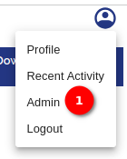
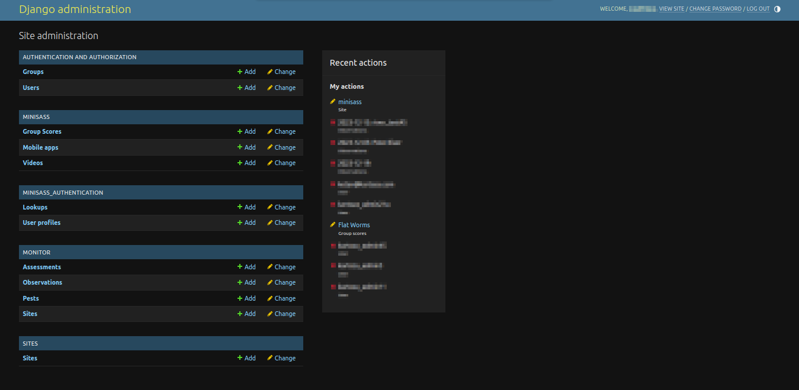

# Admin Profile Option

## Introduction

The `Admin` option is a powerful tool accessible to super users, providing administrative control over the system. This manual outlines the steps to access the admin page option, its features, and the necessary information for efficient utilisation.

1. **Admin** To access the `Admin` option, click on the profile icon available on the top right corner of the page. Note that the `Admin` option is visible only to super users. The `Admin` option is exclusively available to super users. Super users have elevated permissions, allowing them to configure system settings, manage users, and perform administrative tasks.
Upon selecting the `Admin` option, users will be redirected to the `Admin Panel`. This centralised dashboard provides an overview of key system settings, user management, and other administrative functionalities.

Once you have accessed the administration site, please refer to the [Django Administrator](./django-admin.md) documentation for more information regarding which sections to manage.
