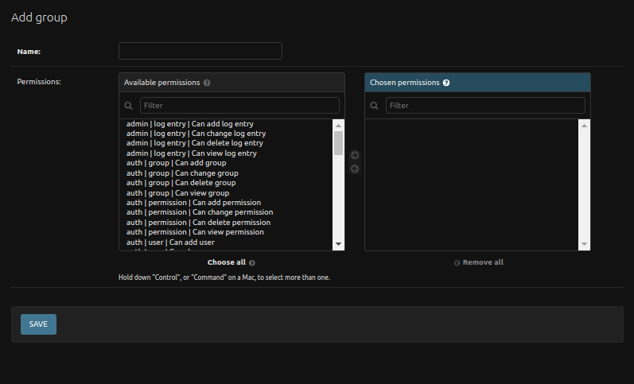

# Django Administration Site

This site is the administration site for the miniSASS platform, and only specific superusers can access it and in turn have the ability to make changes on it.

## Important Tables to Manage

There are a variety of tables to manage on the Django Admin site but the two key ones are the [Users Table](#users-table) and the [Observations Table](#observations-table).

### Users Table
<!-- Main focus on changing novice user to expert user -->
The Django admin user table is a central component within the Django admin interface, providing a comprehensive view of user-related data for the application. This table serves as a management hub for user accounts, offering essential information about each user in a tabular format.

1. **User:** Click on the `Users` to view the users table.

    

    1. **Search Functionality:** The User Table provides a powerful search functionality allowing the administrators to search user records based on various criteria. To perform a search, locate the search bar at the top right corner of the User Table.
    The administrators can search by:
        - Username
        - Email Address
        - First Name
        - Last Name
    
    Simply enter the relevant information into the search bar and hit enter to display matching records.

    2. **Action Dropdown**:** Administrators can perform batch actions on selected user records using the `Action Dropdown`. To select multiple records, use the checkbox in front of each user record. Once selected, open the Action Dropdown and choose the desired action, e.g., Delete selected users. Confirm the action and the selected records will be processed accordingly. This feature streamlines bulk user management tasks, enhancing efficiency for administrators.

    3. **User Name:** Clicking on the username of a user opens a detailed view of that user's record. A new page will open, providing comprehensive information about the selected user.

        

        1. **Username:** The administrator can see the user's username here.

        2. **Change Password Form** The administrator can click on `this form` link, to change the user password. When the administrator clicks on this link opens the change password page.

            

            1. **Password:** This field requires administrators to enter the user's new password.

                **Password Requirements:**
                - Your password can’t be too similar to your other personal information.
                - Your password must contain at least 8 characters.
                - Your password can’t be a commonly used password.
                - Your password can’t be entirely numeric.
            
            2. **Password (again):** The administrators are required to re-enter the new password for confirmation. This field ensures accuracy and helps prevent input errors.

            3. **Change Password Button:** After entering the new password and confirmation, users can click the `CHANGE PASSWORD` button to submit the form. Upon successful submission, the system will update the user's password, enhancing the security of their account.
        
        3. **Personal Information Section:** The Personal Info section of the User Table contains essential information about each user, facilitating easy identification and management.

            - **First Name:** Displays the first name of the user. Administrators can view and edit this field to update user details.

            - **Last Name:** Displays the last name of the user. Administrators can view and edit this field to update user details.

            - **Email Address:** Displays the email address associated with the user's account. Administrators can view and edit this field to update user details.

        4. **Permission Section:** The Permission Section allows administrators to assign specific permissions to users, tailoring their access and roles within the application.

            - **Active:** Checkbox indicating whether the user account is active or inactive. Administrators can toggle this checkbox to control user account status.

            - **Staff Status:** Checkbox granting staff status to the user. Staff status provides additional privileges within the application. Administrators can manage staff status by checking or unchecking the checkbox.

            - **Superuser Status:** Checkbox granting superuser status to the user. Superusers have elevated privileges, often including full control over the application. Administrators can assign or remove superuser status by checking or unchecking the checkbox.
        
        5. **History Button:** The History button allows administrators to access the history log of the user, providing insights into changes and activities related to the user account.

        

        6. **Group (+):** Administrators can create user groups by clicking on the plus icon. Upon clicking the plus icon, a popup window will open, allowing administrators to define the group's details. In the popup, administrators can specify:

            

            - **Group Name:** A unique identifier for the group.
            - **Permissions:** Assign specific permissions to the group, determining the access levels for members.
            
            After providing the necessary information, administrators can save the group.
        
        7. **Permissions**: Available permissions for the group. Administrators can choose permissions from the list and assign them to the user.

        8. **Arrow**: Using these arrows, administrators can add or remove the permissions to the user.

        9. **Choose All**: The button to choose all of the permissions and assign them to the user.

        10. **Remove All**: The button to choose all of the permissions and remove them from the user.

        11. **Organisation Type:** The administrator can view and edit the `organisations type` using this dropdown.

        12. **Icons** The administrator can use the icons to perform many actions.

            - **Edit Icon:** Allows administrators to edit the selected organisation type. Clicking the edit icon opens a form where the administrator can modify the details of the chosen organisation type.
            
            - **Plus Icon:** Enables administrators to add a new organisation type. Clicking the plus icon triggers the creation of a new organisation type, often through a dedicated form.

            - **Cross Icon:** Provides a quick option to delete an organisation type.  Clicking the cross icon initiates the deletion process, prompting users to confirm their action before permanently removing the selected organisation type.
            
            - **Eye Icon:** Allows users to view details or information associated with the selected organisation type. Clicking the eye icon redirects to a page displaying comprehensive details about the chosen organisation type.

        13. **Is Expert Checkbox:** Indicates whether a user has been approved as an expert in the system. Administrators can manually check or uncheck this checkbox to set or revoke expert status for a user.

        14. **Expert Approval Status:**

            - **APPROVED:** The user has been approved as an expert.
            - **REJECTED:** The user's expert status has been rejected.
            
            **Set by Approval Outcome:**

                - If approved, set Expert approval status to APPROVED.
                - If rejected, set Expert approval status to REJECTED.

        15. **Certificate Field:**  Allows administrators to upload user certificates as a part of the expert approval process.

        16. **Save**: Save the current record and then get redirected to the Django Admin Table/record list.
        
        17. **Save and add another**: Save the current record and then be redirected to a new page to add a new record.

        18. **Save and continue editing**: Save the current record while still showing the current record.

        19. **Delete button**: Delete the currently opened record. It will take administrators to a confirmation page.

    4. **Adding a New User:** The administrators can create a new user by clicking on the `add user` button, when the administrators click on this button a new page opens for adding the user record.

        

        1. **Username**: Administrators should enter a unique username for the new user. It should be 150 characters, or less, and may contain only letters, digits, and the characters '@', '.', '+', '-', and '_'.

        2. **Password**: Administrators should create a strong password for the user. The password must meet these criteria:

            - password can not be too similar to your other personal information.
            - password must contain at least 8 characters.
            - password can not be a commonly used password.
            - password can not be entirely numeric.

        3. **Confirm Password:** Re-enter the same password in the confirmation field to verify accuracy.

        

        4. **Organisation Type:** The administrator can add the `organisation type` using the dropdown.

        5. **Is Expert Checkbox:** Indicates whether a user has been approved as an expert in the system. Administrators can manually check or uncheck this checkbox to set or revoke expert status for a user.

        6. **Expert Approval status:** The administrator can choose the `Expert approval status` from the dropdown for the user.

        7. **Certificate Field:**  Allows administrators to upload user certificates as a part of the expert approval process.

        8. **Save**: Save the current record and then get redirected to the Django Admin Table/record list.
        
        9. **Save and add another**: Save the current record and then be redirected to a new page to add a new record.

        10. **Save and continue editing**: Save the current record while still showing the current record.

### Observations Table
<!-- Validating images that are dirty -->

## Other Tables to Manage

There are other tables that can be managed by administrative users and these are the [Group Scores](#group-scores), [Mobile Apps](#mobile-apps), and [Videos](#videos)

### Group Scores
<!-- Shouldn't need to be changed but can be -->

### Mobile Apps
<!-- Current version where app can be added, can add new apk if needed -->

### Videos
<!-- can store videos, but we'd have to do front end work to display them -->

## General Table Management

All of the tables on the administration site follow similar structures and as such can be managed in similar ways.

### Adding Tables

### Editing Tables

### Delete Record of Tables
