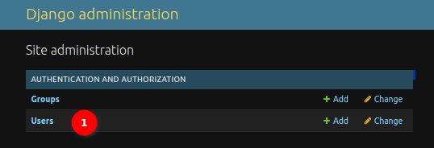
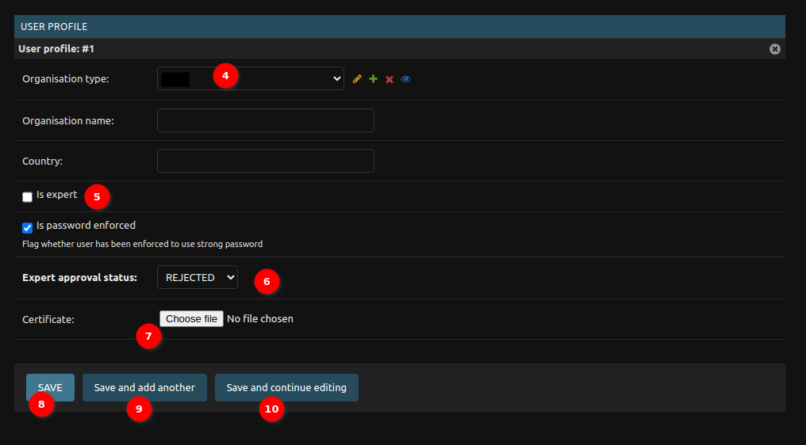
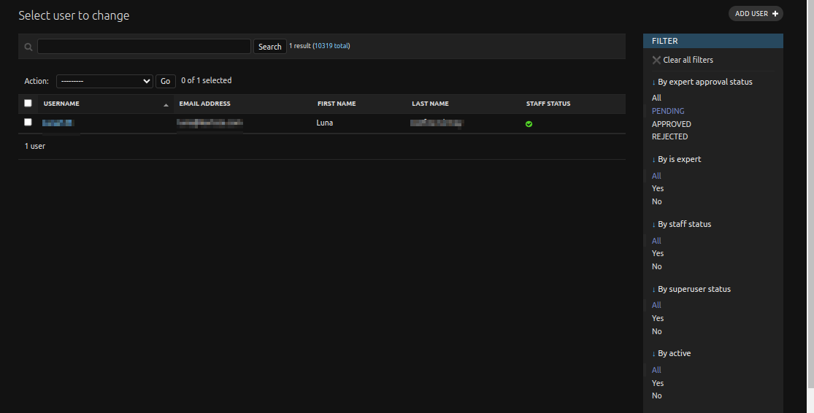

# Django Administration Site

This site is the administration site for the miniSASS platform, and only specific superusers can access it and in turn have the ability to make changes on it.

## Important Tables to Manage

There are a variety of tables to manage on the Django Admin site but the two key ones are the [Users Table](#users-table) and the [Observations Table](#observations-table).

### Users Table

The Django admin user table is a central component within the Django admin interface, providing a comprehensive view of user-related data for the application. This table serves as a management hub for user accounts, offering essential information about each user in a tabular format.

1. **User:** Click on the `Users` to view the users table.

    

    1. **Search Functionality:** The User Table provides a powerful search functionality allowing the administrators to search user records based on various criteria. To perform a search, locate the search bar at the top right corner of the User Table.
    The administrators can search by:
        - Username
        - Email Address
        - First Name
        - Last Name
    
    Simply enter the relevant information into the search bar and hit enter to display matching records.

    2. **Action Dropdown:** Administrators can perform batch actions on selected user records using the `Action Dropdown`. To select multiple records, use the checkbox in front of each user record. Once selected, open the Action Dropdown and choose the desired action, e.g., Delete selected users. Confirm the action and the selected records will be processed accordingly. This feature streamlines bulk user management tasks, enhancing efficiency for administrators.

    3. **User Name:** Clicking on the username of a user opens a detailed view of that user's record. A new page will open, providing comprehensive information about the selected user.

        

        1. **Username:** The administrator can see the user's username here.

        2. **Change Password Form** The administrator can click on `this form` link, to change the user password. When the administrator clicks on this link opens the change password page.

            

            1. **Password:** This field requires administrators to enter the user's new password.

                **Password Requirements:**
                - Your password can’t be too similar to your other personal information.
                - Your password must contain at least 8 characters.
                - Your password can’t be a commonly used password.
                - Your password can’t be entirely numeric.
            
            2. **Password (again):** The administrators are required to re-enter the new password for confirmation. This field ensures accuracy and helps prevent input errors.

            3. **Change Password Button:** After entering the new password and confirmation, users can click the `CHANGE PASSWORD` button to submit the form. Upon successful submission, the system will update the user's password, enhancing the security of their account.
        
        3. **Personal Information Section:** The Personal Info section of the User Table contains essential information about each user, facilitating easy identification and management.

            - **First Name:** Displays the first name of the user. Administrators can view and edit this field to update user details.

            - **Last Name:** Displays the last name of the user. Administrators can view and edit this field to update user details.

            - **Email Address:** Displays the email address associated with the user's account. Administrators can view and edit this field to update user details.

        4. **Permission Section:** The Permission Section allows administrators to assign specific permissions to users, tailoring their access and roles within the application.

            - **Active:** Checkbox indicating whether the user account is active or inactive. Administrators can toggle this checkbox to control user account status.

            - **Staff Status:** Checkbox granting staff status to the user. Staff status provides additional privileges within the application. Administrators can manage staff status by checking or unchecking the checkbox.

            - **Superuser Status:** Checkbox granting superuser status to the user. Superusers have elevated privileges, often including full control over the application. Administrators can assign or remove superuser status by checking or unchecking the checkbox.
        
        5. **History Button:** The History button allows administrators to access the history log of the user, providing insights into changes and activities related to the user account.

        

        6. **Group (+):** Administrators can create user groups by clicking on the plus icon. Upon clicking the plus icon, a popup window will open, allowing administrators to define the group's details. In the popup, administrators can specify:

            

            - **Group Name:** A unique identifier for the group.
            - **Permissions:** Assign specific permissions to the group, determining the access levels for members.
            
            After providing the necessary information, administrators can save the group.
        
        7. **Permissions:** Available permissions for the group. Administrators can choose permissions from the list and assign them to the user.

        8. **Arrow:** Using these arrows, administrators can add or remove the permissions to the user.

        9. **Choose All:** The button to choose all of the permissions and assign them to the user.

        10. **Remove All:** The button to choose all of the permissions and remove them from the user.

        11. **Organisation Type:** The administrator can view and edit the `organisations type` using this dropdown.

        12. **Icons** The administrator can use the icons to perform many actions.

            - **Edit Icon:** Allows administrators to edit the selected organisation type. Clicking the edit icon opens a form where the administrator can modify the details of the chosen organisation type.
            
            - **Plus Icon:** Enables administrators to add a new organisation type. Clicking the plus icon triggers the creation of a new organisation type, often through a dedicated form.

            - **Cross Icon:** Provides a quick option to delete an organisation type.  Clicking the cross icon initiates the deletion process, prompting users to confirm their action before permanently removing the selected organisation type.
            
            - **Eye Icon:** Allows users to view details or information associated with the selected organisation type. Clicking the eye icon redirects to a page displaying comprehensive details about the chosen organisation type.

        13. **Is Expert Checkbox:** Indicates whether a user has been approved as an expert in the system. Administrators can manually check or uncheck this checkbox to set or revoke expert status for a user.

        14. **Expert Approval Status:**

            - **APPROVED:** The user has been approved as an expert.
            - **REJECTED:** The user's expert status has been rejected.
            
            **Set by Approval Outcome:**

                - If approved, set Expert approval status to APPROVED.
                - If rejected, set Expert approval status to REJECTED.

        15. **Certificate Field:**  Allows administrators to upload user certificates as a part of the expert approval process.

        16. **Save:** Save the current record and then get redirected to the Django Admin Table/record list.
        
        17. **Save and add another:** Save the current record and then be redirected to a new page to add a new record.

        18. **Save and continue editing:** Save the current record while still showing the current record.

        19. **Delete button:** Delete the currently opened record. It will take administrators to a confirmation page.

    4. **Adding a New User:** The administrators can create a new user by clicking on the `add user` button, when the administrators click on this button a new page opens for adding the user record.

        

        1. **Username:** Administrators should enter a unique username for the new user. It should be 150 characters, or less, and may contain only letters, digits, and the characters '@', '.', '+', '-', and '_'.

        2. **Password:** Administrators should create a strong password for the user. The password must meet these criteria:

            - password can not be too similar to your other personal information.
            - password must contain at least 8 characters.
            - password can not be a commonly used password.
            - password can not be entirely numeric.

        3. **Confirm Password:** Re-enter the same password in the confirmation field to verify accuracy.

        

        4. **Organisation Type:** The administrator can add the `organisation type` using the dropdown.

        5. **Is Expert Checkbox:** Indicates whether a user has been approved as an expert in the system. Administrators can manually check or uncheck this checkbox to set or revoke expert status for a user.

        6. **Expert Approval status:** The administrator can choose the `Expert approval status` from the dropdown for the user.

        7. **Certificate Field:**  Allows administrators to upload user certificates as a part of the expert approval process.

        8. **Save:** Save the current record and then get redirected to the Django Admin Table/record list.
        
        9. **Save and add another:** Save the current record and then be redirected to a new page to add a new record.

        10. **Save and continue editing:** Save the current record while still showing the current record.

    5. **Filters:** The administrators can filter the user table using the available filters at the right side of the tables. 

        

### Observations Table

1. **Search Functionality:** The Observation Table provides a search functionality allowing the administrators to search records based on the site name and river name.

2. **Action Dropdown:** The Action Dropdown offers various options to perform batch actions on selected observation records.

    Options include:
    - Delete selected Observations: Permanently remove the selected observation records.
    - Mark selected observations as verified (clean): Indicate that selected observations are verified or clean.
    - Mark selected observations as unverified (dirty): Indicate that selected observations are unverified or dirty.

3. **Username:** Clicking on the username in the Observation Table redirects administrators to a detailed page containing specific user observation data.

    

    1. **User Selection:** Select a user from the dropdown menu to associate the observation with a specific user.

    - Edit Icon: Allows administrators to edit user details.
    - Plus Icon: Opens a form for adding a new user.
    - Eye Icon: Redirects administrators to a detailed page showing user-specific data.

    2. **Available Groups:** Checkbox options for different observation groups:
        - Flatworms
        - Worms
        - Leeches
        - Crabs Shrimps
        - Stoneflies
        - Minnow Mayflies
        - Other Mayflies
        - Damselflies
        - Dragonflies
        - Bugs Beetles
        - Caddisflies
        - True Flies
        - Snails
        
        Check the relevant groups that apply to the observation.
    
    3. **Score of Selected Groups:** Numerical score associated with the selected observation groups.

    4. **History Button:** The History button allows administrators to access the history log of the observation, providing insights into changes and activities related to the observation.

    

    5. **Site:** Select a site from the dropdown menu to associate with the observation.
        
        **Icons:**
        - Edit Icon: Allows administrators to edit site details.
        - Plus Icon: Opens a form for adding a new site.
        - Eye Icon: Redirects administrators to a detailed page showing site-specific data.

    6. **Observation Date Field:** Date picker to select the observation date.

    7. **Flag Field:** Labels the observation data as clean or dirty based on user status (expert or novice). Use the Flag field to distinguish between automatically accepted and manually validated data. 

        **Automated Validation:**

        - Expert users' contributions are automatically accepted as clean data.
        - Novice users' contributions are flagged as dirty and require manual validation.
    
    8. **Is Validated Section:** Checkbox for Validation Status. Flags whether the observation correctness has been manually validated.

    9. **Dissolved Oxygen Unit:** Dropdowns to select the unit of measurement (e.g., mg/l for Dissolved Oxygen)
    
    10. **Electrical Conductivity Unit:** Dropdowns to select the unit of measurement (e.g., mS/m for Electrical Conductivity).

    

    11. **Pest Column:** Administrators can choose the pest group from the dropdown.

        **Icons:**
        - Edit Icon: Allows administrators to edit pest group details.
        - Plus Icon: Opens a form for adding a new pest group.
        - Eye Icon: Redirects administrators to a detailed page showing pest group-specific data.

    12. **Image Column:** Administrators can click on the image to view it for validation. Images uploaded by novice users need manual validation by administrators.

    13. **Valid Column:** The checkbox is checked by default if the image is uploaded by an expert user. For novice users, the checkbox is unchecked, indicating that manual validation is required.

    14. **Delete Column:** Checkbox available for deleting the pest record. Check the checkbox to select the pest record for deletion.

    15. **Save:** Save the current record and then get redirected to the Django Admin Table/record list.
        
    16. **Save and add another:** Save the current record and then be redirected to a new page to add a new record.

    17. **Save and continue editing:** Save the current record while still showing the current record.

    18. **Delete button:** Delete the currently opened record. It will take administrators to a confirmation page.

4. **Add Observation:** The `add observation` button allows administrators to create new observation records directly from the `Observation Table`.

    

    To create a new pest observation, administrators must follow a structured process and provide essential information for accurate and detailed records.

    1. **User Selection:** Begin by choosing the user associated with the observation from the available user dropdown. This step attributes the observation to a specific contributor.

    - Edit Icon: Allows administrators to edit user details.
    - Plus Icon: Opens a form for adding a new user.
    - Eye Icon: Redirects administrators to a detailed page showing user-specific data.

    2. **Available Groups:** Checkbox options for different observation groups:
    - Flatworms
    - Worms
    - Leeches
    - Crabs Shrimps
    - Stoneflies
    - Minnow Mayflies
    - Other Mayflies
    - Damselflies
    - Dragonflies
    - Bugs Beetles
    - Caddisflies
    - True Flies
    - Snails
    
    The administrator needs to check the relevant groups that they want to apply to the observation.

    3. **Site:** The administrator needs to select a site from the dropdown menu to associate with the observation.

        **Icons:**
        - Edit Icon: Allows administrators to edit site details.
        - Plus Icon: Opens a form for adding a new site.
        - Eye Icon: Redirects administrators to a detailed page showing site-specific data.
    
    

    
    4. **Observation Date Field:** The administrator needs to use the date picker to select the observation date.

    5. **Flag Field:** Labels the observation data as clean or dirty based on user status (expert or novice). Use the Flag field to distinguish between automatically accepted and manually validated data. 

        - If a user is anexpert user choose the flag `clean` for the user.
        - If a user is a novice user choose the flag `dirty` for the user.

    6. **Is Validated Section:** Checkbox for Validation Status. Flags whether the observation correctness has been manually validated.

    7. **Pest Column:** Administrators need to choose the pest group from the dropdown for the observation.

        **Icons:**
        - Edit Icon: Allows administrators to edit pest group details.
        - Plus Icon: Opens a form for adding a new pest group.
        - Eye Icon: Redirects administrators to a detailed page showing pest group-specific data.
    
    8. **Image Column:** Administrators need to click on the `choose image` button, to upload the image.

    9. **Valid Column:** The administrator needs to check the checkbox if the observation correctness has been verified.
        - For expert-contributed observations, the `Valid` status is checked by default, assuming they are accurate.
        - For novice-contributed observations, the administrator must manually check the checkbox after validating the observation for correctness.
    
    10. **Save:** Save the current record and then get redirected to the Django Admin Table/record list.
        
    11. **Save and add another:** Save the current record and then be redirected to a new page to add a new record.

    12. **Save and continue editing:** Save the current record while still showing the current record.

5. **Filter:** Administrators can filter observations based on cleanliness status - dirty or clean. Click on the available filters to view observations specific to either clean or dirty status.

    - **Filtered by the `dirty` flag.**

    

## Other Tables to Manage

There are other tables that can be managed by administrative users and these are the [Group Scores](#group-scores), [Mobile Apps](#mobile-apps), and [Videos](#videos)

### Group Scores

1. **Group Scores:** The administrators can click on the group to view the group's table.

    

    1. **Group:** 
        - The administrator can view or edit the details of a specific group.
        - When the administrator clicks on the name of the particular group, a change page will open, allowing the administrator to view or edit the details of that specific group.

        
    
    2. **ADD GROUP SCORE:** 
        - The administrator can create a new group.
        - When the administrator clicks on the `ADD GROUP SCORE` button, a new add group score page will open, allowing the administrator to add a new group.

        

### Mobile Apps

1. **Mobile Apps:** Click on the `Mobile Apps` to open the mobile apps table.

2. **Current version:** The current version of the `miniSASS Mobile App`.

3. **ADD MOBILE APPS:** The administrators can add the new version of the miniSASS mobile app by using this button.

### Videos

1. **Videos:** Click on the `Videos` to open the videos table.

2. **View Video:** Click on the name of the video to view or edit the video link.

3. **ADD VIDEO:** Administrators can upload videos using this button. To display the video on the website, additional front-end development work is required.

## General Table Management

All of the tables on the administration site follow similar structures and as such can be managed in similar ways.

### Managing Tables on the Administration Site

All tables on the administration site adhere to a consistent structure, facilitating uniform management procedures. The following points outline the general approach for adding, editing, and deleting records across various tables:

### Adding Tables

- To add a new record, locate the `Add <table name>` button typically available on the respective table page.
- Click on the button to initiate the creation of a new entry.
- Follow the prompts or fill in the required fields in the form that opens.
- Submit the form to add the new record to the table.

### Editing Tables

- For editing existing records, clicking on the name of the record will open a change record page, allowing the administrators to view or edit the record.
- Update the necessary information or fields as required.
- Save the changes to update the record.

### Delete Record of Tables

To delete a record, administrators can follow these steps using the action dropdown:

**Select Record:**
- Checkmark the checkbox available in front of the specific record that needs deletion.

**Open Action Dropdown:**
- Locate the action dropdown, often positioned near the table header or the selected record.

**Choose Delete Option:**
- Open the dropdown menu and select the `Delete` option.

**Initiate Deletion:**
- After selecting the delete option, click the `Go` button to initiate the deletion process.

To delete a record, administrators can utilise the following steps from the change page:

**Navigate to the Change Page:**
- Access the change page of the specific record that needs deletion by clicking on the record name.

**Locate Delete Button:**
On the change page, find the `Delete` button.

**Initiate Deletion:**
- Click the `Delete` button to initiate the deletion process for the record.

### Usage Tips

- Ensure accuracy when adding or editing records by double-checking the entered information.
- Exercise caution when deleting records, as this action is typically irreversible.
- Follow any specific guidelines or procedures outlined in the system documentation for individual tables.

### Additional Notes

- Consistent table structures streamline the process of managing data on the administration site.
- Users familiar with one table's management procedures can easily adapt to others with similar structures.
- Refer to the system documentation for any unique features or requirements specific to individual tables.
- By adhering to these general guidelines, administrators can effectively manage tables on the administration site, maintaining data accuracy and system efficiency.