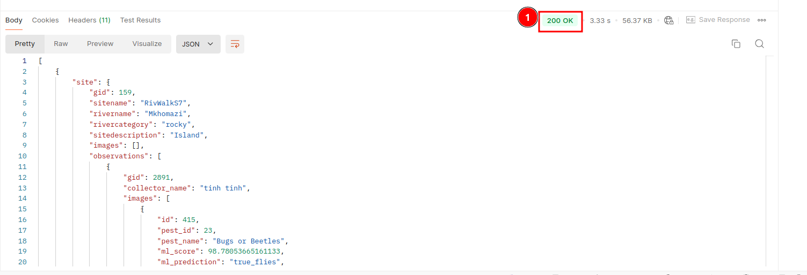
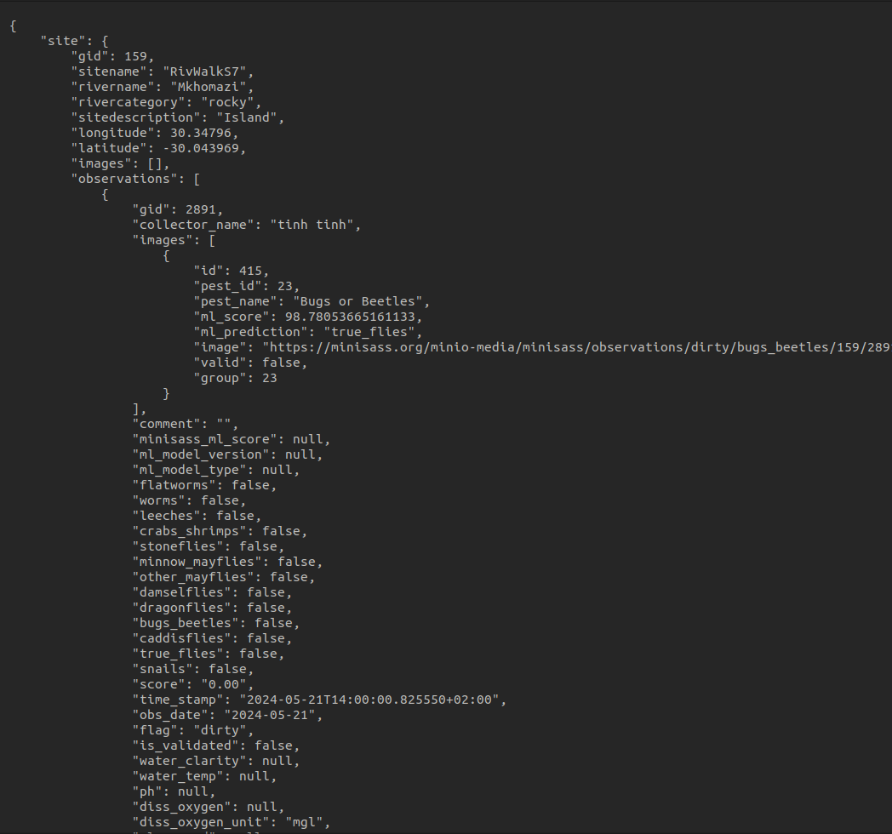
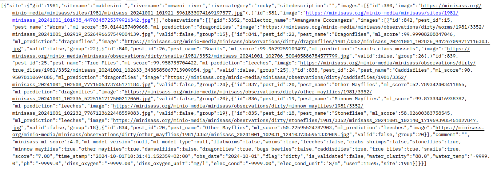

# Accessing the miniSASS 3rd Party API

This guide provides a detailed procedure for accessing the miniSASS 3rd party API, allowing you to retrieve site and observation data.

## API Endpoint

The API can be accessed at the following URL:

`https://minisass.org/monitor/sites-with-observations/?start_date=YYYY-MM-DD`

## Parameters

- **start_date:** Specify the date from which you want to retrieve data. Format: YYYY-MM-DD.

## Step-by-Step Procedure

### Set Up Your Environment: 

To interact with the API, you can use tools like Postman, cURL, or any programming language that supports HTTP requests.

### 1. Using Postman

- **Download and Install Postman:** If you have not already, download Postman from Postman’s [official website](https://www.postman.com/).

### 2. Create a New Request

Open `Postman` then click on 1️⃣ New and then choose 2️⃣ Http Request.

After choosing the Http Request, you will receive the following window.

1. **Enter URL:** This is an input field allows you to enter your url or api you want to call.

2.  **Method:** This input field allows you to select the method you want to perform with the URL.

    

    - **GET:** This is used to retrieve data from the server.

3. **Send:** This is a button that allows you to send your request to the server.

### Construct the API URL

* Use the base URL and append your desired start date in the following format:

    `https://minisass.org/monitor/sites-with-observations/?start_date=YYYY-MM-DD`

* Replace YYYY-MM-DD with the date from which you want to retrieve data. For example, for April 13, 2024, the URL will be:

    `https://minisass.org/monitor/sites-with-observations/?start_date=2024-04-13`

### Make a GET Request

Use your selected tool to perform a GET request to the constructed URL.

**In Postman:**

1. Open Postman and create a new request.

2. Select the GET method.

3. Paste the constructed URL into the request URL field.

4. Click "Send."

To check how to make request click on [request process](#2-create-a-new-request).

### Response

- Once you send the request, the API will return the data in data body.

    This is an example of data you will recieve after  sending the request via [Postman](#1-using-postman).

    

    The user can also choose different response formats by clicking on the 1️⃣ dropdown, such as JSON, XML, text etc.

    

    * **Json Format**
        
        

    *  **Xml Format**

        

    * **Text Format**

        

- You can use the data as per your needs.

**Another Way to Make Request**

**In Browser:**

The user can directly send the request using a browser by pasting the URL into the browser's address bar along with the date from which they want to retrieve data.

- Open your browser and paste the constructed URL into the address bar.

- Press Enter to send the request.

- The browser will display the response in the browser window.

User can also choose response format between JSON and api.

- Click on the 1️⃣ dropdown to select the response format.

    

- The response will be displayed in the selected format.

    * **Json Format**

        

        Click on 1️⃣ `Pretty print` to display the response in a readable format.

        

        After this, the response will look like this:

        

    * **Api Format**

        