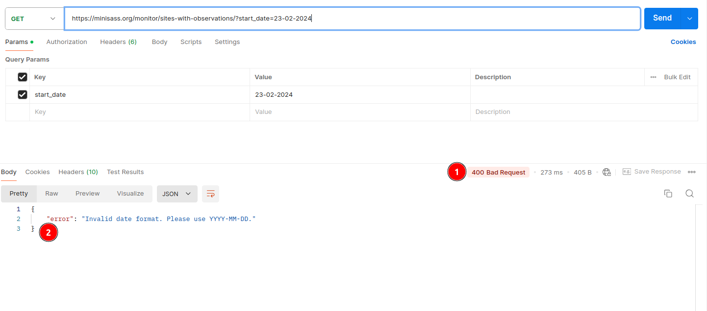
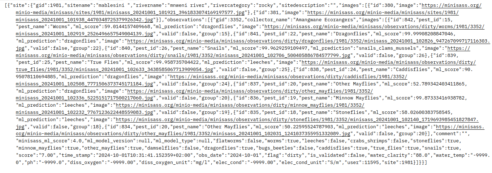
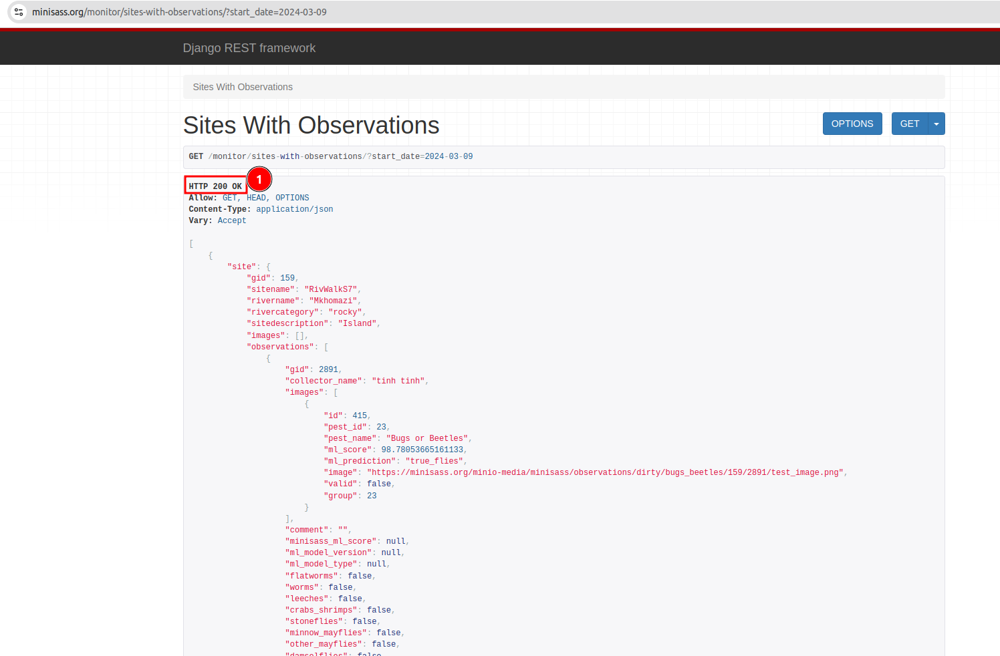

# Accessing the miniSASS 3rd Party API

This guide provides a detailed procedure for accessing the miniSASS 3rd party API, allowing you to retrieve site and observation data.

## API Endpoint

The API can be accessed at the following URL:

`https://minisass.org/monitor/sites-with-observations/?start_date=YYYY-MM-DD`

## Parameters

- **start_date:** Specify the date from which you want to retrieve data. Format: YYYY-MM-DD.

## Step-by-Step Procedure

### Set Up Your Environment: 

To interact with the API, you can use tools like Postman, cURL, or any programming language that supports HTTP requests.

### 1. Using Postman

- **Download and Install Postman:** If you have not already, download Postman from Postman’s [official website](https://www.postman.com/).

### 2. Create a New Request

Open `Postman` then click on 1️⃣ New and then choose 2️⃣ Http Request.

After choosing the Http Request, you will receive the following window.

1. **Enter URL:** This is an input field allows you to enter your url or api you want to call.

2.  **Method:** This input field allows you to select the method you want to perform with the URL.

    

    - **GET:** This is used to retrieve data from the server.

3. **Send:** This is a button that allows you to send your request to the server.

### Construct the API URL

* Use the base URL and append your desired start date in the following format:

    `https://minisass.org/monitor/sites-with-observations/?start_date=YYYY-MM-DD`

* Replace YYYY-MM-DD with the date from which you want to retrieve data. For example, for April 13, 2024, the URL will be:

    `https://minisass.org/monitor/sites-with-observations/?start_date=2024-04-13`

    > Note: Ensure that the date is in the correct format (YYYY-MM-DD) to avoid errors.

### Make a GET Request

Use your selected tool to perform a GET request to the constructed URL.

**In Postman:**

1. Open Postman and create a new request.

2. Select the GET method.

3. Paste the constructed URL into the request URL field.

4. Click "Send."

To check how to make request click on [request process](#2-create-a-new-request).

### Response

- Once you send the request, the API will return the data in data body.

    Here are examples of the responses you will receive after sending the request via [Postman](#1-using-postman).

    ### 200 OK

    **Request With a Specified Date:**

    - The  API will return a list of sites with observations from the specified date.

    - The URL should be in the following format:

    `https://minisass.org/monitor/sites-with-observations/?start_date=2024-03-09`

    

    1. **200 OK:** This status code indicates that the request was successful, and the response data will be returned in the body.

    **Request Without a Specified Date:** If the start date is not specified or provided, the API returns a **200 OK** status code along with all available sites and observations.
    
    - The URL without date  will look like this:

    `https://minisass.org/monitor/sites-with-observations`

    

    ### 400 Bad Request:

     If the date is not provided in the correct `YYYY-MM-DD` format, you will receive a **404 Bad Request** error with an **error message**.

    

    1.  **400 Bad Request:** This status code indicates that the request was invalid or cannot be processed.

    2. **error:**  This is the error message returned by the API. In our case, the error occurs due to an invalid date format. The correct format should be **YYYY-MM-DD**.

    ### 500 Internal Server Error

    

    1.**500 Internal Server Error:** The server returned a 500 Internal Server Error, indicating that the API is currently down and unable to process the request.

    ### Here are the actions you can take after receiving a **200 OK** status code:

    ### Site Image

    The user can also download the site/observation image by clicking on the image URL provided in the response.

    

    Click on the 1️⃣ `image` to open the image in your browser, where you can easily download it.

    

    The user can also choose different response formats by clicking on the 1️⃣ dropdown, such as JSON, XML, text etc.

    

    * **Json Format**
        
        

    *  **Xml Format**

        

    * **Text Format**

        

- You can use the data as per your needs.

**Another Way to Make Request**

**In Browser:**

The user can directly send the request using a browser by pasting the URL into the browser's address bar along with the date from which they want to retrieve data.

- Open your browser and paste the constructed URL into the address bar.

- Press Enter to send the request.

- The browser will display one of the following responses in the browser window.

### HTTP 200 OK

**Request With a Specified Date**

- The  API will return a list of sites with observations from the specified date.

- The URL should be in the following format:

`https://minisass.org/monitor/sites-with-observations/?start_date=2024-03-09`

1. **200 OK:** This status code indicates that the request was successful and the response body contains the requested data.

**Request Without a Specified Date**

- The API will return a list of all sites with observations.

- The URL without date will look like this:

`https://minisass.org/monitor/sites-with-observations`

### HTTP 400 Bad Request

If the date is not provided in the correct `YYYY-MM-DD` format, you will receive a **404 Bad Request** error with an error message.

1. **400 Bad Request:** This status code indicates the request was invalid or couldn't be processed. The response body will include an **error message**, which in this case is **Invalid date format**. Please use **YYYY-MM-DD**.

### HTTP 500 Internal Server Error

1. **500 Internal Server Error:** The server returned a 500 Internal Server Error, indicating that the API is currently down and unable to process the request.

### After receiving the 200 OK status code, the user will be able to perform the following actions:

### Site Image

The user can also download the site/observation image by clicking on the image URL provided in the response.

Click on the 1️⃣ `image` to open the image in your browser, where you can easily download it.

User can also choose response format between JSON and api.

- Click on the 1️⃣ dropdown to select the response format.

    

- The response will be displayed in the selected format.

    * **Json Format**

        

        Click on 1️⃣ `Pretty print` to display the response in a readable format.

        

        After this, the response will look like this:

        

    * **Api Format**

        