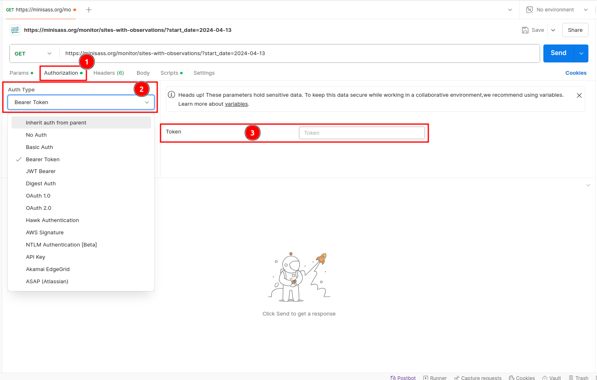
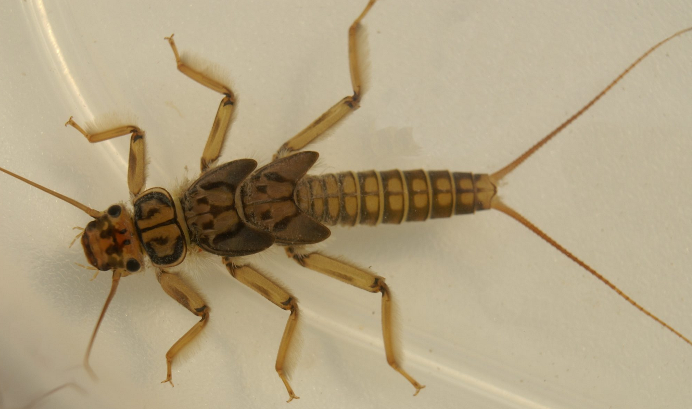
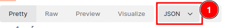
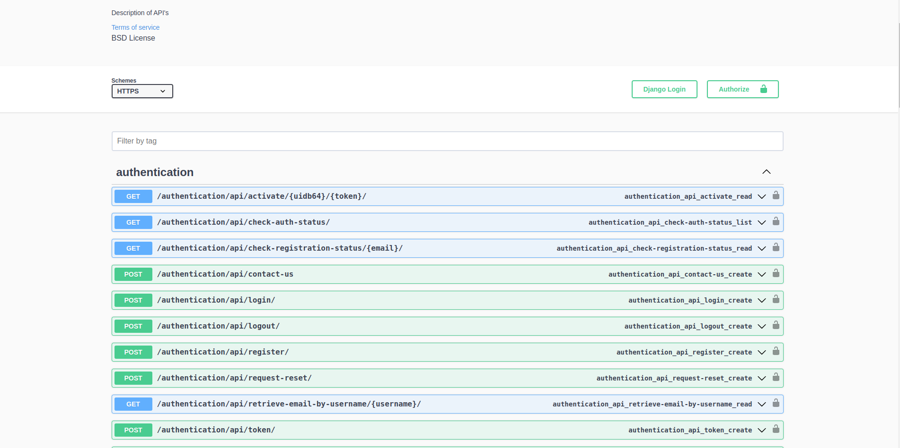
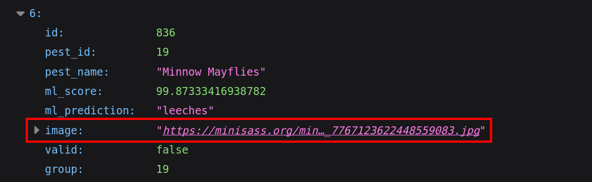

# Accessing the miniSASS 3rd Party API

This guide provides a detailed procedure for accessing the miniSASS 3rd party API, allowing you to retrieve site and observation data. The first section outlines the API and using a service like Postman and the second section outlines the use of Swagger as a standardised way to access the API.

## Access Token

In order to access the miniSASS third-party API, users are required to request an access token. This token is essential for authentication and will enable you to interact with the API securely.

### How to request for the access token:

> Note: Only registered users will be able to get the access token. So make sure you are registered on the miniSASS.

- Go to the miniSASS official website. Click [here](https://minisass.org/) to visit the website.

- Click on the 1️⃣ `CONTACT US` button in the navigation bar.

    [](./img/3rd-party-api-access-42.png)

- Fill out the `Contact Form` provided below to submit your request.

    [](./img/3rd-party-api-access-43.png)

    **1. Name**: Enter your name.

    **2. Email**: Enter your registered email address, where you will receive the access token.

    **3. Phone Number**: Enter your phone number.

    **4. Message**: Enter your message in the following format
    
    ```
    Dear miniSASS Admin,

    My name is [Your Name], and I am a [Your Profession/Role]. I would like to request an API token for accessing data from the miniSASS platform.

    Purpose of data access: Briefly explain why you need the data, e.g., for research, analysis, project work, etc.

    Intended use of data: Describe how the data will be used, e.g., environmental studies, GIS mapping, etc.
    ```

    **5. Submit**: Click on the `Submit` button to send your request.

    After submitting the form, you will receive an API access token at your registered email address. You can use this token to access the miniSASS 3rd party API.

## Api for accessing site observation data

### API Endpoint

The API can be accessed at the following URL:

`https://minisass.org/monitor/sites-with-observations/?start_date=YYYY-MM-DD`

### Parameters

- **start_date:** Specify the date from which you want to retrieve data. Format: YYYY-MM-DD.

## Step-by-Step Procedure to Make Request Using the Access Token

**Set Up Your Environment:** To interact with the API, you can use tools like Postman, cURL, or any programming language that supports HTTP requests.

### Using Postman

- **Download and Install Postman:** If you have not already, download Postman from Postman’s [official website](https://www.postman.com/).

### Create a New Request

Open Postman, click on 1️⃣ `New`, and select 2️⃣ `HTTP` to begin.

[](./img/3rd-party-api-access-1.png)

#### How to use access token 

Click on the 1️⃣ `Authorisation`, and select 2️⃣ `Bearer Token` from the `Auth Type` dropdown menu. Enter the token you get on the email in the 3️⃣ `Token` input field.

[](./img/3rd-party-api-access-38.png)

**401 Unauthorised**

If the user requests site observation data without providing the `Token`, the server will return a 1️⃣ 401 Unauthorised response along with the following 2️⃣ `detail: Authentication credentials were not provided` message.

[](./img/3rd-party-api-access-39.png)

#### Make Request for the data

> Note: Ensure that the date is in the correct format (YYYY-MM-DD) to avoid errors.

* Use the base URL and append your desired start date in the following format:

    `https://minisass.org/monitor/sites-with-observations/?start_date=YYYY-MM-DD`

* Replace YYYY-MM-DD with the date from which you want to retrieve data. For example, for April 13, 2024, the URL will be:

    `https://minisass.org/monitor/sites-with-observations/?start_date=2024-04-13`

Select the `GET` from the 1️⃣ `method` dropdown and enter the constructed URL into the 2️⃣ `input` field, ensuring it is in the correct format. After verifying the URL format, click the 3️⃣ `Send` button to send the request.

[](./img/3rd-party-api-access-2.png)

### Response

- Once you send the request, the API will return the data in data body.

    Here are examples of the responses you will receive after sending the request via [Postman](#1-using-postman).

    #### 200 OK

    **Request With a Specified Date:**

    - The  API will return a list of sites with observations from the specified date.

    - The URL should be in the following format: `https://minisass.org/monitor/sites-with-observations/?start_date=2024-03-09`

    This status code 1️⃣ `200 OK` indicates that the request was successful, and the response data will be returned in the body.

    [](./img/3rd-party-api-access-4.png)

    **Request Without a Specified Date:** If the start date is not specified or provided, the API returns a **200 OK** status code along with all available sites and observations.
    
    - The URL without date  will look like this: `https://minisass.org/monitor/sites-with-observations`

    [](./img/3rd-party-api-access-16.png)

    #### 400 Bad Request:

     If the date is not provided in the correct `YYYY-MM-DD` format, you will receive 1️⃣ `404 Bad Request` error with the 2️⃣ `error message`.

    [](./img/3rd-party-api-access-15.png)

    #### 500 Internal Server Error

    The server return the 1️⃣ `500 Internal Server Error`, indicating that the API is currently down and unable to process the request.

    [](./img/3rd-party-api-access-17.png)

    #### Here are the actions you can take after receiving a **200 OK** status code:

    #### Site Image

    The user can also download the site/observation image by clicking on the image URL provided in the response.

    [](./img/3rd-party-api-access-20.png)

    Click on the 1️⃣ `image` to open the image in your browser, where you can easily download it.

    [](./img/3rd-party-api-access-21.png)

    The user can also choose different response formats by clicking on the 1️⃣ dropdown, such as JSON, XML, text etc.

    [](./img/3rd-party-api-access-5.png)

    * **JSON Format**
        
        [](./img/3rd-party-api-access-6.png)

    *  **Xml Format**

        [](./img/3rd-party-api-access-7.png)

    * **Text Format**

        [](./img/3rd-party-api-access-8.png)

- You can use the data as per your needs.

### Make Request Using Browser

The user can directly send the request using a browser by pasting the URL into the browser's address bar along with the date from which they want to retrieve data.

**Here is the process:**

- Open your browser and paste the constructed URL into the address bar.

- Press Enter to send the request.

- The browser will display one of the following responses in the browser window.

#### HTTP 200 OK

**Request With a Specified Date**

- The  API will return a list of sites with observations from the specified date.

- The URL should be in the following format:

`https://minisass.org/monitor/sites-with-observations/?start_date=2024-03-09`

[](./img/3rd-party-api-access-9.png)

1. **200 OK:** This status code indicates that the request was successful and the response body contains the requested data.

**Request Without a Specified Date**

- The API will return a list of all sites with observations.

- The URL without date will look like this:

`https://minisass.org/monitor/sites-with-observations`

#### HTTP 400 Bad Request

If the date is not provided in the correct `YYYY-MM-DD` format, you will receive a **404 Bad Request** error with an error message.

[](./img/3rd-party-api-access-18.png)

1. **400 Bad Request:** This status code indicates the request was invalid or couldn't be processed. The response body will include an **error message**, which in this case is **Invalid date format**. Please use **YYYY-MM-DD**.

#### HTTP 500 Internal Server Error

The server return the `500 Internal Server Error`, indicating that the API is currently down and unable to process the request.

[](./img/3rd-party-api-access-19.png)

### After receiving the 200 OK status code, the user will be able to perform the following actions:

### Site Image

The user can also download the site/observation image by clicking on the image URL provided in the response.

[](./img/3rd-party-api-access-20.png)

Click on the 1️⃣ `image` to open the image in your browser, where you can easily download it.

[](./img/3rd-party-api-access-21.png)

#### Download Image:

* Right click on the image  and select **Save Image As**.

    [](./img/3rd-party-api-access-35.png)

    
* Choose a location to save the image and click 1️⃣ `Save`.

    [](./img/3rd-party-api-access-36.png)

    The following process will download the image in the `jpg` format.

User can also choose response format between JSON and api.

- Click on the 1️⃣ dropdown to select the response format.

    [(./img/3rd-party-api-access-10.png)]

- The response will be displayed in the selected format.

    * **JSON Format**

        [](./img/3rd-party-api-access-11.png)

        Click on 1️⃣ `Pretty print` to display the response in a readable format.

        [](./img/3rd-party-api-access-12.png)

        After this, the response will look like this:

        [](./img/3rd-party-api-access-13.png)

    * **Api Format**

        [](./img/3rd-party-api-access-14.png)

## Other ways to access the API

**Here are two URLs through which user can retrieve/download the site observation data:**

### Swagger

Accessing the API using Swagger

- Click [here](https://minisass.org/swagger/), to redirect to the swagger.

    [](./img/3rd-party-api-access-22.png)

- Choose `GET /monitor/sites-with-observations` endpoint.

    [](./img/3rd-party-api-access-23.png)

- This is the api dashboard which will appear after clicking on the endpoint `GET  /monitor/sites-with-observations`.

    [](./img/3rd-party-api-access-24.png)

    1. **Try it out:** This option allows you to interact with the API directly.

    2. **start_date:**  This is the date from which you want to retrieve the data.

    3. **Response content type:** This is the format in which you will receive the data.

    4. **Example value:** Click on 4️⃣ `Example Value`, and it will display a sample of the data you will receive. 

        [](./img/3rd-party-api-access-34.png)

- Click on 1️⃣ `Try it out` to access the API, which will enable you to enter the 2️⃣ `start date` in the format `YYYY-MM-DD`.

    [](./img/3rd-party-api-access-25.png)

    >Note: If the `start_date` is provided, the API will return data from that specified date. If not, it will return all site observation data.

- Click on 1️⃣ `Execute` to retrieve the data, or choose 2️⃣ `Cancel` to abort the process.

    [](./img/3rd-party-api-access-26.png)

- These are the examples of responses you will receive in the response body.
    
    * ** Code 200:** This is the response you will receive along with the data if the request is successful.
    
    [](./img/3rd-party-api-access-27.png)

    * **Code 400:**  This is the response you will receive if the request is not successful.

    [](./img/3rd-party-api-access-28.png)

    In our case, we received 1️⃣ a **400 Bad Request** code along with 2️⃣ an **error** message due to an invalid date format.

- After receiving the response, the user can download the received data by clicking on the 1️⃣ **Download** button.

    [](./img/3rd-party-api-access-29.png)

- The downloaded file will be in the `json` format. Here is the example of data you will receive in the downloaded file.

    [](./img/3rd-party-api-access-30.png)

    * **Image:** This is the site image URL. Clicking on it will redirect you to the browser, where you can download the site observation image.

        [](./img/3rd-party-api-access-21.png)

    **To view the process for downloading the image, click [here](#download-image).**

### Redoc URL

Click [here](https://minisass.org/redoc/#tag/monitor/operation/monitor_site-observations_read), to access the redoc documentation site.
<!--  -->
[](./img/3rd-party-api-access-31.png)


Click on 1️⃣ `Search` to look for the API you want to access, or simply click on 2️⃣ `Sites with Observations`, which will open a dropdown menu.

[](./img/3rd-party-api-access-32.png)

Click on 1️⃣ `monitor_sites-with-observations_list` to access the API.

[](./img/3rd-party-api-access-33.png)

1. **monitor_sites-with-observations_list:** By clicking on this, the user will be able to access the API documentation.

2. **start_date:**  This is the start date of the observation.

3. **Responses:**  These are the examples of responses you will receive if the request is successful.

    *  **200:**  This is the response you will receive if the request is successful.

    * **400:** This is the response you will receive, along with an error message, if the request is not successful.

4. **Endpoints:** The API endpoint `GET /monitor/sites-with-observations/` is used to retrieve sites along with their observation data.

5. **Response samples:** Displaying the content type of the response along with the response body containing an example of the response.
