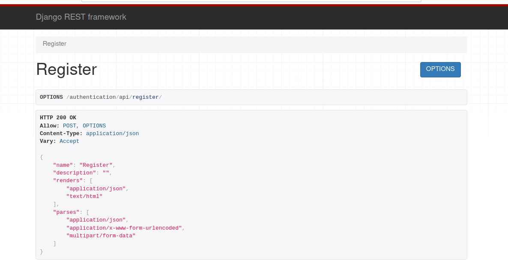
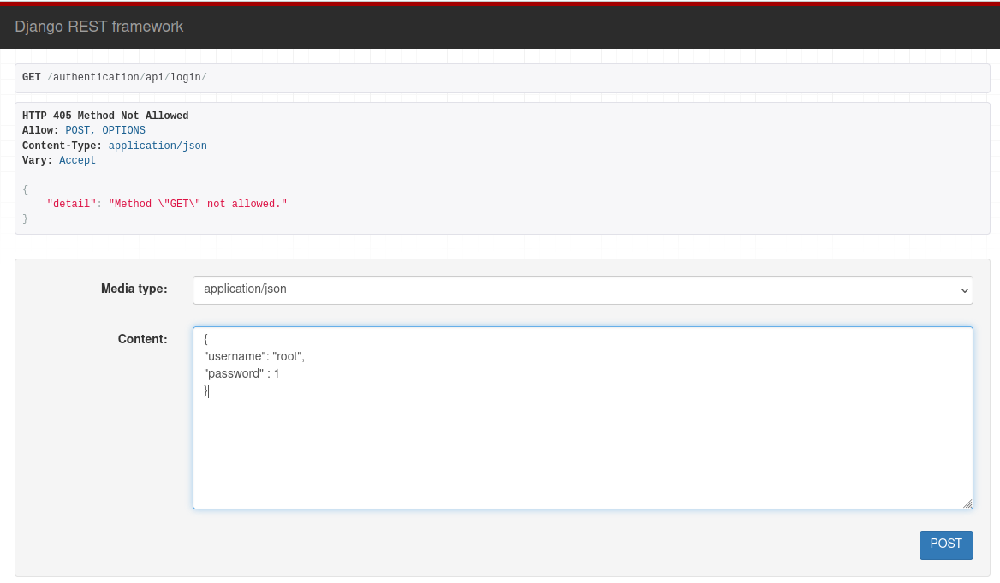
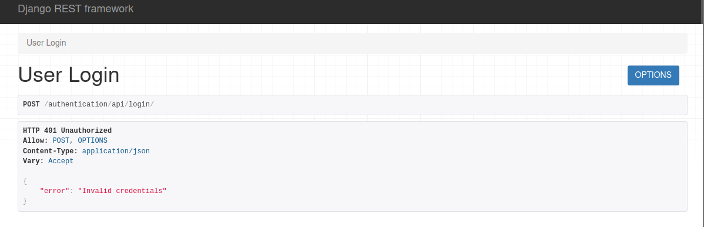
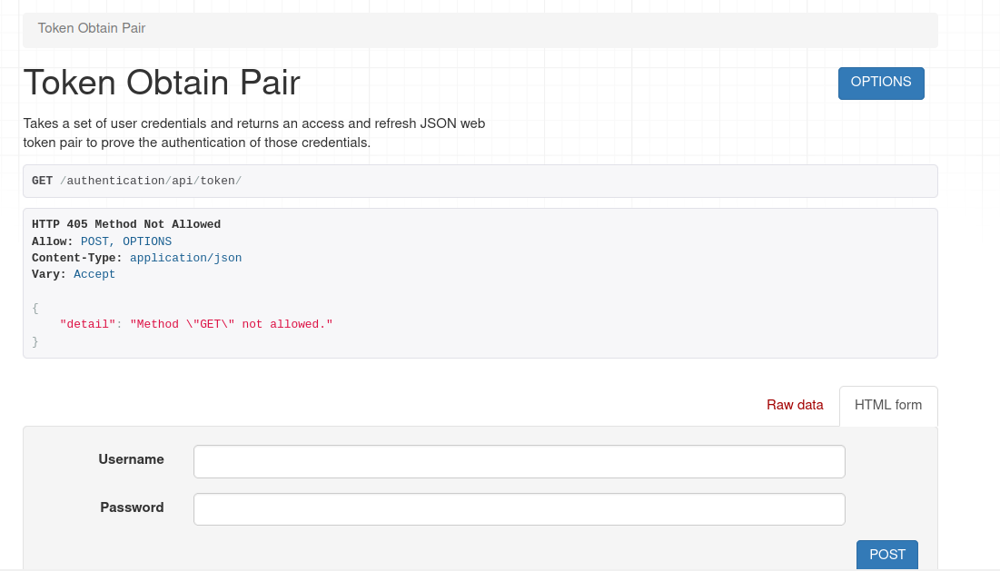
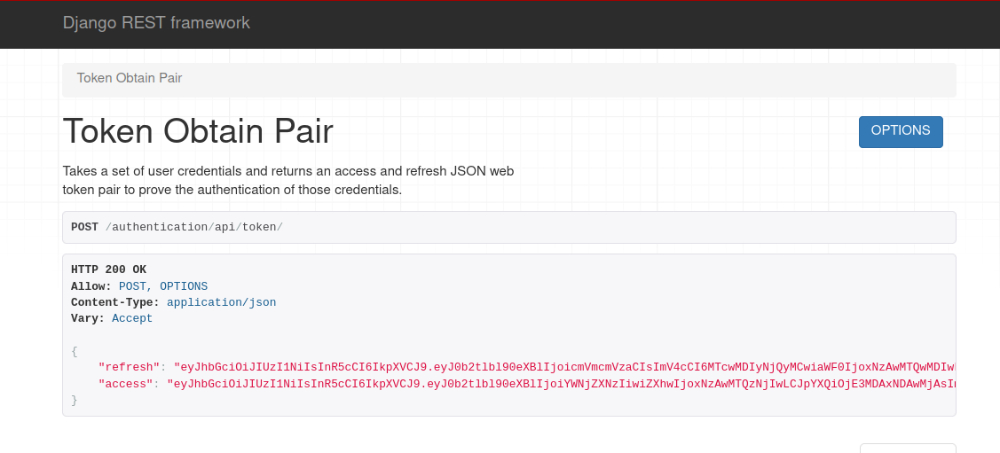
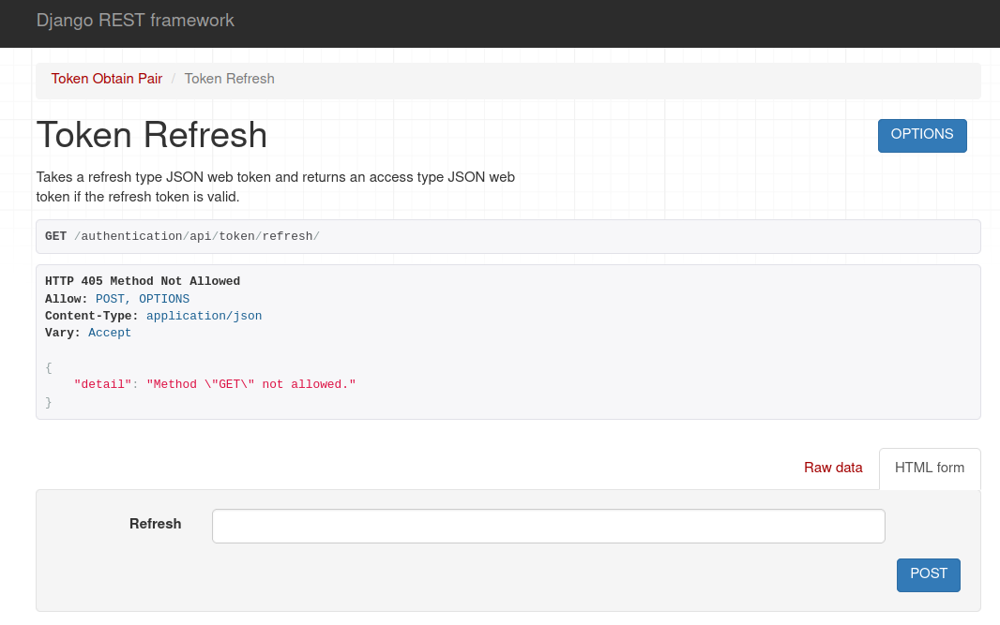
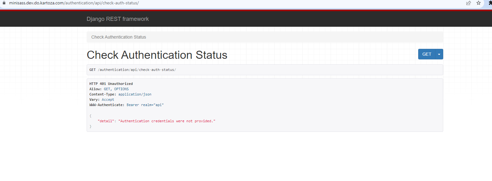
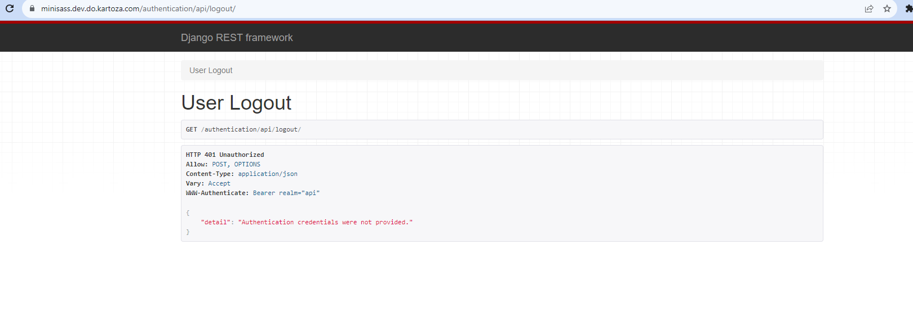
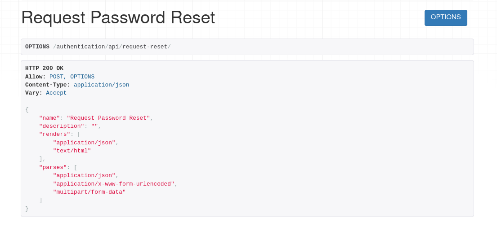

# Authentication API

miniSASS uses JSON Web Tokens (JWT) via Django REST Framework. You obtain a pair
of tokens, send the access token with each request, and swap the refresh token for
a new access token when it expires.

**Base URL.** `https://minisass.org` in production, `http://localhost:61122` for a
local stack. All paths below are relative to it.

!!! note "Trailing slashes matter"
    Every path here is written exactly as the server expects it. Django will not
    match `/authentication/api/login` without the trailing slash. The one
    exception is `/authentication/api/contact-us`, which genuinely has none.

## Token lifetimes

| Token | Lifetime |
| ----- | -------- |
| Access | 60 minutes |
| Refresh | 1 day |

Your client should refresh before the access token expires rather than waiting for
a `401`.

---

## Register

`POST /authentication/api/register/`

```json
{
  "name": "Jane",
  "surname": "Citizen",
  "email": "jane.citizen@example.org",
  "password": "a-strong-passphrase",
  "organizationName": "Example School",
  "organizationType": "NGO",
  "country": "ZA",
  "agree": true
}
```

| Field | Required | Notes |
| ----- | :------: | ----- |
| `name` | yes | Stored as the user's first name |
| `surname` | yes | Stored as the user's last name |
| `email` | yes | Must be unique. **Also becomes the username** |
| `password` | yes | |
| `organizationName` | yes | |
| `organizationType` | yes | Must match an existing lookup, for example `NGO` |
| `country` | yes | **ISO 3166-1 alpha-2 code** such as `ZA`, not a country name |
| `agree` | yes | Privacy policy consent |

!!! warning "The username is the email address"
    There is no separate username. The account's username is set to the email
    address, so that is what you send to `/authentication/api/token/`.

**Responses**

| Status | Meaning |
| ------ | ------- |
| `201` | Account created |
| `400` | `{"error": "This email is already registered."}` or field validation errors |

New accounts are **inactive** until the emailed activation link is followed. See
[Activation](#activation) for what that changes.



---

## Log in

`POST /authentication/api/login/`

```json
{
  "email": "jane.citizen@example.org",
  "password": "a-strong-passphrase"
}
```

Accepts `application/json`, `application/x-www-form-urlencoded` or
`multipart/form-data`.

| Status | Meaning |
| ------ | ------- |
| `200` | Logged in |
| `401` | Invalid credentials, **or the account has not been activated** |





---

## Obtain a token pair

`POST /authentication/api/token/`

```json
{
  "username": "jane.citizen@example.org",
  "password": "a-strong-passphrase"
}
```

Note the field is `username`, and its value is the **email address**.

**Response** `200`

```json
{
  "refresh": "<refresh token>",
  "access": "<access token>"
}
```

!!! warning "Requires an activated account"
    Returns `401` for an account that has not yet followed its activation link.
    `/authentication/api/login/` behaves the same way, so if either returns `401`
    for credentials you believe are correct, check activation first with
    `/authentication/api/check-registration-status/<email>/`.





---

## Refresh a token

`POST /authentication/api/token/refresh/`

```json
{
  "refresh": "<refresh token>"
}
```

**Response** `200`

```json
{
  "access": "<new access token>"
}
```



---

## Using the access token

Send it as a bearer token on every authenticated request:

```bash
curl -H "Authorization: Bearer <access token>" \
     https://minisass.org/monitor/observations/
```

---

## Check authentication status

`GET /authentication/api/check-auth-status/`

Requires authentication. Returns the current user and login state.

```json
{
  "is_authenticated": true,
  "username": "jane.citizen@example.org",
  "email": "jane.citizen@example.org",
  "is_admin": false,
  "is_agreed_to_privacy_policy": true
}
```

Returns `401` when not authenticated.



---

## Log out

`POST /authentication/api/logout/`

Requires authentication. Any frontend action that logs a user out should call
this so the session is ended server-side as well.



---

## Activation

`GET /authentication/api/activate/<uidb64>/<token>/`

The target of the link in the activation email. Following it marks the account
active and redirects with `activation_complete=true`.

To check whether an account has been activated:

`GET /authentication/api/check-registration-status/<email>/`

```json
{
  "email": "jane.citizen@example.org",
  "is_registration_completed": true
}
```

---

## Password reset

**1. Request a reset email**

`POST /authentication/api/request-reset/`

```json
{
  "email": "jane.citizen@example.org"
}
```

| Status | Meaning |
| ------ | ------- |
| `200` | Reset email sent |
| `404` | No account with that email |
| `400` | More than one account shares that email |

**2. Set the new password**

`POST /authentication/api/update-password-reset/<uid>/<token>/`

```json
{
  "newPassword": "a-new-strong-passphrase"
}
```

| Status | Meaning |
| ------ | ------- |
| `200` | Password updated |
| `400` | The password has been used by this account before |



---

## Contact and support requests

`POST /authentication/api/contact-us`

Public, no authentication required. Note this path has **no trailing slash**.

```json
{
  "name": "Jane Citizen",
  "email": "jane.citizen@example.org",
  "phone": "+27 82 000 0000",
  "message": "The map will not load my observation for site 42."
}
```

`email` and `message` are required; a submission missing either returns `400`.

The resulting email is sent to the support team with **`Reply-To` set to the
submitter**, so replying reaches the person who raised the request.

---

## Summary

Register, activate, then obtain a token pair and send the access token as a bearer
token. Refresh before it expires. If login succeeds but token issuance returns
`401`, check activation first.
