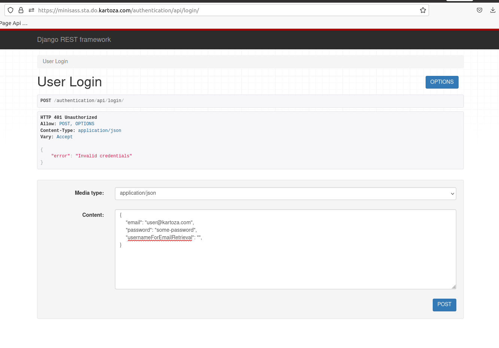

# Authentication API

## Our system uses the Django Rest Framework Authentication Package

## Description

Uses JSON Web Tokens, which are encoded tokens containing user information.
With every request made, the token will be validated for the logged in user.
The token expires after a certain interval, which means on the frontend there should be a mechanism
to refresh the token for example a function to constantly check and determine if the user is still logged in, if so refresh the token.

## How to use

### current_domain: https://minisass.sta.do.kartoza.com/

### 1. https://{current_domain}/authentication/api/login

This API is used for logging in a user.
This API only allows 2 methods:

1. POST
2. OPTIONS

 **POST**: used to submit user credentials. The credentials are accepted in the form of:
    i. application/json
    ii. application/x-www-form-urlencoded
    iii. multipart/form-data

    **example usage**:
    {
        "email": "test@gmail.com",
        "password": "test_password",
        "usernameForEmailRetrieval": "test_username"
    }

 **OPTIONS**: Returns the documentation available for the login api (basic description).

**Additional Info**:
    The api is interactive and will usually return an error message provided the credentials
    are invalid for example 401 unauthorized etc.

**Obtaining a token**:
    All users that are authenticated require a token in order to be able to make
    successful request to the API.

### 2. https://{current_domain}/authentication/api/token/

    example usage:
    {
        "username": "test_user",
        "password": "test_password"
    }

    This will return an access token as well as a refresh token for the user.

**Refreshing the token**:

### 3. https://{current_domain}/authentication/api/refresh/

    example usage: 
    {
        "refresh": "long_refresh_token_string"
    }

    returns a success response 200 with the access token.

**Checking the Authentication status**:

### 4. https://{current_domain}/authentication/api/check-auth-status/

This API is used to confirm if the user is logged in.

    example usage: 
    A get request to the above url.

    returns a success response 200 with the with an object containing user details e.g. is_authenticated variable.

**Logging out a user**:

### 5. https://{current_domain}/authentication/api/logout/

This API is used to logout the user against the authentication backend.
Any action from the frontend that triggers the logout of a user should also call this api. This ensures the user is logged out

    example usage: 
    A post request to the above url

**Registering a user**:

### 6. https://{current_domain}/authentication/api/register/

This API is used for registering a user.
This API only allows 2 methods

1. POST
2. OPTIONS

**POST**: used to submit user details. The details are accepted in the form of:
    i. application/json
    ii. application/x-www-form-urlencoded
    iii. multipart/form-data

    example usage: 
    {
        "username": "test_user",
        "first_name": "test_name",
        "last_name": "test_lastname",
        "email": "test@kartoza.com",
        "password": "test_password",
        "organizationType": "NGO",
        "organizationName": "test",
        "country": "South Africa",
        "additional_fields": "additional_data"
    }

    returns success response 201 created.

**Additional data** for the user is saved on their User Profile:
    Currently, fields required:
    i.organisation_type
    ii.organisation_name
    iii.country
    These fields are mandatory on registration or a 400 bad request error is returned.

**Additional Info**:
    This API is also interactive, returns errors for example
    400 bad request ie `enter a valid email`.

**Requesting Password Reset**:

### 5. https://{current_domain}/authentication/api/request-reset

    This API enables the user to reset their forgotten password from the frontend.

    example usage: 
    {
        "email": "users_email"
    }

    returns a success message and a 200 ok.

**Additional Info**:
    The user will receive an email with the instructions on how to reset their forgotten password.

### Summary

The `Authentication API, is responsible for login, registration and password reset.
