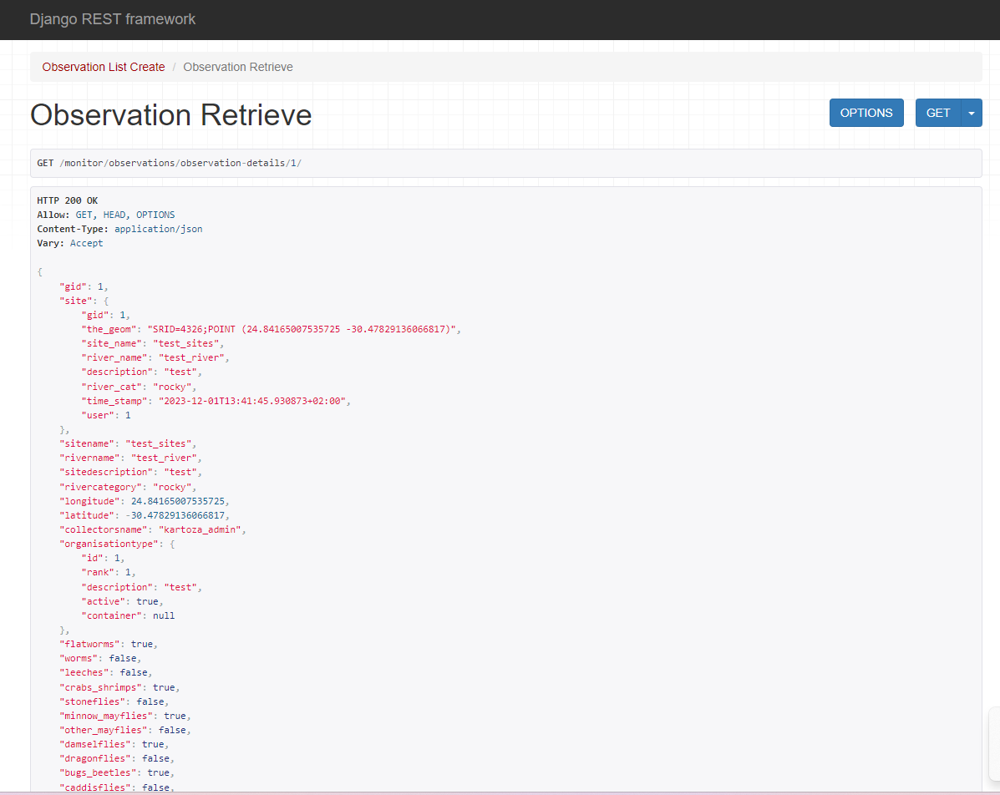

# Observations and Images API Documentation

The Observations API facilitates users in creating observations for various sites, allowing the specification of existing site IDs or the creation of new sites if they are not available. Additionally, it enables retrieval of recent observations, access to all observations, fetching a single observation, and other CRUD (Create, Retrieve, Update, Delete) operations.

## current_domain: https://minisass.sta.do.kartoza.com/

## Endpoints

1. **CREATE** `https://{current_domain}/monitor/observations-create/`

- **Request Type**: POST
- **Authentication**: User authentication required (Login)
- **CSRF Protection**: Exempted
- **Content Type**: Application/JSON

### Request Payload


The API expects a JSON payload containing the following fields:

- `datainput`: Object containing observation data.
    - `score`: Decimal value representing the observation score.
    - `notes`: Comments or notes regarding the observation.
    - `waterclaritycm`: Decimal value representing water clarity.
    - `watertemperatureOne`: Decimal value representing water temperature.
    - `ph`: Decimal value representing pH.
    - `dissolvedoxygenOne`: Decimal value representing dissolved oxygen.
    - `dissolvedoxygenOneUnit`: Unit for dissolved oxygen (default: 'mgl').
    - `electricalconduOne`: Decimal value representing electrical conductivity.
    - `electricalconduOneUnit`: Unit for electrical conductivity (default: 'mS/m').
    - `selectedSite`: ID of an existing site or 0 if a new site is to be created.
    - `siteName`: (Optional) Name of the new site.
    - `riverName`: (Optional) Name of the river for the new site.
    - `siteDescription`: (Optional) Description of the new site.
    - `rivercategory`: (Optional) River category for the new site.
    - `longitude`: (Optional) Longitude for the new site's location.
    - `latitude`: (Optional) Latitude for the new site's location.
    - `date`: Observation date.

### Response

- **Success Response**: 
    - Status Code: 200 OK
    - JSON Response:
        ```json
        {
            "status": "success",
            "observation_id": observation_id
        }
        ```
        - `observation_id`: ID of the created observation.

- **Error Response**:
    - Status Code: 500 Internal Server Error
    - JSON Response:
        ```json
        {
            "status": "error",
            "message": "Error message details..."
        }
        ```
        - `message`: Details of the encountered error.

### Steps to Use

1. **Provide Payload Data**: To create observations, you'll need to send a POST request to the `/create-observations/` endpoint with the required payload. 
2. **Payload Structure**: Include observation data within the `datainput` object. Specify site ID for existing sites or create a new site by adding its details and setting `selectedSite` to 0.
3. **Understanding GeoLocation**: For new sites, use `longitude` and `latitude` for the site's location.
4. **Checkboxes**: Use boolean values (True/False) for checkboxes indicating checked groups.
5. **Observation Creation**: Upon success, the API returns the observation ID in the response.
6. **Error Handling**: In case of errors, the API responds with an error message for troubleshooting.

### Below is an example of the object structure to be included in the request:

```javascript
const observationsData = {
  flatworms: true,
  leeches: false,
  crabs_shrimps: true,
  stoneflies: false,
  minnow_mayflies: false,
  other_mayflies: false,
  damselflies: false,
  dragonflies: false,
  bugs_beetles: false,
  true_flies: false,
  caddisflies: false,
  snails: false,
  datainput: {
    // Data input for the observation
    score: 5.5,
    notes: "Comments or notes regarding the observation",
    waterclaritycm: 8.2,
    watertemperatureOne: 25.3,
    ph: 7.0,
    dissolvedoxygenOne: 9.1,
    dissolvedoxygenOneUnit: "mgl",
    electricalconduOne: 15.7,
    electricalconduOneUnit: "mS/m",
    selectedSite: 0, // ID of an existing site or 0 if creating a new site

    // If creating a new site, include the following:
    siteName: "New Site Name",
    riverName: "New River",
    siteDescription: "Description of the new site",
    rivercategory: "Rocky",
    longitude: 24.84165,
    latitude: -30.47829,
    date: "2023-12-01" // Observation date
  }
};

axios.post(`${current_domain}/monitor/observations-create/`, observationsData);
```

2. **GET RECENT OBSERVATIONS** `https://{current_domain}/monitor/observations/recent-observations/`


- **Request Type**: GET
- **Authentication**: None required
- **CSRF Protection**: Not applicable
- **Content Type**: Not applicable

### Response

The response contains a list of recent observations, limited to a maximum of 20, ordered by their timestamp.

#### Response Structure

Each observation object in the response includes the following fields:
- `observation`: ID of the observation
- `site`: Name of the site associated with the observation
- `username`: Username of the user who submitted the observation
- `organisation`: Organization name (if available) associated with the user
- `time_stamp`: Timestamp of the observation
- `score`: Score assigned to the observation

#### Example Response

```json
[
  {
    "observation": 123,
    "site": "Site Name",
    "username": "User123",
    "organisation": "Organization Name",
    "time_stamp": "2023-12-01T13:41:45.930873+02:00",
    "score": 5.5
  },
  {
    "observation": 124,
    "site": "Another Site",
    "username": "User456",
    "organisation": "",
    "time_stamp": "2023-11-30T09:15:30.123456+02:00",
    "score": 6.8
  },
]
```

3. **GET OBSERVATION DETAILS** `https://{current_domain}/monitor/observations/observation-details/<observation_id>/`



This API endpoint retrieves a specific observation by its ID.

## Endpoint

`/observations/<observation_id>/`

- **Request Type**: GET
- **Authentication**: Not required
- **CSRF Protection**: Not applicable
- **Content Type**: Not applicable

### Response

The response contains details of the requested observation.

#### Response Structure

The response includes various details related to the observation:

- `observation`: ID of the observation
- `site`: Site details associated with the observation, including:
  - `sitename`: Name of the site
  - `rivername`: Name of the river for the site
  - `sitedescription`: Description of the site
  - `rivercategory`: Category of the river for the site
  - `longitude`: Longitude of the site's location
  - `latitude`: Latitude of the site's location
- `collectorsname`: Name of the user who collected the observation
- `organisationtype`: Organization type associated with the user (if available)

#### Example Response

```json
{
  "observation": 123,
  "site": {
    "sitename": "Sample Site",
    "rivername": "Sample River",
    "sitedescription": "Description of the site",
    "rivercategory": "Rocky",
    "longitude": 24.84165,
    "latitude": -30.47829
  },
  "collectorsname": "John Doe",
  "organisationtype": {
    "id": 1,
    "description": "NGO"
  }
}
```

4. **Observation Update, and Deletion** `https://{current_domain}/monitor/observations/observation-details/<observation_id>/`


This API endpoint allows retrieving, updating, or deleting a specific observation by its ID.

## Endpoint

`/observations/<observation_id>/`

- **Request Type**: GET (Retrieve), PUT (Update), DELETE (Delete)
- **Authentication**: Required (User authentication)
- **CSRF Protection**: Not applicable
- **Content Type**: Application/JSON

### Retrieve Observation

#### Request Type: GET

- **Authentication**: Required
- **Permission**: Read permission required
- **Response**: Details of the requested observation

### Update Observation

#### Request Type: PUT

- **Authentication**: Required
- **Permission**: Write permission required
- **Request Payload**: JSON object with updated observation data
- **Response**: Updated observation details

```json
{
  "score": 8.0,
  "waterclaritycm": 9.2,
  "notes": "Updated notes for the observation",
  // Other fields to update
}
```

### Delete Observation

#### Request Type: DELETE

- **Authentication**: Required
- **Permission**: Delete permission required
- **Response**: Confirmation of successful deletion


## Images use the same API for observations 


### 1. **creating an observation with images**

### Example payload

```json
{
  "image_0": "(binary)",
  "pest_0:flatworms": "(binary)",
  "pest_0:stoneflies": "(binary)",
  "data": {
    "score": 13,
    "datainput": {
      "riverName": "river_test1",
      "siteName": "site_1",
      "siteDescription": "test",
      "rivercategory": "sandy",
      "sitelocation": "",
      "selectKnownSite": "",
      "selectOnMap": "",
      "typeInCoordinates": "",
      "observationdetaOne": "",
      "date": "2023-12-08",
      "collectorsname": "Tinashe",
      "notes": "test",
      "measurements": "",
      "waterclaritycm": 22,
      "watertemperaturOne": 18,
      "ph": 14,
      "dissolvedoxygenOne": 13,
      "electricalconduOne": 16,
      "dissolvedoxygenOneUnit": "%DO",
      "electricalconduOneUnit": "µS/cm",
      "latitude": 0,
      "longitude": 0,
      "selectedSite": "",
      "images": [{}]
    },
    "flatworms": true,
    "stoneflies": true,
    "other_mayflies": true
  }
}
```

### Additional Information

1. **image_0:** Represents a site image. If uploading multiple site images, it would be `image_0`, `image_1`, etc.
2. For attaching images to pests/groups (e.g. flatworms, stoneflies, other_mayflies), the variable should be named `"pest_0:name_of_pest"`. The value should be the binary file (image), and the corresponding pest/group must be set to `true`.
3. Accommodations for file uploading should be made on the frontend. Simply call the API for observation creation, passing the required parameters, and all the data will be saved on that site.

### 2. Retrieving Observations with images


- The response returned from the API will contain an `images` field that will have the observation images.
- each image is an object containing 
```
the id of the image
the pest_id
the pest_name
the image path
```

### 3. Deleting an observation Image

- When deleting an image, make a DELETE request, supplying the following:
  - Observation ID
  - Pest Image ID to delete

### Example URL:
- https://{current_domain}/monitor/observations/observation-details/1/image/1/

### Endpoint:

- `/observations/observation-details/{observation_pk}/image/pest_image_id/`

#### Request Type: DELETE

- **Authentication**: Required
- **Permission**: creator of observation
- **Response**: Confirmation of successful deletion


### 4. Fetching Site Images

- Consume the same API endpoint for sites and the returned object contains the images on that site:


### Additional Information

1. **images** Images is an array type containing the images for that particular site.


## Response Types

### HTTP 401 Unauthorized
The request lacks valid authentication credentials or the authentication has failed.

### HTTP 403 Forbidden
The request lacks valid permissions to perform the action they intend.

### HTTP 200 OK
The request has succeeded. The information returned with the response is dependent on the specific view or action performed.

### HTTP 201 Created
The request has been fulfilled, resulting in the creation of a new resource. This indicates a successful creation of an observation.


This API is subject to changes or improvements. Always check for updates.
