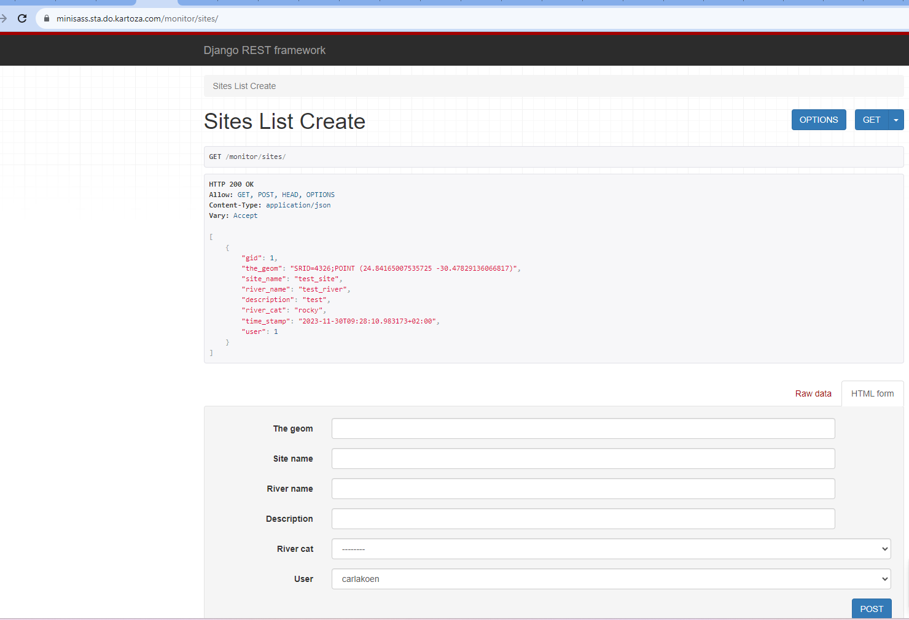
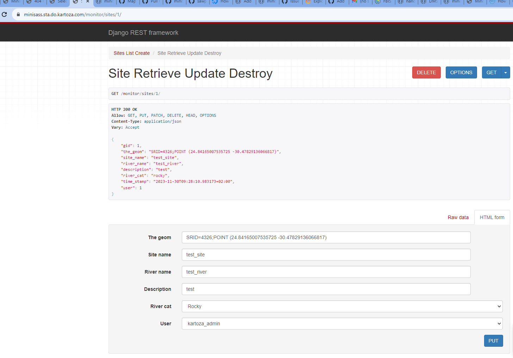
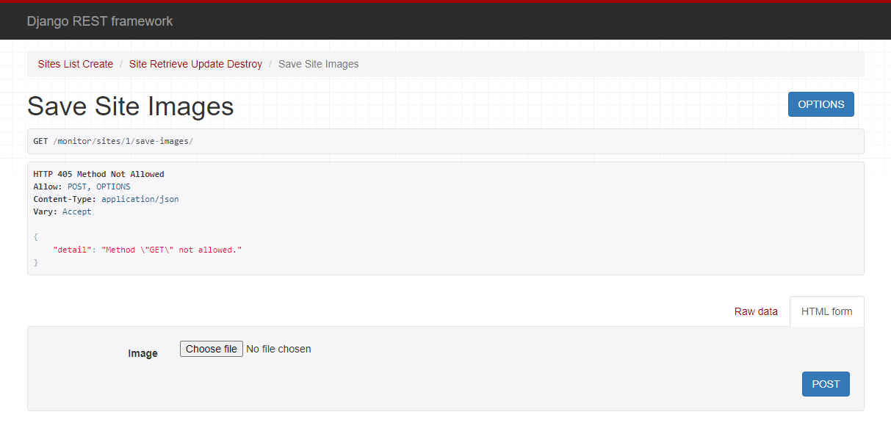

# Sites API

## Description

The Sites API offers CRUD (Create, Read, Update, Delete) operations for managing site information.

## How to Use

**current_domain**: https://minisass.org/



### 1. Retrieve All Sites

#### Endpoint: `https://{current_domain}/monitor/sites/`

- **GET METHOD**: Retrieve a list of all sites.
- **Authentication**: Not required. This endpoint is public.

Returns an HTTP 200 OK and an array of the sites stored in the database.
- example output:
```[
    {
        "gid": 1,
        "the_geom": "SRID=4326;POINT (24.84165007535725 -30.47829136066817)",
        "site_name": "test_sites",
        "river_name": "test_river",
        "description": "test",
        "river_cat": "rocky",
        "time_stamp": "2023-12-01T13:41:45.930873+02:00",
        "user": 1,
        "images": []
    },
    {
        "gid": 3,
        "the_geom": "SRID=4326;POINT (24.84165007535725 -30.47829136066817)",
        "site_name": "testing",
        "river_name": "testing",
        "description": "testing",
        "river_cat": "rocky",
        "time_stamp": "2023-12-01T14:13:46.123655+02:00",
        "user": 1,
        "images": []
    }
]
```

### 2. Create a Site

#### Endpoint: `https://{current_domain}/monitor/sites/`

- **Authentication**: **Required.** An unauthenticated `POST` returns `401`.

Fields required for site creation:

| Field | Type | Notes |
| ----- | ---- | ----- |
| `the_geom` | Point | `SRID=4326;POINT (<longitude> <latitude>)`. Longitude first |
| `site_name` | string | Mandatory, max length **50** |
| `river_name` | string | Mandatory, max length **50** |
| `description` | string | Optional, max length 255 |
| `river_cat` | string | One of `rocky` or `sandy` |
| `user` | integer | User reference |
| `time_stamp` | datetime | Optional; set to the current time when omitted |

!!! warning "Coordinate order and valid range"
    `POINT` takes **longitude first, then latitude**, which is the opposite of how
    coordinates are usually spoken. Getting this backwards is the most common
    mistake when creating sites, and it places the site in the wrong hemisphere.

    Latitude must be between -90 and 90, longitude between -180 and 180. A new
    site whose coordinate falls in the ocean is rejected. You can check a
    coordinate before submitting with
    `GET /monitor/sites/is-land/<latitude>/<longitude>/`, which returns
    `{"is_land": true}` or `{"is_land": false}`. Note that endpoint takes
    **latitude first**.

The site's `country` is derived automatically from the coordinate on save.

These fields should be attached to the post request as a json object.
- **POST METHOD**: Create a new site.
  - Example Payload:
    ```json
    {
        "the_geom": "SRID=4326;POINT (24.84165007535725 -30.47829136066817)",
        "site_name": "test_site",
        "river_name": "river_name",
        "description": "description",
        "river_cat": "rocky",
        "user": 1
    }
    ```

Returns an HTTP 201 Created.

### 3. Retrieve a Site



#### Endpoint: `/monitor/sites/<site_id>/` (e.g., `https://{current_domain}/monitor/sites/1/`)

- **GET METHOD**: Retrieve details of a specific site by its ID.

Returns a JSON object:
```json
{
    "gid": 1,
    "the_geom": "SRID=4326;POINT (24.84165007535725 -30.47829136066817)",
    "site_name": "test_sites",
    "river_name": "test_river",
    "description": "test",
    "river_cat": "rocky",
    "time_stamp": "2023-12-01T13:41:45.930873+02:00",
    "user": 1,
    "images": []
}
```


### 4. Update a Site

#### Endpoint: `/monitor/sites/<site_id>/` (e.g., `https://{current_domain}/monitor/sites/1/`)

Any field can be updated on the site

- **PUT METHOD**: Update details of a specific site by its ID.
  - Example Payload:
    ```json
    {
        "site_name": "Updated Site Name",
        // Other fields to update
    }
    ```

### 5. Delete a Site

#### Endpoint: `/monitor/sites/<site_id>/`

- **DELETE METHOD**: Delete a specific site by its ID.

### 6. Adding images to a Site



#### Endpoint: `/monitor/sites/<site_id>/save-images/`

- **POST METHOD**: uses a post method to upload images.
  
#### prerequisites
  - authenticated user or user_id supplied in the request object.
  - format:'multipart' (recommended), Form, JSON.
  - Example Payload:
    ```
    {
        'images': image_files,
        'user_id': 1
    }
    ```

#### Responses
  - HTTP_201_CREATED: when the image/s is/are successfully saved.
  - HTTP_400_BAD_REQUEST: invalid site id supplied (non integer, unconvertable string char etc).
  - HTTP_404_NOT_FOUND: no site exist with specified id.
  - HTTP_500_INTERNAL_SERVER_ERROR: provided image is invalid or something unexpected occurred.


## Summary

This API allows:
- Retrieving all sites (GET METHOD)
- Retrieving a single site (GET METHOD WITH ID PARAMETER)
- Updating a specific site (PUT METHOD WITH ID PARAMETER)
- Creating a new site (POST METHOD WITH REQUIRED FIELDS)
- Deleting a specific site (DELETE METHOD WITH REQUIRED FIELDS)
- Saving images to a specific site (POST METHOD WITH SITE ID PARAM AND REQUIRED FIELDS IN REQUEST OBJECT)

The API is subject to changes and improvements, so always refer back to see any updates.
