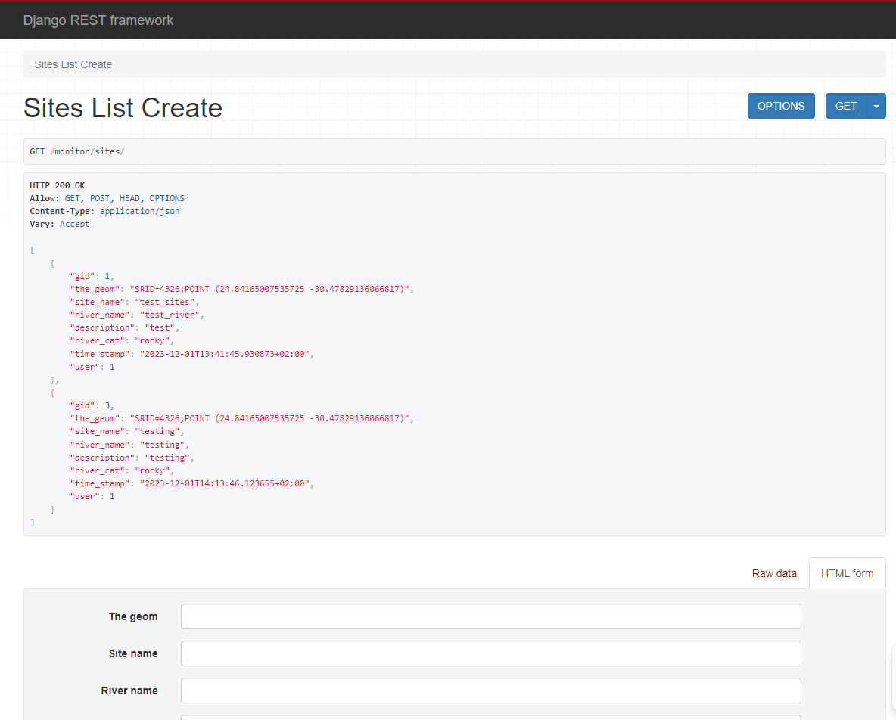
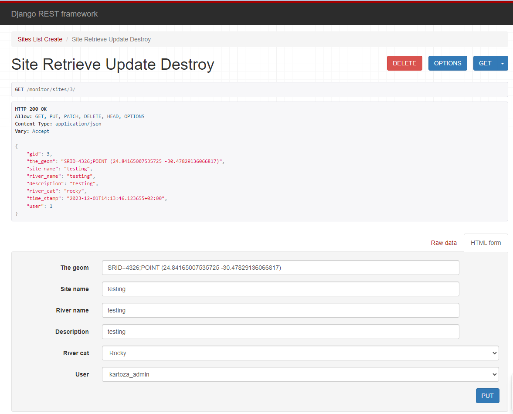

# Sites API

## Description

The Sites API offers CRUD (Create, Read, Update, Delete) operations for managing site information.

## How to Use

**current_domain**: https://minisass.sta.do.kartoza.com/



### 1. Retrieve All Sites

#### Endpoint: `https://{current_domain}/monitor/sites/`

- **GET METHOD**: Retrieve a list of all sites.

Returns an HTTP 200 OK and an array of the sites stored in the database.
- example output:
```[
    {
        "gid": 1,
        "the_geom": "SRID=4326;POINT (24.84165007535725 -30.47829136066817)",
        "site_name": "test_sites",
        "river_name": "test_river",
        "description": "test",
        "river_cat": "rocky",
        "time_stamp": "2023-12-01T13:41:45.930873+02:00",
        "user": 1
    },
    {
        "gid": 3,
        "the_geom": "SRID=4326;POINT (24.84165007535725 -30.47829136066817)",
        "site_name": "testing",
        "river_name": "testing",
        "description": "testing",
        "river_cat": "rocky",
        "time_stamp": "2023-12-01T14:13:46.123655+02:00",
        "user": 1
    }
]
```

### 2. Create a Site

#### Endpoint: `https://{current_domain}/monitor/sites/`

Fields required for site creation:
- `the_geom`: Geometric point field (e.g., SRID=4326;POINT (24.84165007535725 -30.47829136066817))
- `site_name`: Name of the site (max length: 15, mandatory)
- `river_name`: Name of the river (max length: 15, mandatory)
- `description`: Description of the site (max length: 255)
- `river_cat`: River category (choices: 'rocky', 'sandy')
- `user`: User reference
- `time_stamp`: Optional field ,if not provided current datetime is added to the site

These fields should be attached to the post request as a json object.
- **POST METHOD**: Create a new site.
  - Example Payload:
    ```json
    {
        "the_geom": "SRID=4326;POINT (24.84165007535725 -30.47829136066817)",
        "site_name": "test_site",
        "river_name": "river_name",
        "description": "description",
        "river_cat": "rocky",
        "user": 1
    }
    ```

Returns an HTTP 201 Created.

### 3. Retrieve a Site



#### Endpoint: `/sites/<site_id>/` (e.g., `https://{current_domain}/monitor/sites/1/`)

- **GET METHOD**: Retrieve details of a specific site by its ID.

Returns a JSON object:
```json
{
    "gid": 1,
    "the_geom": "SRID=4326;POINT (24.84165007535725 -30.47829136066817)",
    "site_name": "test_sites",
    "river_name": "test_river",
    "description": "test",
    "river_cat": "rocky",
    "time_stamp": "2023-12-01T13:41:45.930873+02:00",
    "user": 1
}
```


### 4. Update a Site

#### Endpoint: `/sites/<site_id>/` (e.g., `https://{current_domain}/monitor/sites/1/`)

any field can be updated on the site 

- **PUT METHOD**: Update details of a specific site by its ID.
  - Example Payload:
    ```json
    {
        "site_name": "Updated Site Name",
        // Other fields to update
    }
    ```

### 5. Delete a Site

#### Endpoint: `/sites/<site_id>/`

- **DELETE METHOD**: Delete a specific site by its ID.

## Summary

This API allows:
- Retrieving all sites (GET METHOD)
- Retrieving a single site (GET METHOD WITH ID PARAMETER)
- Updating a specific site (PUT METHOD WITH ID PARAMETER)
- Creating a new site (POST METHOD WITH REQUIRED FIELDS)
- Deleting a specific site (DELETE METHOD WITH REQUIRED FIELDS)

The API is subject to changes and improvements, so always refer back to see any updates.
