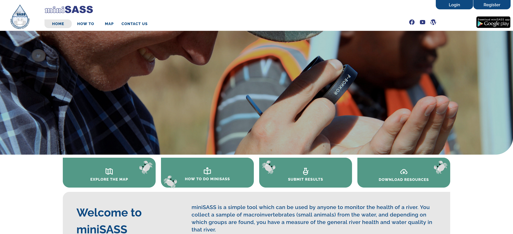

# Welcome to MiniSASS

## miniSASS Web Application and CMS

Copyright (C) CGIAR Initiative on Digital Innovation with UNICEF.

This program is free software: you can redistribute it and/or modify it under the terms of the GNU General Public
License as published by the Free Software Foundation, either version 3 of the License, or (at your option) any
later version.

This program is distributed in the hope that it will be useful, but WITHOUT ANY WARRANTY; without even the implied
warranty of MERCHANTABILITY or FITNESS FOR A PARTICULAR PURPOSE. See the GNU General Public License for more details.

You should have received a copy of the GNU General Public License along with this program.
If not, see <http://www.gnu.org/licenses/>.

Contact: `MiniSASS admin team` `info@minisass.org`

A running instance is accessible through [miniSASS](https://minisass.org/)

## Running your own instance

You can deploy your own instance by following instructions in [installation](./developer/install.md)

## Support

If you experience issues when interacting with the platform or setting up your own instance
please report the issues through [GitHub Issue Tracker](https://github.com/kartoza/miniSASS/issues)

## About

Please visit the [About](./about/index.md) page for more information regarding contributors.
