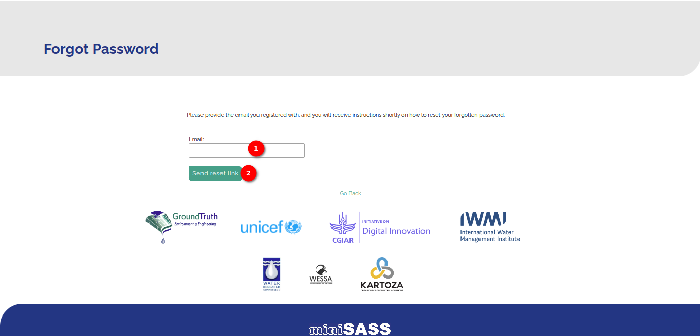

# miniSASS Forgot Password Page User Guide

Welcome to the miniSASS Forgot Password Guide. In this guide, I'll walk you through the steps to reset your password if you've forgotten it.

## How do I reset password

Click on the 1️⃣ `click here` link, to go to the forgot password page.

Upon clicking on the link you will be redirected to the forgot password page where you need to enter your email address in the 1️⃣ email field in order to receive a reset password email. Once you entered your email click on the 2️⃣ `Send reset link` button to submit your forgot password request.

On successful submission the success message will be displayed.

Upon initiating the password reset process, you will receive an email containing a link to reset your password. You have three options to access the password update page:

Within the email, there will be a 1️⃣ button labelled `Reset Password`. You can click on this button to be directed to the password update page. Alternatively, you can simply click on the 2️⃣ `Click Here` link provided in the email. This will also take you to the password update page. Or you can manually copy the provided link 3️⃣ from the email and paste it into your web browser's address bar. Press Enter to navigate to the password update page.

Upon clicking on any of three options you will be redirected to the update password page. Enter the new password into the 1️⃣ password fields and click on the 2️⃣ `Reset` button to reset the password.

Upon successfully updating your password, you will receive a confirmation message indicating the update was successful. YOu can click on the `Go Back` button to go to the home page.

Once you are back on the home page, you will find the login button. Click on the login button, and you will be directed to the login page where you can proceed to log in using your new password.