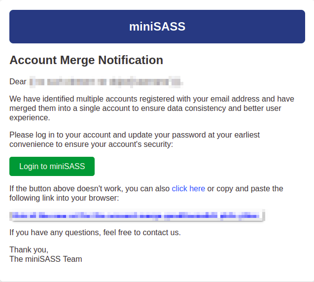
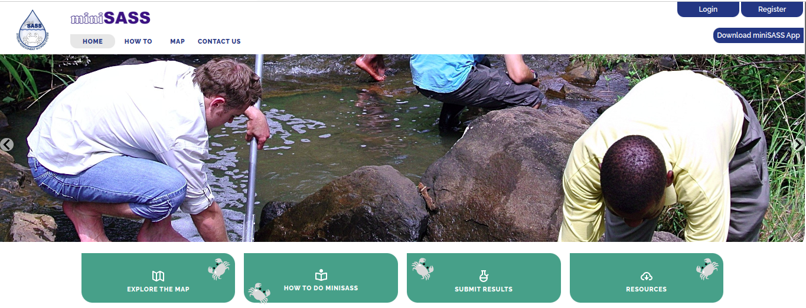

# Legacy User Accommodation (Account Merge Process)

When you receive an email notifying you about account merging, it is important to understand the process and what it entails. Here's a guide to help you navigate through this process:

## Why am I Receiving this Email?

- You are receiving this email because our system has detected multiple accounts associated with the same email address.

- To ensure data accuracy and streamline your experience, we are merging these duplicate accounts into one.

## What Happens During the Account Merge Process?

- Our system will identify all duplicate accounts linked to your email address.

- Among these duplicates, first account will be selected as the primary account, and all related data will be consolidated under this account.

- Any redundant or duplicate accounts will be disposed of to maintain data integrity and reduce clutter in our system.

## What Happens After Account Merge?

- After the merge process is completed, you will have a single, consolidated account that contains all your information and data from the duplicate accounts.

- Your login credentials, preferences, and other account settings will remain unchanged.

- You can continue using the platform as usual with your merged account.

## Email Notification:

- After the account merge process is completed, you will receive a notification email confirming the merge and detailing any changes made to your account.

- This email serves to keep you informed about the actions taken and ensures transparency throughout the process.

### To access the miniSASS login page, follow these steps:

- Simply click on the 1️⃣ button labeled `Login to miniSASS`. This will directly take you to the miniSASS login page.

- In case the button does not work, you can alternatively click on the 2️⃣ `click here` link. This will also redirect you to the miniSASS login page.

- If both the button and link do not work, you can manually copy and paste the 3️⃣ `Login URL` into your web browser.

Upon reaching the login page, please proceed to log in using your credentials.

> Note: We kindly request you to log in to your account and update your password at your earliest convenience to ensure the security of your account.

## Need Help or Have Questions?

If you have any questions or concerns regarding the account merge process, please don't hesitate to reach out to our support team. We are here to assist you and ensure a smooth transition as we consolidate your accounts.

We appreciate your understanding and cooperation as we work to improve our system's efficiency and enhance your experience on our platform. If you have any further inquiries, feel free to contact us at any time. Click on the [Contact Us](../manual/contact-us.md) for the detailed documentation on how to contact with miniSASS team.

Thank you for being a valued member of our community!
