# miniSASS Map User Guide

Welcome to the `Map User Guide` This guide will walk you through how you can use the map, layers, and filters.

## how can I access the Map?

To access the map click on the `Map` option available in the navigation options.

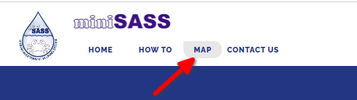

Upon clicking you will be redirected to the map page, where you can utilise the features of the map.

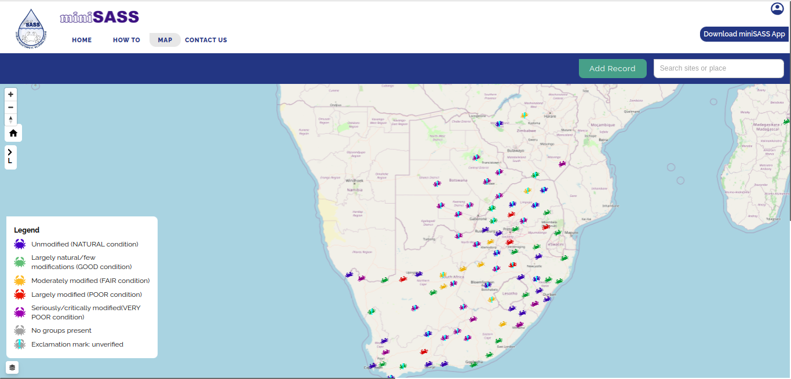

## How can I hide/unhide the legend?

By default, the legend is shown on the map page but you can hide the legend for a cleaner view by clicking on the 1️⃣ `Arrow` icon.

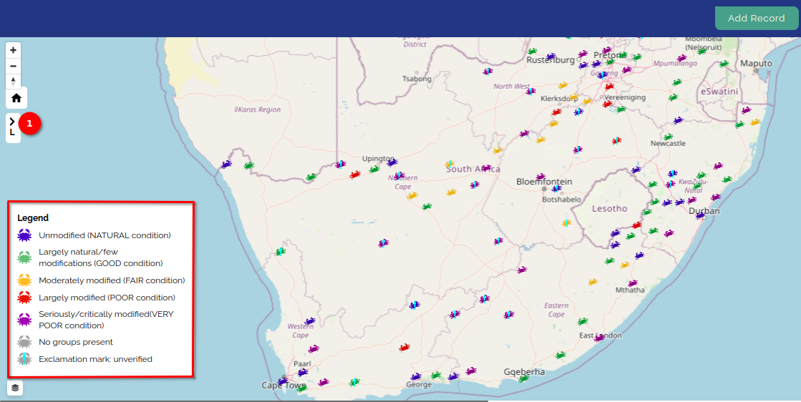

Upon clicking the icon, the legend will be hidden.

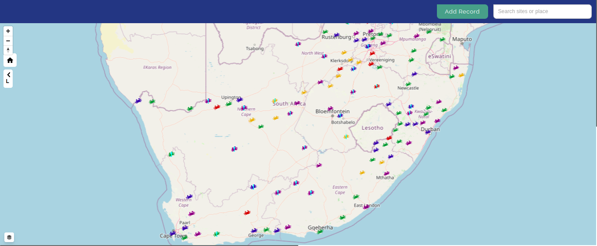

## How can I search for the site?

You can search for the desired site on the map by typing into the 1️⃣ search bar located in the top right corner.

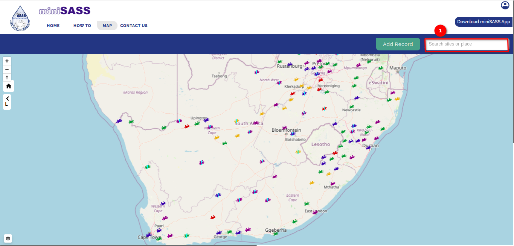

Type the desired site name into the search field and select from the given suggestions to find the site.

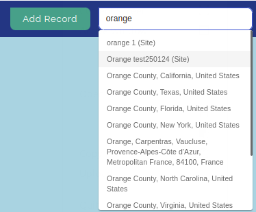

Upon selecting the site from the suggestions, the map will zoom to the searched site location.

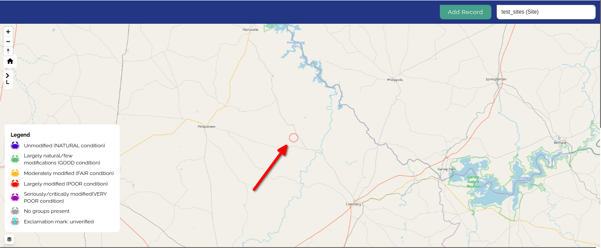

## How can I change the layers?

By default, the miniSASS Observation (Overlay layer) and the Default (Base layer) is selected to show the map but you can change the layer for a different view.

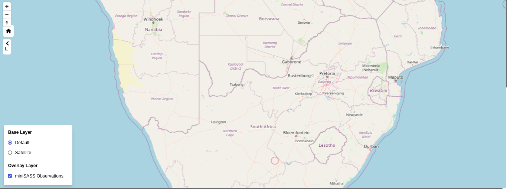

To change the layer click on the 1️⃣ layer icon available in the bottom left corner.

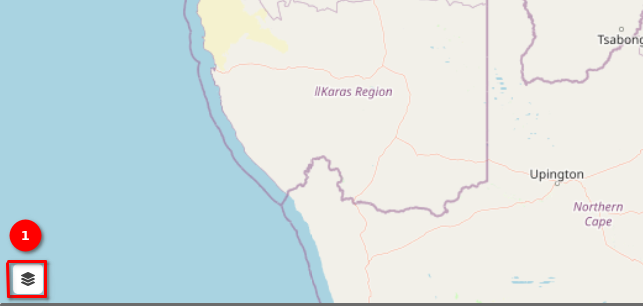

Upon clicking the icon, the popup will open, where you can select the layer. To select the `Satellite` layer click on the 1️⃣ radio button available in front of the satellite.

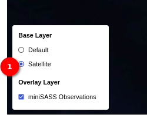

After selecting the satellite layer, the map will display satellite images.

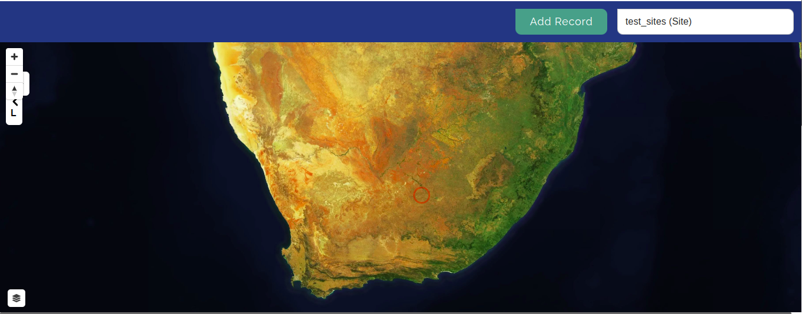

## How can I use the map controls?

You can use the map controls to view the map as per the requirements. Click on the 1️⃣ `Plus` icon, to zoom in on the map, and click on the 2️⃣ `Minus` icon, to zoom out the map. Click and move the 3️⃣ `Compass` icon to rotate the map or just click on the icon to reset to the north. Click on the 4️⃣ `Home` icon to zoom in to the selected site (if you have selected the site) or to return to the normal map view.

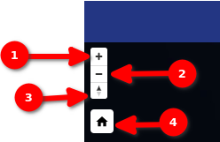

#### Zoom-In View

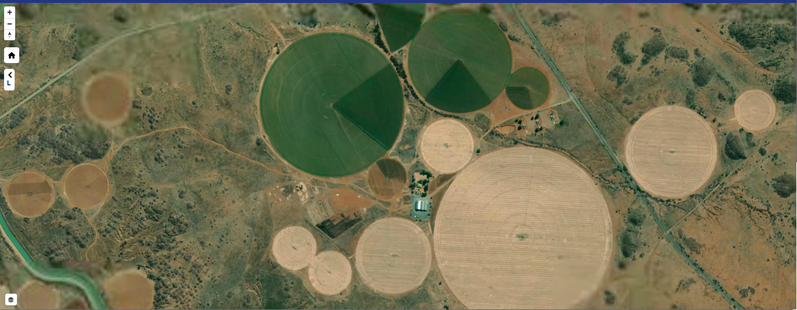

#### Zoom-Out View

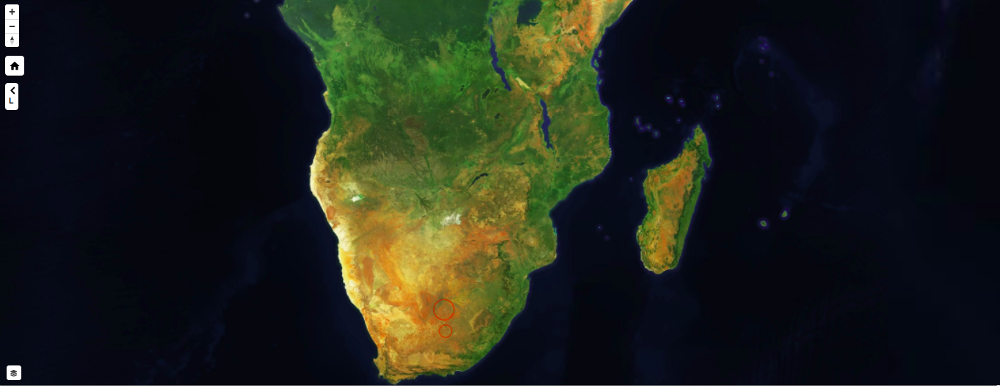

#### Rotated View

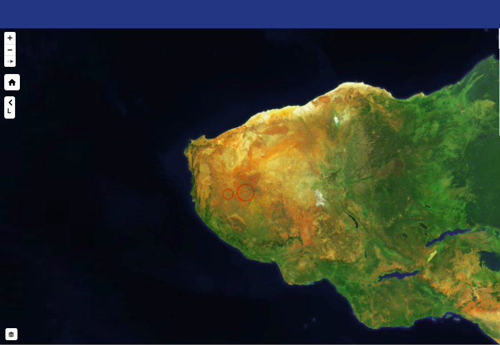

#### Zoom to the Site 

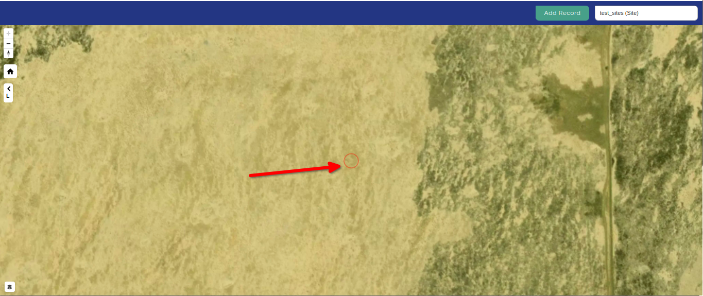
