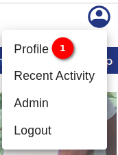
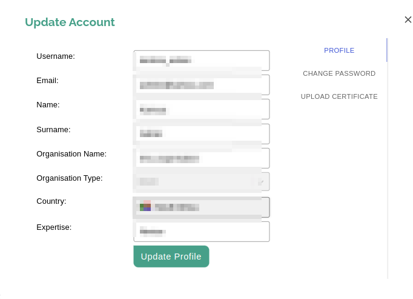
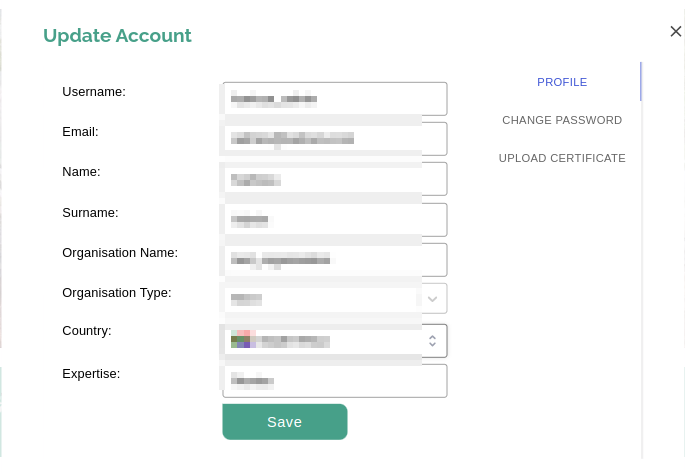
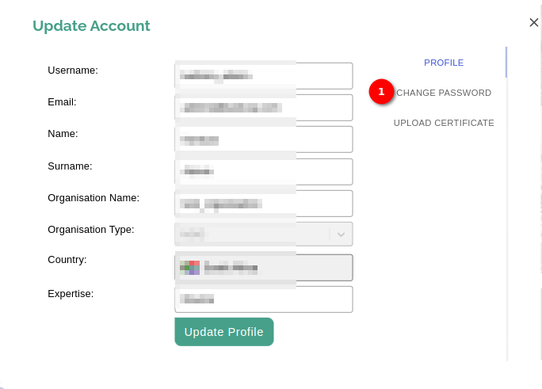
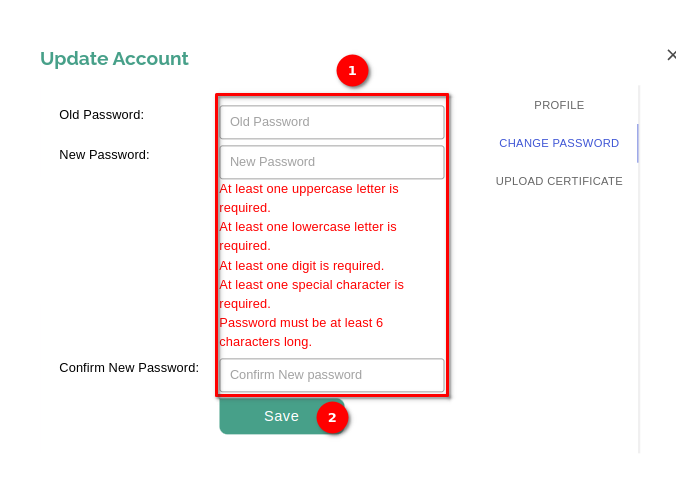
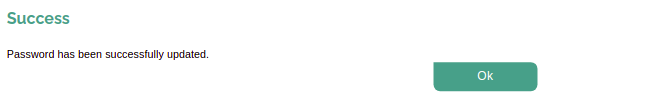
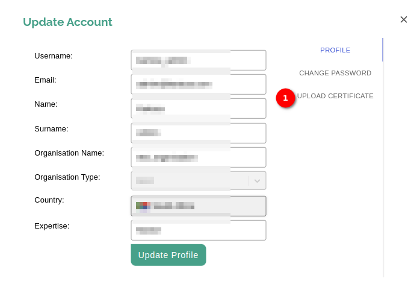
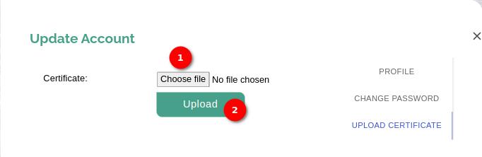
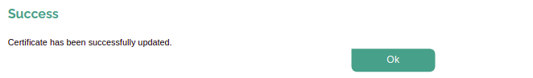

# miniSASS Profile User Guide

Welcome to the Profile user manual. This guide is designed to help users navigate and make the most of the profile experience. The profile page allows users to manage their personal information, customise settings, and access various features. Follow the instructions below to explore and use the profile form efficiently.

## How can I access the profile page?

Click on the profile icon available on the top right corner to unveil the options. To go to the profile page click on the 1️⃣ `Profile` option.

## How can I update the profile?

Upon clicking on the profile option, the profile form will open where you can update your profile-related details. To update the details, you need to click on the 1️⃣ `Update Profile` button. After that, you will be able to edit the details in the given fields.

Click on the 1️⃣ `Save` button to save the updated details.

## How can I change password?

To change your password click on the 1️⃣ `CHANGE PASSWORD`.

Upon clicking on this link, the change password form will open. Fill the 1️⃣ old password, new password and confirm password fields, then click on the 2️⃣ `Save` button to save the new password.

On successful submission the success message will be displayed.

## How can I upload certificate?

To upload your certificate, Click on the 1️⃣ `UPLOAD CERTIFICATE`.

Upon clicking on this link, the upload certificate form will open. Click on the 1️⃣ `Choose file` button to choose the file from the system and then click on the 2️⃣ `Upload` button to upload the certificate.

On successful submission the success message will be displayed.

