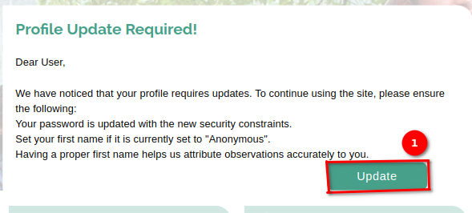
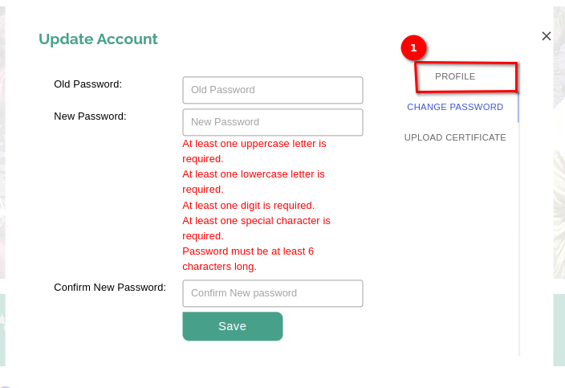
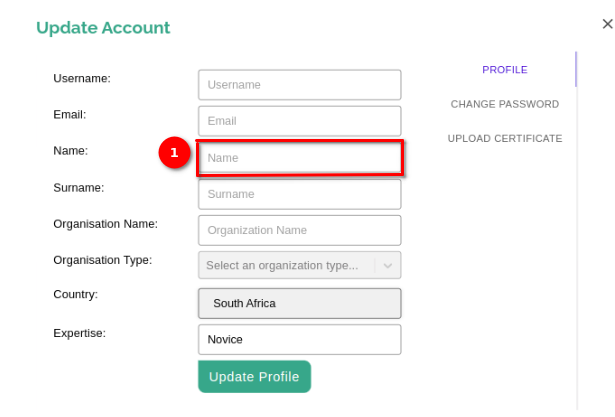
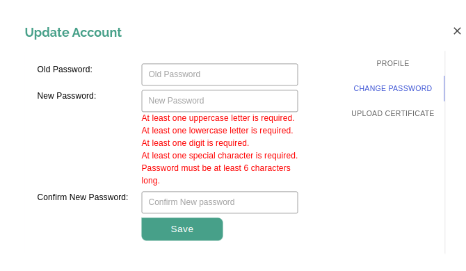

# User Guide: Registration, Login, and Logout on miniSASS

## How do I register on the site?

Welcome to `miniSASS!` Follow these simple steps to create your account and join our community.

1️⃣ Locate the `Register` button at the top right corner of the page. Click on the Register button to initiate the account creation process.

### Fill in the Required Fields

On the register page, you will find several fields that need to be completed. Fill all the 1️⃣ fields.

- Email Address: Enter your valid email address. This will be used for communication and account recovery.

- Name: Provide your first name in the designated field.

- Surname: Enter your last name.

- Organisation Name: Enter the organisation name.

- Organisation Type: Select the organisation type from the dropdown menu.

- Password: Create a secure password for your account. Make sure it meets any specified password requirements.

- Password Confirmation: Re-enter the password to confirm accuracy.

- Country: Select the country using the dropdown menu.

After filling in all the required fields, double-check to ensure accuracy. Click on 2️⃣ the `Register` button to proceed.

On successful submission you will see the registration in progress message. To complete the registration process you need to activate your account.

## How do I Activate account

Go to your email and check the activation email for the account activation sent by the miniSASS.

There are three links available in the email to activate the account.

- **Activate Account Button:** Click the Activate Account button provided in the email. This will redirect the user to the activation page.

- **Click Here Option:** Alternatively, if the button above does not work, the user can click the `click here` option to open the activation page.

- **Link Option for Copy Paste:** If neither of the above options is feasible, the user can copy and paste the given link into the browser to open the activation page.
    
## How do I login?

Welcome to miniSASS! This user guide will walk you through the steps to log in to your miniSASS account.

Click on the 1️⃣ login button to access the login page.

On the login page fill the email address and the password in the 1️⃣ corresponding fields. Once you have entered your email address and password, click on the 2️⃣ `Login` button to proceed.

On successful login you will be redirected to the home page of the miniSASS.

## Why Am I Seeing the Profile Update Popup?

The profile update popup appears for users under specific circumstances to ensure the security and accuracy of their account information. This guide aims to clarify why you might encounter this popup and how to address the required updates.

**Reasons for Seeing the Profile Update Popup:** You are seeing the profile update popup for one of the following reasons:

**First Name Set to Anonymous:**

If your account's first name is currently set to "Anonymous," the system prompts you to update your profile upon login. This helps personalise your account and ensures accurate attribution of your observations within the platform.

Click on the 1️⃣ `Update` button for the update profile option.

Upon clicking on the `Update` button, the update password form will open, along with other options. You can click on the 1️⃣ `PROFILE` option, to navigate to the update profile page. 

Here, you can fill in your first name in the 1️⃣ `Name` field and save the changes to avoid encountering the popup upon subsequent logins.

**Password Security Constraints:**

If your password does not meet the updated security constraints implemented by the site, you will be prompted to update your password when logging in. This is crucial for enhancing the security of your account and protecting your data from potential threats.

Click on the 1️⃣ `Update` button, to update your password.

To avoid encountering the popup upon logging in, update your password according to the provided instructions. ensure your password meets the following criteria:

    - Include at least one uppercase letter.
    - Include at least one lowercase letter.
    - Include at least one digit.
    - Include at least one special character.
    - Ensure the password is at least 6 characters long.

## How do I logout?

Logging out of your miniSASS account is a straightforward process. Follow these simple steps to ensure a secure logout.

On any page within the miniSASS platform, look for the profile icon. This icon is typically represented by an image associated with your account. Once you have located the profile icon, click on it. This action will open a dropdown menu. In the dropdown menu, you will find 1️⃣ the `Logout` option. It is usually clearly labelled to facilitate easy identification.

 Simply click on the `Logout` option. This action will open a confirmation popup. Click on the 1️⃣ `Yes` to logout from your miniSASS account.

Congratulations! You have successfully logged out of your miniSASS account.

>Remember to keep your login credentials confidential and to log out of your account when using shared or public computers to maintain the security of your information.
