# Upload Data User Guide

Welcome to the `Add Record` user guide. This guide will walk you through the process of adding a new record using our user-friendly form. Follow the steps below to efficiently input data and contribute valuable information to our system.

## How can I access the add record form?

To access the `Add Record` form click on the 1️⃣ `Map` option available in the navigation bar.

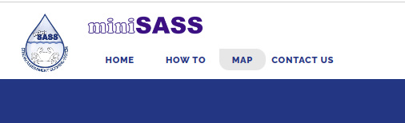

After clicking on this button, you will be redirected to the map page where you will find the 1️⃣ `Add Record` button, click on this button to open add record form.

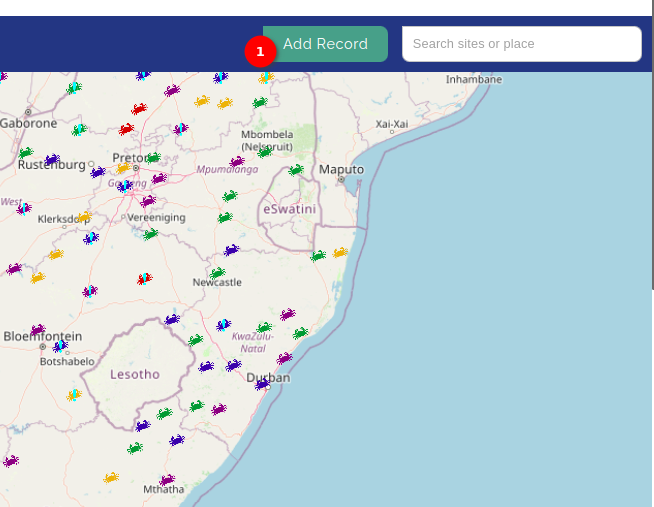

Upon clicking on this button the add record form will open. This form have four sections

## Site details section

For the site details you can create a new site or can select an existing site. To create a new site choose the 1️⃣ `Create New Site` option or to use the existing site choose the 2️⃣ `Use Existing Site` option.

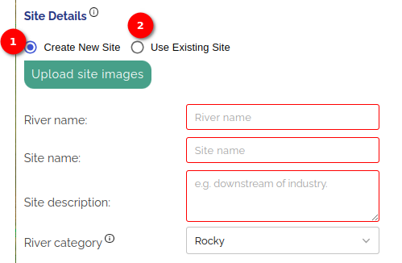

### Create New Site option

By default the create new site option is selected. Fill the 1️⃣ required filds and upload the image of the site. To upload the image of the site click on the 2️⃣ `Upload site images` button.

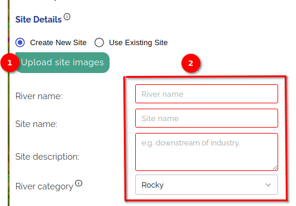

Upon clicking the popup will open, where you can select the images from the system. Click on the 1️⃣ `Browse` button to select the images from the system and then click on the 2️⃣ `upload chosen file` button to upload the images.

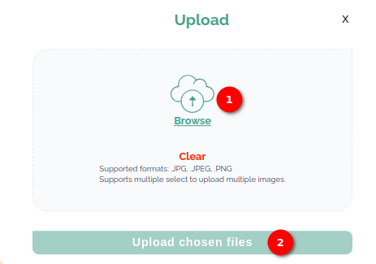

### Use Existing Site option

Select this option by clickng on the 1️⃣ `Use Existing Site` radio button.

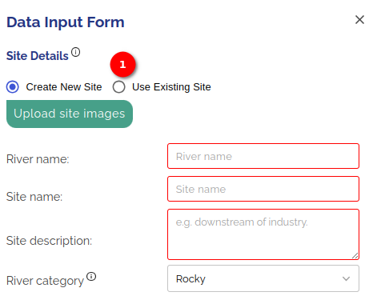

In this option you can upload the images or can select the site on map. To upload the images click on the 1️⃣ `Upload site images` button or to select the site on map click on the 2️⃣ `Select site on map` button. Select the sites from the 3️⃣ available dropdown and fill all the 4️⃣ required fields.

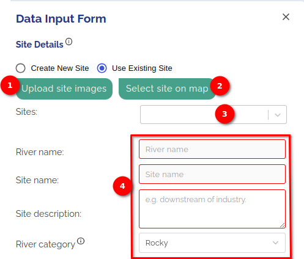

Upon clicking the `Upload site images` button, a popup will open, where you can select the images from the system. Click on the 1️⃣ `Browse` button to select the images from the system and then click on the 2️⃣ `upload chosen file` button to upload the images.

After clicking the `Select site on map` button, select site location on the map. Upon selecting the site on the map all the fields will be filled.

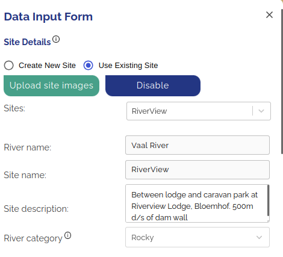

## Site Location section

>Note: If you choose site from the map the `Site Location` section will be disabled.

There are two option to enter the site location  information, either by clicking on the 1️⃣ `Site on map` button or by clicking on the 2️⃣ `Type in coordinates` button.

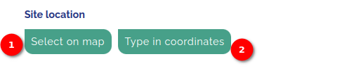

### Select on map option

After clicking the `Select on map` button, select site location on the map.

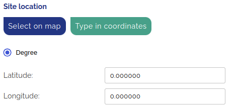

Upon selecting the site on the map latitude and longitude will be filled automatically.

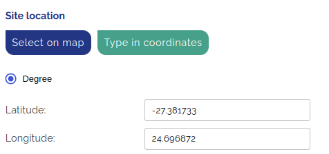

### Type in coordinates option

In this option you can enter the coordinates manually via two different types. You can either enter DMS coorrdinates or degree coordinate.

By default the degree coordinates (latitude and longitude) is selected.

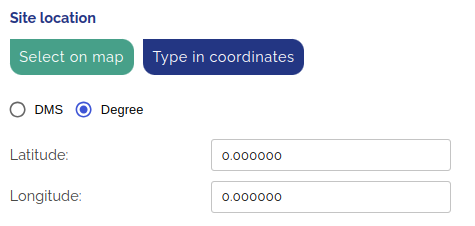

To enter the DMS coordinates click on the redio button available in front of the DMS.

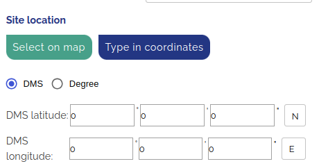

## Observation details section

Enter the collectors name and the notes in the 1️⃣ available fields and select the 2️⃣ date from the calander.

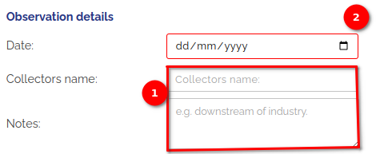

To select the date from the calendar click on the calendar icon available in the date field.

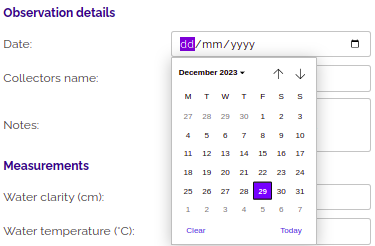

## Measurements section

Enter the measurment details in the 1️⃣ available fields. and the click on the 

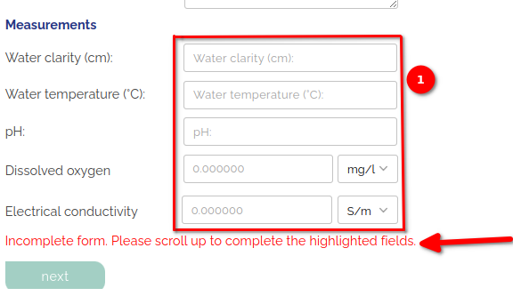

>Note: If the `Next` button is not clickable and the incomplete form message (Incomplete form. Please scroll up to complete the highlighted fields.) shown on the form that means you have forgotten to fill the required field.

Fill all the required fields to proceed further. After filling all the required fields the incomplete form message will not show on the page and the `Next` button will be clickable. Click on the 1️⃣ next button for next step of data uploading.

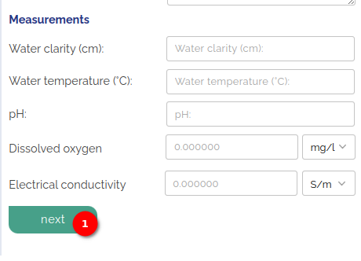

Upon clicking the next button the score form will open. Where you can select the group by clicking on the checkbox available in front of the group name and upload the images by clickin on the `Upload images` button available after the name of the group.

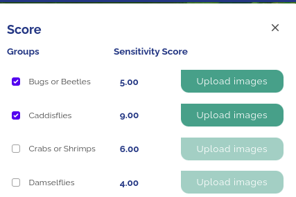

After selecting the group and uploading the images click on the 1️⃣ `Save` button to save the data.

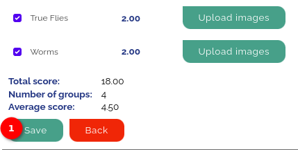
