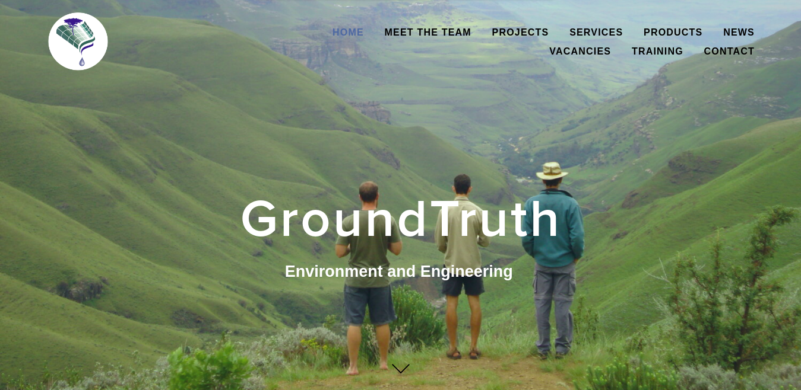
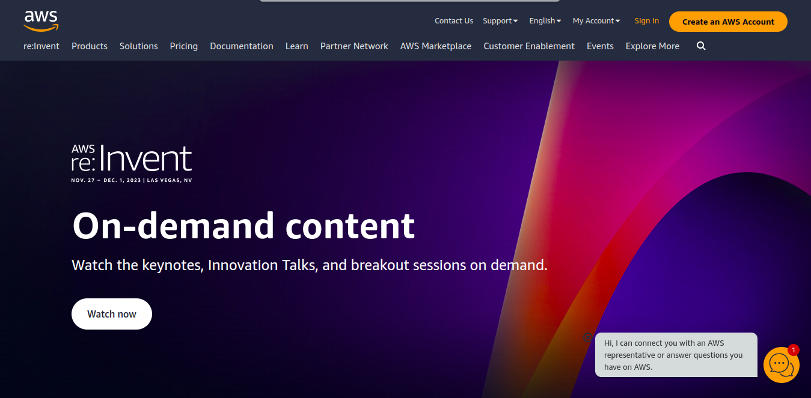

# How To User Manual

## Introduction

Welcome to the comprehensive guide on conducting a miniSASS survey! Whether you are new to miniSASS assessments or looking for a refresher, this How-To page is designed to walk you through each step of the process. Ensuring both accuracy and safety, this guide covers key aspects, including site selection, sample collection, scoring, and data upload.

1. **How To:** Click on the `How To` link, to go to the how-to page.

## How to do a miniSASS survey

1. **How to do a miniSASS survey:** Conducting a miniSASS survey requires minimal equipment, emphasising accessibility for everyone. Essential items include a MiniSASS field sheet, a miniSASS net (or homemade alternative), a white tray for sorting macroinvertebrates, gumboots or waders, a hat and sunscreen for safety, drinking water, soap or hand wash, a magnifying glass, and a charged cellphone for emergencies. Consider additional tools like a clarity tube to measure stream clarity, providing valuable supplementary data.

2. **Link for miniSASS equipment:** Visit [Ground Truth's](https://www.groundtruth.co.za/our-products) MiniSASS Equipment to explore and acquire the necessary tools for your miniSASS survey.

## MiniSASS survey: How to do a miniSASS assessment

Embark on your miniSASS survey with thorough preparation, ensuring you have all the necessary equipment for a successful assessment. Prioritise safety by going with a friend or in a group, and inform others about your location. Recognise potential hazards in rivers, such as toxins, pollutants, or wildlife, and dress appropriately in gumboots or waders to protect against sharp rocks and other harmful elements. Consider wearing a life jacket for added safety. These precautions contribute to a secure and enjoyable miniSASS assessment experience.

1. **MiniSASS Equipment Kit:** [Click here](https://youtu.be/XJLcJMutXP8) to watch the tutorial on miniSASS equipment kit ordered from [Ground Truth](https://www.groundtruth.co.za/our-products) on YouTube. 

2. **Make MiniSASS Equipment at Home:** [Click here](https://youtu.be/_-L-Xs4QJRg) to watch the tutorial on how to make miniSASS equipment at home on YouTube.

## How to stay safe when doing miniSASS

Ensuring safety during a miniSASS survey involves selecting a suitable site along a flowing stream or river, excluding stagnant water bodies like ponds or dams. Prioritise safety by choosing sites with diverse habitats such as rocks, vegetation, gravel, sand, and mud (GSM). Classify your stream/river based on its characteristics, identifying rocky or sandy sections. Always remember that the best site is a safe site. Keep track of your location using a phone or GPS for crucial information during the miniSASS survey. This ensures a secure and effective assessment of macroinvertebrate diversity in the water.

1. **Safety Concerns when doing MiniSASS:** [Click here](https://youtu.be/yGbi7P8RYoU) to watch the tutorial on safety concerns when doing miniSASS on YouTube.

## Choosing a site to sample for miniSASS

When choosing a site for miniSASS sampling, maximise habitat diversity by sampling various areas in the stream for 5 minutes. Engage actively in the process by kicking up rocks, gravel, sand, and mud to dislodge macroinvertebrates into your net. Explore under rocks, ensuring to wash the collected creatures into your net. Thoroughly scoop in and around vegetation to capture critters hiding in those areas. Stay vigilant for unique aquatic life such as clams, mussels, crabs, snails, and other species that may not be easily caught in the net. This dynamic approach ensures a comprehensive assessment of macroinvertebrate presence in different habitats within the stream.

1. **Choosing a site to sample for miniSASS:** [Click here](https://youtu.be/WX_DkYyfnmk) to watch the tutorial on choosing a site to sample for miniSASS on YouTube.

## How to take a miniSASS sample

To take a miniSASS sample effectively, start by running water through your net in the stream or using a bucket to filter out mud and grit, ensuring a cleaner sample. Transfer some river water to a tray and empty your net into it, checking for any creatures clinging to the net. Identify all the different macroinvertebrates using the dichotomous key, paying careful attention to each specimen. Mark each miniSASS group on your score sheet as you identify them. Once identification is complete, return all contents of the tray to the stream or river. This method ensures a thorough and accurate assessment of macroinvertebrates while maintaining the ecological balance of the environment.

1. **How to take a miniSASS sample:** [Click here](https://youtu.be/XY_p8usHx4Q) to watch the tutorial on how to take a miniSASS sample on YouTube.

2. **Cleaning your miniSASS sample:** [Click here](https://youtu.be/8RATZXY2jyo) to watch the tutorial on cleaning your miniSASS sample on YouTube.

## How to calculate your miniSASS score

To calculate your miniSASS score and determine the ecological category of river health, assign sensitivity scores to each macroinvertebrate group based on their tolerance to pollution and disturbance. High sensitivity scores indicate intolerance to disturbance, while low scores suggest resistance to pollution. Add up the scores and divide by the number of groups found to obtain the average score for the river site—this is your miniSASS score, reflecting the ecological condition of the stream/river. Note that an "Unmodified/Natural" ecological category doesn't necessarily imply drinkable water; additional chemical and microbial analyses are needed for water safety assessment. The miniSASS score specifically indicates the environmental health of the stream/river.

1. **How to use miniSASS dichotomous key:** [Click here](https://youtu.be/hKdPiSSVL0s) to watch the tutorial on how to use miniSASS dichotomous key on YouTube.

2. **How to calculate your miniSASS score:** [Click here](https://youtu.be/O_deXdCQIfM) to watch the tutorial on how to calculate your miniSASS score on YouTube.

## Uploading your miniSASS score

To contribute to the miniSASS database, register on the miniSASS website if you haven't already. Upload your collected data by clicking on the 'Submit Results' button and completing all the required fields. This step ensures your valuable observations are added to the collective effort of monitoring river health. Great job on actively participating in the miniSASS initiative!

1. **Uploading your miniSASS score:** [Click here](https://youtu.be/O_deXdCQIfM) to watch the tutorial on Uploading your miniSASS score on YouTube.

## Using miniSASS for monitoring

After submitting your miniSASS data, monitor your submission on the map alongside others to ensure its accuracy. The color of the crab icon representing your assessment reflects the health of the stream at your site. Revisit the same site every 5-6 weeks to establish a time series, contributing to a robust global dataset on water quality and stream/river health. You can explore new sites along the same stream or venture to different streams to conduct additional miniSASS surveys, consistently contributing valuable data for enhanced monitoring and management of Earth's freshwater resources. Your ongoing efforts play a crucial role in maintaining the health of our water ecosystems.

1. **Using miniSASS for monitoring:** [Click here](https://youtu.be/uU7hOj4zjG0) to watch the tutorial on using miniSASS for monitoring on YouTube.

2. **MiniSASS summary:** [Click here](https://youtu.be/uU7hOj4zjG0) to watch the tutorial on miniSASS summary on YouTube.

## For Educators

The provided educational resources are part of the Share-Net partnership project between the Wildlife and Environment Society of South Africa (WESSA) and the Water Research Commission (WRC). Share-Net is dedicated to creating and distributing copyright-free materials for environmental education. The resources include miniSASS field sheets, a Dichotomous Key, method information, background information, and macroinvertebrate group information.

These materials are designed for learners in different grades, specifically Grades 5, 7, 9, and 11. The focus is on activities that promote learning in natural sciences, environmental health, and sustainability, with an emphasis on freshwater ecology. Educators are encouraged to adapt and use the materials in innovative ways, but attribution to Share-Net as the original source is requested. The responsible use of these curriculum activities lies entirely with the educator. The aim is to engage students in hands-on experiences related to water quality assessment using the miniSASS method.

1. **Available miniSASS field sheets to download:** click on the name of the sheet to view and download.

    [miniSASS Dichotomous Key](https://minisass.sta.do.kartoza.com/static/docs/minisass_dichotomous_key_pg_4_5.pdf)

    [miniSASS Method information](https://minisass.sta.do.kartoza.com/static/docs/minisass_info_pamphlet_pg_1_8_1.pdf)

    [miniSASS Background information](https://minisass.sta.do.kartoza.com/static/docs/minisass_info_pamphlet_pg_2_3_1.pdf)

    [miniSASS macroinvertebrate Groups](https://minisass.sta.do.kartoza.com/static/docs/minisass_microinvertebrate_groups_pg_6_7.pdf)

2. **Educational Resources:** click on the name of the resource to view and download.

    [mini SASS Grade 5](https://minisass.sta.do.kartoza.com/static/docs/minisass_grade_5.pdf)

    [miniSASS Grade 7](https://minisass.sta.do.kartoza.com/static/docs/minisass_grade_7.pdf)

    [mini SASS Grade 9](https://minisass.sta.do.kartoza.com/static/docs/minisass_grade_9.pdf)

    [mini SASS Grade 11](https://minisass.sta.do.kartoza.com/static/docs/minisass_grade_11.pdf)

## Available References

1. **Ground Truth**: GroundTruth provides a range of consulting services and equipment beneficial to water resource management projects.

    - GroundTruth has provided input into and coordinated large-scale, multi-national projects as well as small-scale, local projects. Through these projects, we have fostered a large and diverse client base and gained recognition for our work through several awards. 

    

2. **United Nations Children's Fund (UNICEF)**: UNICEF works in over 190 countries and territories to save children's lives, defend their rights, and help them fulfill their potential, from early childhood through adolescence. And we never give up.

    

3. **CGIAR**: CGIAR is a global research partnership for a food-secure future dedicated to transforming food, land, and water systems in a climate crisis.CGIAR is the world’s largest global agricultural innovation network.
    - We provide evidence to policymakers, innovation to partners, and new tools to harness the economic, environmental and nutritional power of agriculture.

    

4. **International Water Management Institute (IWMI)**: IWMI is an international, research-for-development organization, with offices in 15 countries and a global network of scientists operating in more than 55 countries. For over three decades, our research results have led to changes in water management that have contributed to social and economic development.

    - A global network for water research that focuses on issues related to sustainable use of water resources.
    - IWMI’s mission is a water-secure world.

    

5. **Water Research Commission:** The WRC was established in terms of the Water Research Act (Act No 34 of 1971), following a period of serious water shortage. It was deemed to be of national importance to generate new knowledge and to promote the country’s water research purposefully, owing to the view held that water would be one of South Africa’s most limiting factors in the 21st century. In 1971 when the WRC was founded, water research and development (R&D) in South Africa was limited to a few institutions and the funding level inadequate. There was no research coordination and an apparent neglect of some key research fields. In addition, there was little strategic direction or leadership that would provide for the identification of priority areas or appropriate technology transfer. It was to address these issues, that the WRC was established.

    

6. **Amazon Web Services (AWS)**: Amazon Web Services (AWS) is the world’s most comprehensive and broadly adopted cloud, offering over 200 fully featured services from data centers globally. Millions of customers—including the fastest-growing startups, largest enterprises, and leading government agencies—are using AWS to lower costs, become more agile, and innovate faster.
    
    

7. **WESSA (Wildlife and Environment Society of South Africa):** WESSA (the Wildlife and Environment Society of South Africa) is a South African environmental organisation that aims to initiate and support high-impact environmental and conservation projects to promote participation in caring for the Earth. For over 90 years we have proactively engaged with the challenges and opportunities presented by our country’s unique natural heritage and the social and economic systems that depend on it.

    

8. **Kartoza:** Make geospatial data and technology work for you by partnering with us for training, development and maintenance of GIS systems. Kartoza is a South Africa-based Free and Open Source GIS (FOSSGIS) service provider. We use GIS software to solve complex location-related problems for individuals, businesses and governments around the world. Our team develops software using FOSSGIS to give you the freedom to share and modify your GIS as your needs grow and change.

    

## Footer Options

1. **How To**: Navigate to the how-to page by clicking on the `How To` link.

2. **Map**: Navigate to the map page by clicking on the `Map` link. For detailed map instructions, refer to the [map page documentation](../map/map.md).

3. **Documentation:** Access comprehensive documentation to explore detailed information, usage guides, and helpful resources. Enhance understanding and make the most out of the platform by referring to the documentation. 

4. **Contact Us:** Have questions, feedback, or need assistance? Feel free to reach out to the dedicated support team. Click on the `Contact Us` link to open the contact page. For detailed contact page instructions, refer to the [contact page documentation](../contact-us.md)

5. **YouTube Icon:** Click on the `YouTube` icon, to open the [GroundTruth Citizen Science](https://www.youtube.com/@groundtruthcitizenscience) channel playlist.
