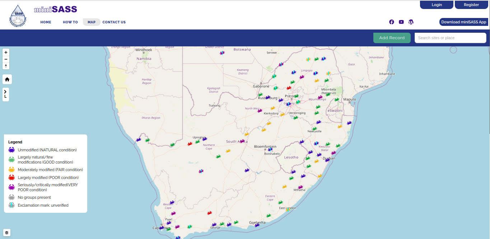
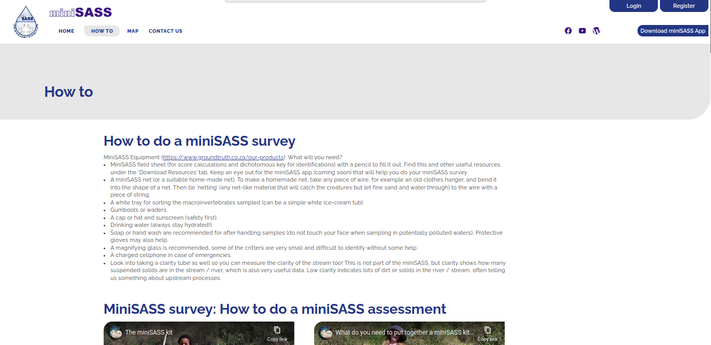
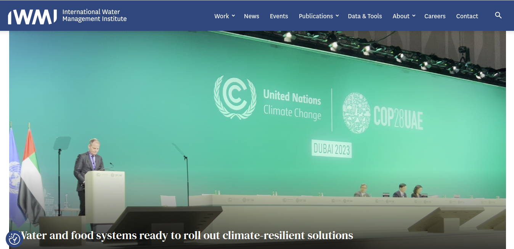

# Landing Page User Manual

## Overview

Welcome to miniSASS, the user's go-to tool for effortlessly monitoring the health of rivers. Whether users are environmental enthusiasts, a student, or concerned citizens, miniSASS empowers users to contribute to the well-being of their local water bodies. This simple yet powerful tool provides valuable insights into river health and water quality by examining the diverse macroinvertebrate communities living in the water.

Ready to explore the health of the local river? Grab the collection kit, follow the easy-to-understand manual, and embark on a journey to contribute to the preservation of water ecosystems with miniSASS. Join us in making a positive impact on the environment one river at a time.

## Landing Page Before Login

1. **Home**: Navigate to the home page by clicking on the `Home` link.

2. **HowTo**: Navigate to the how-to page by clicking on the `HowTo` link.

3. **Map**: Navigate to the map page by clicking on the `Map` link.

4. **Contact**: If the user needs to get in touch with us, simply click the `CONTACT` button. Our team is ready to assist users with any inquiries or issues.

5. **Login**: Access your account by clicking the `LOGIN` button. If the user is a registered user, they can log in here. For detailed login instructions, refer to the [login page documentation](./login-logout/index.md).

6. **Register**: If the user is new to the platform, they can click `REGISTER` to create a new account. Registration is quick and easy, and it will give you full access to the platform. For detailed registration instructions, refer to the [register page documentation](./login-logout/index.md).

7. **Facebook Icon**: Locate and click on the Facebook icon to visit miniSASS's `Facebook` page.

    - **Note:** Users are required to log in to Facebook using their Facebook account to access the miniSASS Facebook page.

    

8. **YouTube Icon**: Navigate to miniSASS's YouTube channel by clicking on the `YouTube` icon.

    

9. **WordPress Icon**: Explore miniSASS's blog site by clicking on the `WordPress` icon.

    

10. **EXPLORE THE MAP**: Click on the `EXPLORE THE MAP` card section, to explore the interactive map.

    

    - For a detailed map user manual, refer to the [map page documentation](./map/index.md).

11. **HOW TO DO MINISASS**: Click on the `HOW TO DO MINISASS` card section, to go to the how-to page.

    

    - For a detailed how-to user manual, refer to the [how-to page documentation](./how-to/index.md).

12. **UPLOAD RESULTS**: Click on the `UPLOAD RESULTS` card section, to upload the results.

    

    - For a detailed upload result user manual, refer to the [upload result page documentation](./upload/index.md).

13. **DOWNLOAD RESOURCES**: Click on the `DOWNLOAD RESOURCES` card section, to download resources. It will redirect users to the how-to page. Where users can find how-to download resources.

    

    - For a detailed download resource user manual, refer to the [download resource page documentation](./how-to/index.md).

## Information

1. **Information**: Provides an overview and instructions on how to collect a miniSASS sample from a river, interpret the results, and use the miniSASS website features, such as the How To page and the miniSASS Map. The text encourages individuals, communities, schools, and families to get involved in monitoring their local streams and rivers, contributing to a map of river health across Southern Africa. Overall, it serves as an informative guide for those interested in learning about rivers, monitoring water quality, and actively participating in environmental conservation efforts.

## Recent Observations

1. **Right Arrow Icon**: Click on the `Right Arrow` Icon to navigate to the next set of observations and the `Left Arrow` for the previous set of observations.

2. **Title**: The title of the observation.

3. **Details**: The details section provides information about the observation uploader's username, organisation name, and the date of upload for a more detailed insight.

4. **View Details**: Click on the `View Details` link to access comprehensive information about the observation.

5. **Score Icon**: An icon representing the observation's score.

    - If the score is greater than or equal to 5, the boundary and crab image will appear in green.

    - If the score is less than 5, the boundary and crab image will appear in red.

## miniSASS Map

1. **Map image**: Displays map image.

2. **Map Feature Information**: Information about the map feature on the site.

3. **Map**: Click on the `Map` link, to navigate to the map page.

4. **See the map**: The `See the map` button also navigates the user to the map page.

## Latest Articles

1. **Right Arrow Icon**: Click on the `Right Arrow` Icon to navigate to the next set of articles and the `Left Arrow` for the previous set of articles.

2. **Title**: The title of the article.

3. **Details**: The details section provides information about the article's date of upload and the organisation name for more detailed insights.

4. **Learn More**: Click on the `Learn More` button, to see the full article.

    

## Available References

1. **Ground Truth**: GroundTruth provides a range of consulting services and equipment beneficial to water resource management projects.

    - GroundTruth has provided input into and coordinated large-scale, multi-national projects as well as small-scale, local projects. Through these projects, we have fostered a large and diverse client base and gained recognition for our work through several awards. 

    

2. **International Water Management Institute (IWMI)**: IWMI is an international, research-for-development organization, with offices in 15 countries and a global network of scientists operating in more than 55 countries. For over three decades, our research results have led to changes in water management that have contributed to social and economic development.

    - A global network for water research that focuses on issues related to sustainable use of water resources.
    - IWMI’s mission is a water-secure world.

    

3. **Amazon Web Services (AWS)**: Amazon Web Services (AWS) is the world’s most comprehensive and broadly adopted cloud, offering over 200 fully featured services from data centers globally. Millions of customers—including the fastest-growing startups, largest enterprises, and leading government agencies—are using AWS to lower costs, become more agile, and innovate faster.
    
    

4. **CGIAR**: CGIAR is a global research partnership for a food-secure future dedicated to transforming food, land, and water systems in a climate crisis.CGIAR is the world’s largest global agricultural innovation network.
    - We provide evidence to policymakers, innovation to partners, and new tools to harness the economic, environmental and nutritional power of agriculture.

    

5. **United Nations Children's Fund (UNICEF)**: UNICEF works in over 190 countries and territories to save children's lives, defend their rights, and help them fulfill their potential, from early childhood through adolescence. And we never give up.

    

## Footer Options

1. **Home**: Navigate to the home page by clicking on the `Home` link.

2. **HowTo**: Navigate to the how-to page by clicking on the `HowTo` link.

3. **Map**: Navigate to the map page by clicking on the `Map` link.

4. **GitHub**: miniSASS is an Open Source Project. Explore and contribute to the source code on GitHub. Click on the GitHub link to get the source code.

