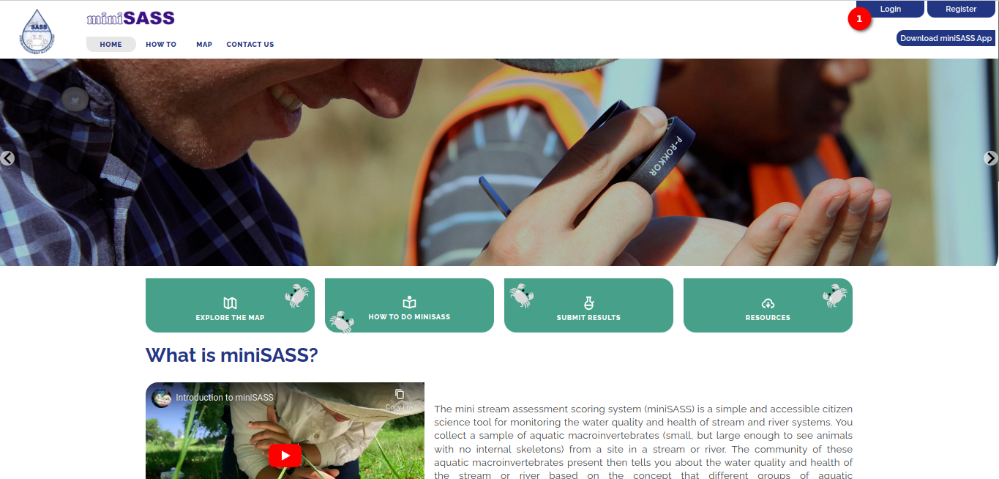
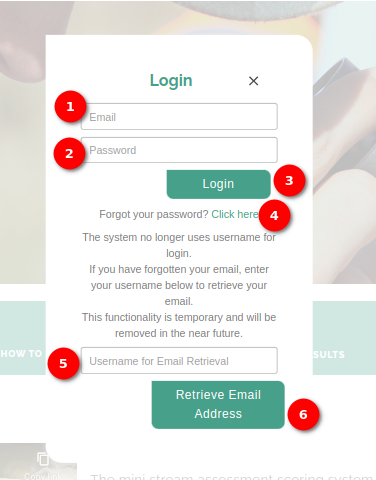
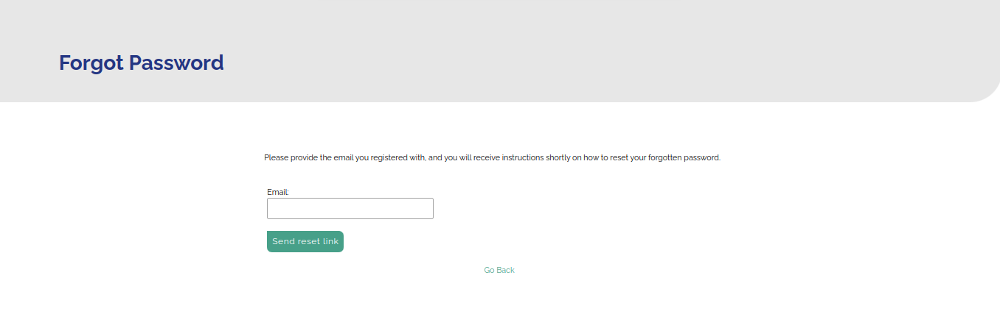

# Login Page User Manual

Welcome to miniSASS! This user manual will guide you through the login process on miniSASS.

## Logging In

1. **Username Field**: Enter your registered username in the provided input field.

2. **Password Field**: Input your password in the password field. Ensure your password is correct, taking note of uppercase and lowercase characters.

3. **Login Button**: Click the `Login` button to access your miniSASS account.

    - **On Success:**
    After successful login, you will be automatically redirected to the home page of miniSASS.

    - **On Failure:**
    If the login attempt fails, an error message will be displayed.
    
    

4. **Forgot Password**: If you have forgotten your password, click on the `Click here` link. You will be redirected to the password recovery page.

    

    - Follow the on-screen instructions to reset your password.

    - Once your password is reset, return to the login page to log in with your new credentials.

    - For detailed forgot password instructions, refer to the [forgot password page documentation](./forgot-password.md).

5. **Cross Icon**: Click on the `Cross` icon, to cancel the login process.
