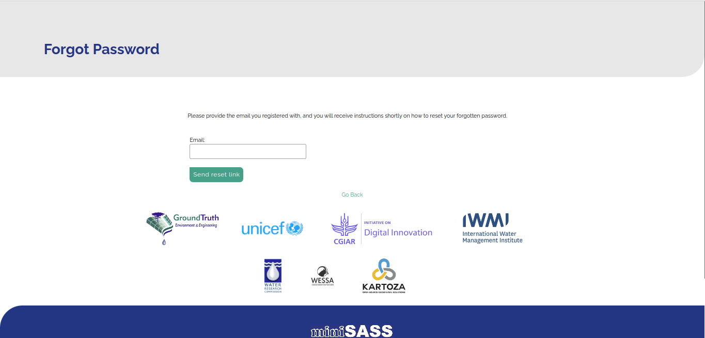
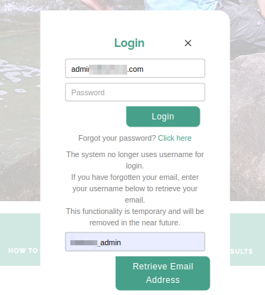
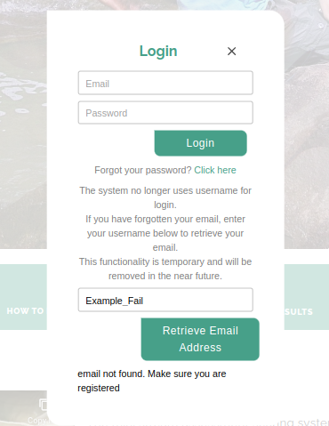

# Login Page User Manual

Welcome to miniSASS login user manual. This user manual will walk you through the login process on miniSASS.

1. **Login Button:** Click on the `login` button to go to the login page. Upon clicking on the login button the user will redirected to the login page.

1. **Email Field**: The user needs to enter their registered email address in the provided input field. If the user forgot their email they can use the `Retrieve Email Address` functionality.

2. **Password Field**: The user needs to enter their password in the password field. Ensure that the password is correct, taking note of uppercase and lowercase characters.

3. **Login Button**: Click the `Login` button to access your miniSASS account.

    - **On Success:**
    After successful login, the user will be automatically redirected to the home page of miniSASS.

    - **On Failure:**
    If the login attempt fails, an error message will be displayed.
    
    

4. **Forgot Password**: If the user have forgotten their password, they can click on the `Click here` link. Upon clicking they will be redirected to the password recovery page.

    

    - Follow the on-screen instructions to reset the password.

    - Once the password is reset, return to the login page to log in with the new credentials.

    - For detailed forgot password instructions, refer to the [forgot password page documentation](./forgot-password.md).

5. **Username Field:** Enter the username in the designated field to retrieve the associated email address.

6. **Retrieve Email Address Button:** Click this button to retrieve the email address linked to the username entered above.

    - **On Success:**
    If the username is correct the email address will appear in the email input box.

    

    - **On Failure:**
    If the username is wrong, an error message will be displayed.
    
    

>Disclaimer: The system no longer utilises usernames for login. This functionality is provided temporarily for users who may have forgotten their email addresses. It will be discontinued in the near future.

**Cross Icon**: Click on the `Cross` icon, to cancel the login process.
