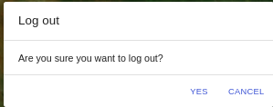

# Logout User Manual

## Introduction

The `Logout` link allows the user to securely end the user's session on the platform. Follow these steps to log out:

1. **Logout:** Click on the `Logout` link, to log out. The platform will securely log the user out, terminating the user's current session. This is important for maintaining the security of the user's account. After successfully logging out the user will redirected to the home page.

    

    1. **Yes:** After clicking on the `Logout` option, a confirmation popup will open. Click on the `Yes` to logout from the miniSASS account.

    

    Congratulations! You have successfully logged out of the miniSASS account.

>Remember to keep your login credentials confidential and to log out of your account when using shared or public computers to maintain the security of your information.
