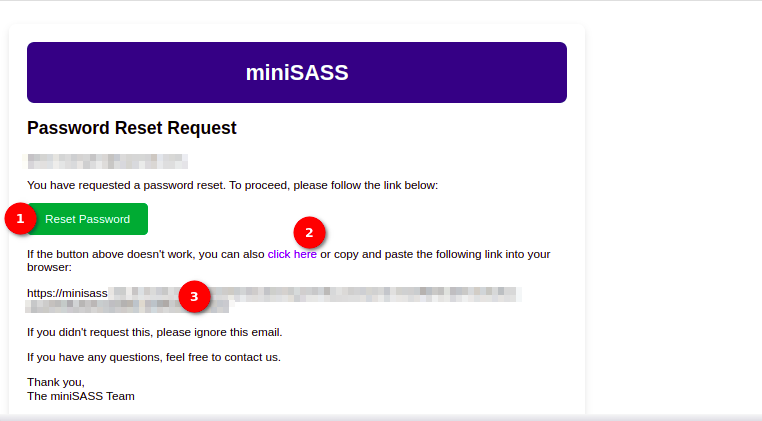

# Reset Password Email & Update Password User Manual

Welcome to the miniSASS Reset Password page! Follow these steps to reset your password.

## Reset Password Email

1. **Reset Password Button:**

    Click the `Reset Password` button provided in the email. This will direct you to the update password page.

2. **Click Here Option:**

    Alternatively, if the button above doesn't work, you can click the `Click here` option to openm the update password page.

3. **Link Option for Copy Paste:**

    If neither of the above options is feasible, you can copy and paste the given link into your browser to open the update password page.

## Update Password Page

1. **Password Input Field:**

    - Enter your new password in the provided password input field.
    - Ensure your new password adheres to any specified requirements, such as
        
        * Your password can’t be too similar to your other personal information. 
        * Your password must contain at least 8 characters.
        * Your password can’t be a commonly used password.
        * Your password can’t be entirely numeric.

2. **Confirm Password Input Field:**

    - Re-enter your new password in the confirm password input field to ensure accuracy.
    - If your password does not match you will see the error message.

        

    - If your password does not match you will see the error message.

        

3. **Reset Button:**

    Click the `Reset` button to apply the changes and update your password.
    A confirmation message will inform you that your password has been successfully updated.

    

4. **Go Back Button:**

    If you decide not to update your password, click the `Go Back` button to return to the login page.
