# Map Page User Manual

## Introduction

Welcome to the Map User Manual, the user's comprehensive guide to navigating and utilising the features of the map application. This manual is designed to provide the user with a clear understanding of the functionalities and tools available to enhance the user's map viewing experience. Whether the user is a first-time user or looking to explore advanced features, this guide will walk the user through the various options available at the user's fingertips.

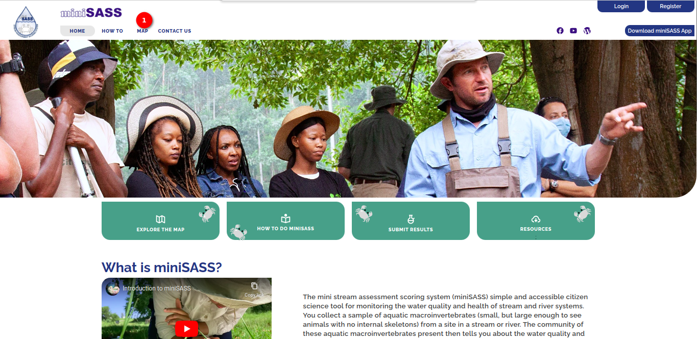

1. **Map:** To access the map page, simply click on the `Map` link located in the navigation bar. This will direct the users to the dedicated map section, allowing them to explore and interact with the geographic information and features available.

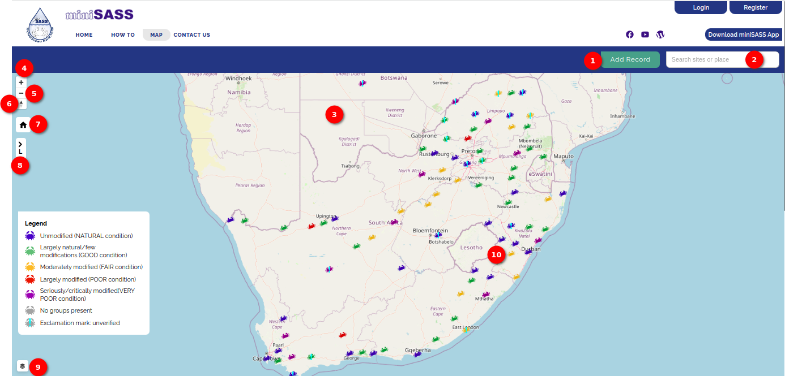

1. **Add Record** Record and contribute information by using the Add Record button. Please note that this feature requires user authentication. If the user is not logged in, clicking on this button will redirect the user to the login page.

2. **Search Site or Place:** Efficiently locate specific sites or places with the search option. Simply enter the desired location, and the map will guide the user to the relevant area. When the user searches for a location, a list of matching locations will be shown based on the entered search text.

    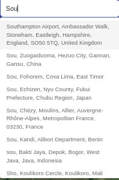

    Click on the desired location to view it on the map.

    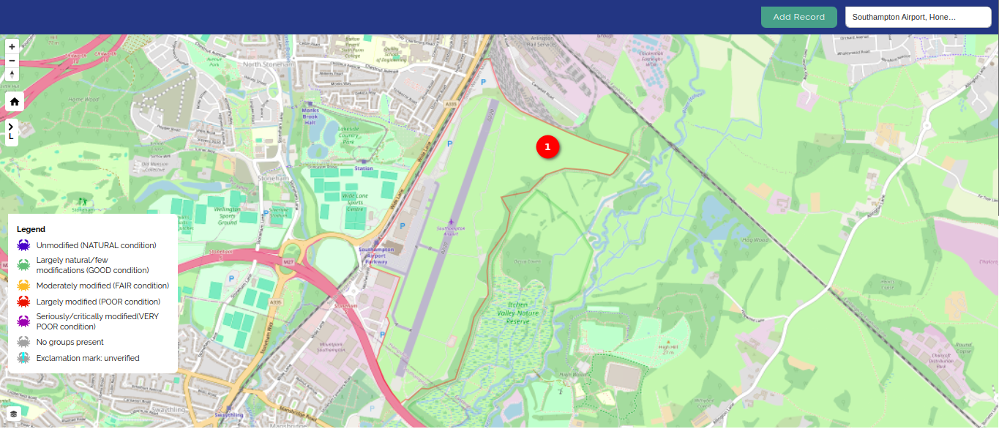

    1. **High-Lighted Area:** The searched area is highlighted on the map.

3. **Map:** Displays the map.

4. **Zooming In Icon:** The zooming-in icon is represented by a plus sign (+). Click on this icon to zoom in on the map, making features and details appear larger and more visible. By zooming in, users can view the locations of the uploaded miniSASS observations.

    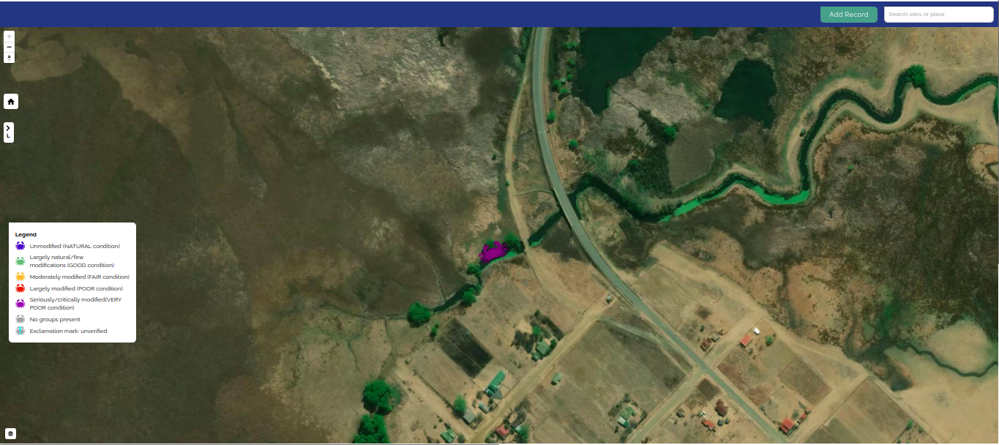

5. **Zooming Out Icon:** The zooming-out icon is represented by a minus sign (-). Click on this icon to zoom out on the map, reducing the size of the displayed area and providing a broader view.

6. **Compass Icon:** Orient the user with the compass option, ensuring that the users are aware of their direction and alignment as they navigate through the map.

    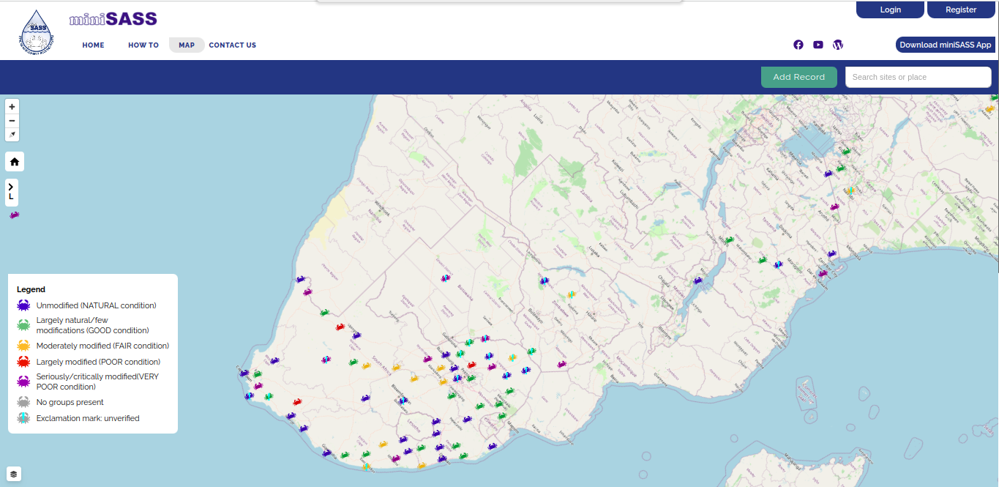

7. **Home Icon:** Easily return to the default view or home location with the `Home` option, providing a quick and convenient way to reset the map.

8. **Legend Option:** Enhance the map comprehension by utilising the `Legend` option, which offers valuable insights into the symbols and markers representing various elements on the map. The Legend is displayed by default, and users can conveniently hide it by clicking on the arrow icon for a cleaner viewing experience. This feature ensures that users have quick access to essential information while retaining the flexibility to customise their map interface according to their preferences.

    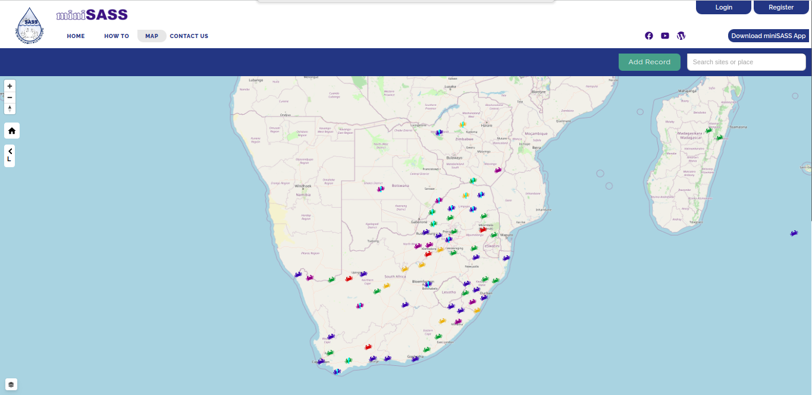

9. **Layers Icon:** Explore various data layers by toggling through different options, allowing the users to customise their map view based on their preferences and specific information needs. Hover over the `Layer` icon, to view the layers options.

    - By default, the `miniSASS Observation` layer is selected with the `Default` base layer.

    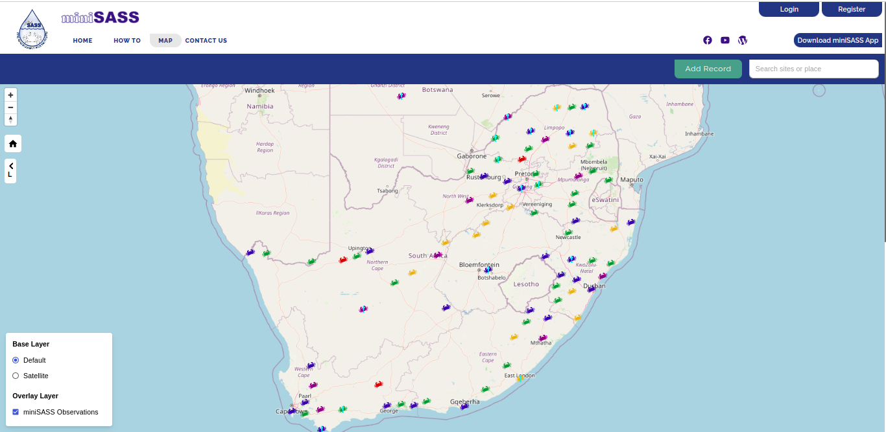

    - `Default` base layer without `miniSASS observation` layer. If the `miniSASS Observation` layer is not selected, the crab icons will not be visible on the map.

    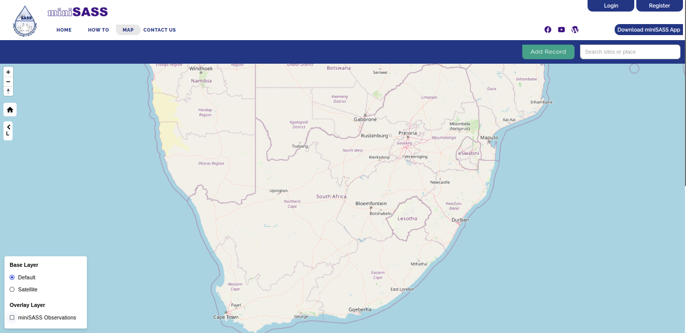

    - `Satellite` base layer with `miniSASS observation` layer.

    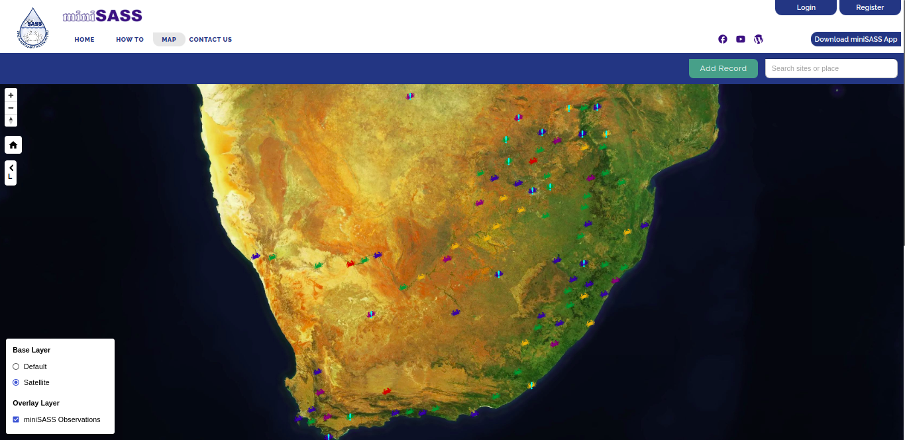

    - `Satellite` base layer without `miniSASS Observation` layer. If the `miniSASS Observation` layer is not selected, the crab icons will not be visible on the map.

    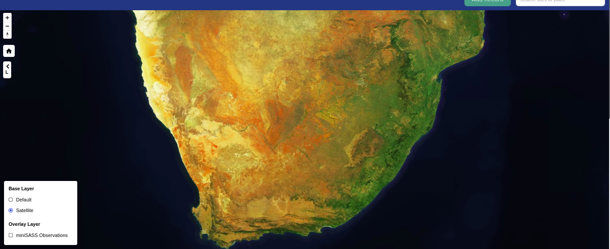

10. **Crab Icons:** The `Crab` icons indicate areas where miniSASS observations have been uploaded. The color of the crabs reflects the condition of the water, categorizing it as GOOD, FAIR, POOR, or VERY POOR. Users can refer to the legend, represented by the crab symbol, to interpret the corresponding water conditions associated with each color.

    **See Details:** Users can access the details of the uploaded miniSASS observation by clicking on the crab icon.

    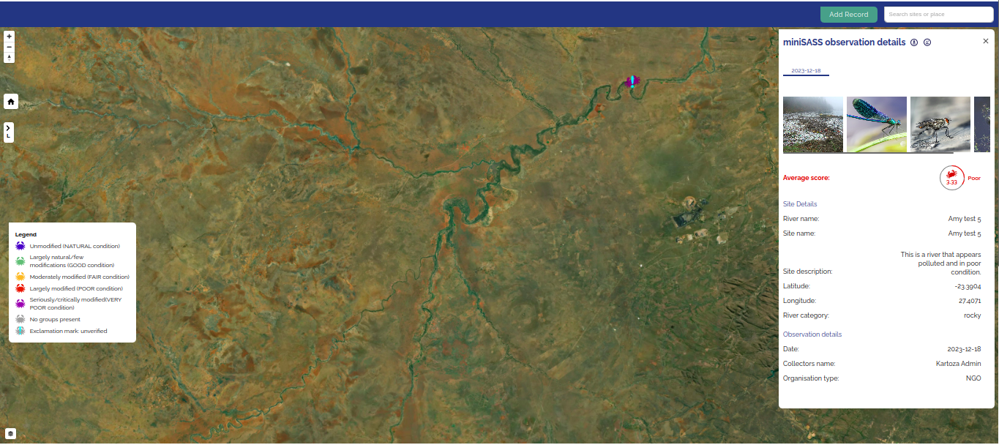
