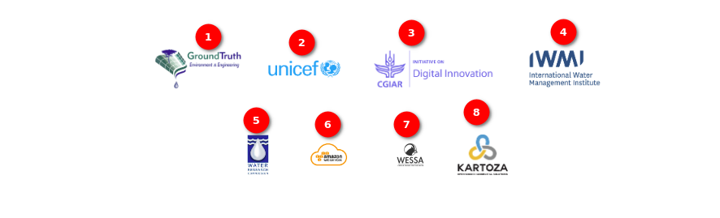
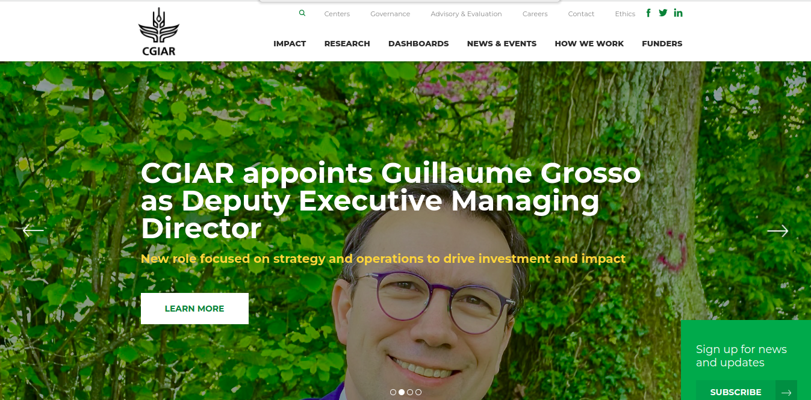

# Map Page User Manual

## Introduction

Welcome to the Map User Manual, the user's comprehensive guide to navigating and utilising the features of the map application. This manual is designed to provide the user with a clear understanding of the functionalities and tools available to enhance the user's map viewing experience. Whether the user is a first-time user or looking to explore advanced features, this guide will walk the user through the various options available at the user's fingertips.

1. **Map:** To access the map page, simply click on the `Map` link located in the navigation bar. This will direct the users to the dedicated map section, allowing them to explore and interact with the geographic information and features available.

1. **Add Record** Record and contribute information by using the Add Record button. Please note that this feature requires user authentication. If the user is not logged in, clicking on this button will redirect the user to the login page.

2. **Search Site or Place:** Efficiently locate specific sites or places with the search option. Simply enter the desired location, and the map will guide the user to the relevant area. When the user searches for a location, a list of matching locations will be shown based on the entered search text.

    

    Click on the desired location to view it on the map.

    

    1. **High-Lighted Area:** The searched area is highlighted on the map.

3. **Map:** Displays the map.

4. **Zooming In Icon:** The zooming-in icon is represented by a plus sign (+). Click on this icon to zoom in on the map, making features and details appear larger and more visible. By zooming in, users can view the locations of the uploaded miniSASS observations.

    

5. **Zooming Out Icon:** The zooming-out icon is represented by a minus sign (-). Click on this icon to zoom out on the map, reducing the size of the displayed area and providing a broader view.

6. **Compass Icon:** Orient the user with the compass option, ensuring that the users are aware of their direction and alignment as they navigate through the map.

    

7. **Home Icon:** Easily return to the default view or home location with the `Home` option, providing a quick and convenient way to reset the map.

8. **Legend Option:** Enhance the map comprehension by utilising the `Legend` option, which offers valuable insights into the symbols and markers representing various elements on the map. The Legend is displayed by default, and users can conveniently hide it by clicking on the arrow icon for a cleaner viewing experience. This feature ensures that users have quick access to essential information while retaining the flexibility to customise their map interface according to their preferences.

    

9. **Layers Icon:** Explore various data layers by toggling through different options, allowing the users to customise their map view based on their preferences and specific information needs. Hover over the `Layer` icon, to view the layers options.

    - By default, the `miniSASS Observation` layer is selected with the `Default` base layer.

    

    - `Default` base layer without `miniSASS observation` layer. If the `miniSASS Observation` layer is not selected, the crab icons will not be visible on the map.

    

    - `Satellite` base layer with `miniSASS observation` layer.

    

    - `Satellite` base layer without `miniSASS Observation` layer. If the `miniSASS Observation` layer is not selected, the crab icons will not be visible on the map.

    

10. **Crab Icons:** The `Crab` icons indicate areas where miniSASS observations have been uploaded. The color of the crabs reflects the condition of the water, categorizing it as GOOD, FAIR, POOR, or VERY POOR. Users can refer to the legend, represented by the crab symbol, to interpret the corresponding water conditions associated with each color.

    **See Details:** Users can access the details of the uploaded miniSASS observation by clicking on the crab icon.

    

    1 **Exclamation Mark:** The exclamation mark on the crab indicates that the record has not been validated yet.

    

## Available References

1. **Ground Truth**: GroundTruth provides a range of consulting services and equipment beneficial to water resource management projects.

    - GroundTruth has provided input into and coordinated large-scale, multi-national projects as well as small-scale, local projects. Through these projects, we have fostered a large and diverse client base and gained recognition for our work through several awards. 

    

2. **United Nations Children's Fund (UNICEF)**: UNICEF works in over 190 countries and territories to save children's lives, defend their rights, and help them fulfil their potential, from early childhood through adolescence. And we never give up.

    

3. **CGIAR**: CGIAR is a global research partnership for a food-secure future dedicated to transforming food, land, and water systems in a climate crisis.CGIAR is the world’s largest global agricultural innovation network.
    - We provide evidence to policymakers, innovation to partners, and new tools to harness the economic, environmental and nutritional power of agriculture.

    

4. **International Water Management Institute (IWMI)**: IWMI is an international, research-for-development organization, with offices in 15 countries and a global network of scientists operating in more than 55 countries. For over three decades, our research results have led to changes in water management that have contributed to social and economic development.

    - A global network for water research that focuses on issues related to sustainable use of water resources.
    - IWMI’s mission is a water-secure world.

    

5. **Water Research Commission:** The WRC was established in terms of the Water Research Act (Act No 34 of 1971), following a period of serious water shortage. It was deemed to be of national importance to generate new knowledge and to promote the country’s water research purposefully, owing to the view held that water would be one of South Africa’s most limiting factors in the 21st century. In 1971 when the WRC was founded, water research and development (R&D) in South Africa was limited to a few institutions and the funding level inadequate. There was no research coordination and an apparent neglect of some key research fields. In addition, there was little strategic direction or leadership that would provide for the identification of priority areas or appropriate technology transfer. It was to address these issues, that the WRC was established.

    

6. **Amazon Web Services (AWS)**: Amazon Web Services (AWS) is the world’s most comprehensive and broadly adopted cloud, offering over 200 fully featured services from data centers globally. Millions of customers—including the fastest-growing startups, largest enterprises, and leading government agencies—are using AWS to lower costs, become more agile, and innovate faster.

    

7. **WESSA (Wildlife and Environment Society of South Africa):** WESSA (the Wildlife and Environment Society of South Africa) is a South African environmental organisation that aims to initiate and support high-impact environmental and conservation projects to promote participation in caring for the Earth. For over 90 years we have proactively engaged with the challenges and opportunities presented by our country’s unique natural heritage and the social and economic systems that depend on it.

    

8. **Kartoza:** Make geospatial data and technology work for you by partnering with us for training, development and maintenance of GIS systems. Kartoza is a South Africa-based Free and Open Source GIS (FOSSGIS) service provider. We use GIS software to solve complex location-related problems for individuals, businesses and governments around the world. Our team develops software using FOSSGIS to give you the freedom to share and modify your GIS as your needs grow and change.

    

## Footer Options

1. **Home**: Navigate to the home page by clicking on the `Home` link.

2. **HowTo**: Navigate to the how-to page by clicking on the `HowTo` link. For detailed how-to instructions, refer to the [how-to page documentation](../how-to/how-to.md).

3. **Map**: Navigate to the map page by clicking on the `Map` link.

4. **GitHub**: miniSASS is an Open Source Project. Explore and contribute to the source code on GitHub. Click on the GitHub link to get the source code.

## Map Page After Login User Manual

1. **Map:** To access the map page, simply click on the `Map` link located in the navigation bar. This will direct the users to the dedicated map section, allowing them to explore and interact with the geographic information and features available.

1. **Add Record** Click on the `Add Record` button, to add the record on the site.

    

    - For detailed instructions on adding a record on the site, refer to the [add record documentation](../upload/add-records.md).

2. **Search Site or Place:** Efficiently locate specific sites or places with the search option. Simply enter the desired location, and the map will guide the user to the relevant area. When the user searches for a location, a list of matching locations will be shown based on the entered search text.

    

    Click on the desired location to view it on the map.

    

    1. **High-Lighted Area:** The searched area is highlighted on the map.

3. **Map:** Displays the map.

4. **Zooming In Icon:** The zooming-in icon is represented by a plus sign (+). Click on this icon to zoom in on the map, making features and details appear larger and more visible. By zooming in, users can view the locations of the uploaded miniSASS observations.

    

5. **Zooming Out Icon:** The zooming-out icon is represented by a minus sign (-). Click on this icon to zoom out on the map, reducing the size of the displayed area and providing a broader view.

6. **Compass Icon:** Orient the user with the compass option, ensuring that the users are aware of their direction and alignment as they navigate through the map.

    

7. **Home Icon:** Easily return to the default view or home location with the `Home` option, providing a quick and convenient way to reset the map.

8. **Legend Option:** Enhance the map comprehension by utilising the `Legend` option, which offers valuable insights into the symbols and markers representing various elements on the map. The Legend is displayed by default, and users can conveniently hide it by clicking on the arrow icon for a cleaner viewing experience. This feature ensures that users have quick access to essential information while retaining the flexibility to customise their map interface according to their preferences.

    

9. **Layers Icon:** Explore various data layers by toggling through different options, allowing the users to customise their map view based on their preferences and specific information needs. Hover over the `Layer` icon, to view the layers options.

    - By default, the `miniSASS Observation` layer is selected with the `Default` base layer.

    

    - `Default` base layer without `miniSASS observation` layer. If the `miniSASS Observation` layer is not selected, the crab icons will not be visible on the map.

    

    - `Satellite` base layer with `miniSASS observation` layer.

    

    - `Satellite` base layer without `miniSASS Observation` layer. If the `miniSASS Observation` layer is not selected, the crab icons will not be visible on the map.

    

10. **Crab Icons:** The `Crab` icons indicate areas where miniSASS observations have been uploaded. The color of the crabs reflects the condition of the water, categorizing it as GOOD, FAIR, POOR, or VERY POOR. Users can refer to the legend, represented by the crab symbol, to interpret the corresponding water conditions associated with each color.

    **See Details:** Users can access the details of the uploaded miniSASS observation by clicking on the crab icon.

    

    1 **Exclamation Mark:** The exclamation mark on the crab indicates that the record has not been validated yet.

    

### Available References

1. **Ground Truth**: GroundTruth provides a range of consulting services and equipment beneficial to water resource management projects.

    - GroundTruth has provided input into and coordinated large-scale, multi-national projects as well as small-scale, local projects. Through these projects, we have fostered a large and diverse client base and gained recognition for our work through several awards. 

    

2. **United Nations Children's Fund (UNICEF)**: UNICEF works in over 190 countries and territories to save children's lives, defend their rights, and help them fulfil their potential, from early childhood through adolescence. And we never give up.

    

3. **CGIAR**: CGIAR is a global research partnership for a food-secure future dedicated to transforming food, land, and water systems in a climate crisis.CGIAR is the world’s largest global agricultural innovation network.
    - We provide evidence to policymakers, innovation to partners, and new tools to harness the economic, environmental and nutritional power of agriculture.

    

4. **International Water Management Institute (IWMI)**: IWMI is an international, research-for-development organization, with offices in 15 countries and a global network of scientists operating in more than 55 countries. For over three decades, our research results have led to changes in water management that have contributed to social and economic development.

    - A global network for water research that focuses on issues related to sustainable use of water resources.
    - IWMI’s mission is a water-secure world.

    

5. **Water Research Commission:** The WRC was established in terms of the Water Research Act (Act No 34 of 1971), following a period of serious water shortage. It was deemed to be of national importance to generate new knowledge and to promote the country’s water research purposefully, owing to the view held that water would be one of South Africa’s most limiting factors in the 21st century. In 1971 when the WRC was founded, water research and development (R&D) in South Africa was limited to a few institutions and the funding level inadequate. There was no research coordination and an apparent neglect of some key research fields. In addition, there was little strategic direction or leadership that would provide for the identification of priority areas or appropriate technology transfer. It was to address these issues, that the WRC was established.

    

6. **Amazon Web Services (AWS)**: Amazon Web Services (AWS) is the world’s most comprehensive and broadly adopted cloud, offering over 200 fully featured services from data centers globally. Millions of customers—including the fastest-growing startups, largest enterprises, and leading government agencies—are using AWS to lower costs, become more agile, and innovate faster.

    

7. **WESSA (Wildlife and Environment Society of South Africa):** WESSA (the Wildlife and Environment Society of South Africa) is a South African environmental organisation that aims to initiate and support high-impact environmental and conservation projects to promote participation in caring for the Earth. For over 90 years we have proactively engaged with the challenges and opportunities presented by our country’s unique natural heritage and the social and economic systems that depend on it.

    

8. **Kartoza:** Make geospatial data and technology work for you by partnering with us for training, development and maintenance of GIS systems. Kartoza is a South Africa-based Free and Open Source GIS (FOSSGIS) service provider. We use GIS software to solve complex location-related problems for individuals, businesses and governments around the world. Our team develops software using FOSSGIS to give you the freedom to share and modify your GIS as your needs grow and change.

    

### Footer Options

1. **Home**: Navigate to the home page by clicking on the `Home` link.

2. **HowTo**: Navigate to the how-to page by clicking on the `HowTo` link. For detailed how-to instructions, refer to the [how-to page documentation](../how-to/how-to.md).

3. **Map**: Navigate to the map page by clicking on the `Map` link.

4. **GitHub**: miniSASS is an Open Source Project. Explore and contribute to the source code on GitHub. Click on the GitHub link to get the source code.
