# Recent Observation User Manual

## Introduction:

The `Recent Observations` feature on the home page provides a quick overview of the latest observations. By clicking on the `View Details` link, users can access a dedicated map page displaying the location associated with each observation. Navigate to the home page. Locate the `Recent Observations` section, which typically includes a list of recent observations.

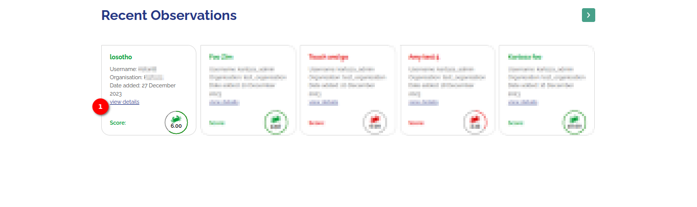

1. **View Details:** Click on the `View Details` link, to view the details of that observation. This action will redirect the user to the map page.

Upon clicking `View Details,` you will be directed to the map page. This page displays the geographical location of the site associated with the selected observation.

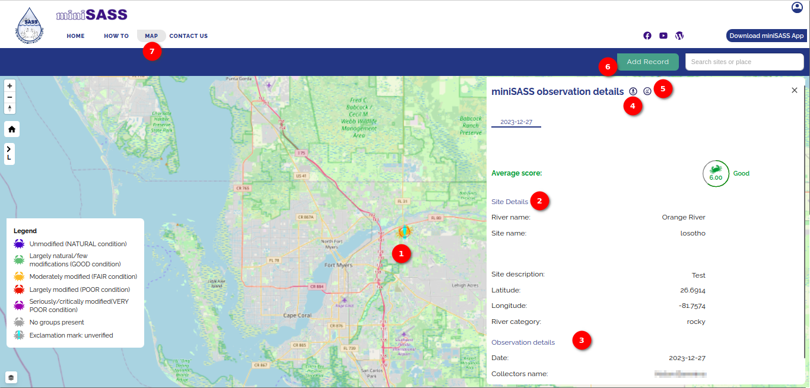

1. **Crab Icon - Location on Map:** On the recent observation interface, look for the crab icon.
This icon visually represents the location on the map where the uploaded observation was made. The presence of an `Exclamation Mark` overlaid on the crab icon indicates that the observation record has not been verified yet.

2. **Site Details:** This section provides information about the specific site where the observation was recorded.

3. **Observation Details:** This section contains specific details related to the observation, such as descriptions, notes, or any other data associated with the recorded event.

4. **Download Icon:** Clicking on this icon will trigger a popup for downloading the recent observation. The download option allows the user to save the observation data for offline use or external analysis.

    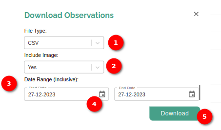

    1. **File Type Selection Options:** The `File Type` dropdown provides options such as CSV (Comma-Separated Values) and GeoPackage. The user can choose the desired file type based on their preferences.

    2. **Include Image Selection Options:** The `Include Image` dropdown offers options `Yes` and `No`. Indicate whether the user wants to include images in the downloaded observation data.

    3. **Date Range:** The user can set the date range for the observation data they wish to download. Use the calendar icon in both the `Start Date` and `End Date` fields to select dates interactively.

    4. **Calendar Icon:** Click on the calendar icon in the `Start Date` and `End Date` fields to open a date picker. Choose the desired date from the calendar to set the start and end dates conveniently.

        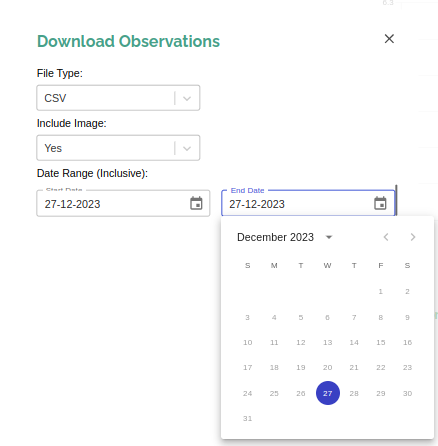

    5. Download Button: After configuring the file type, image inclusion, and date range, locate the `Download` button. Click on the `Download` button to initiate the download process for the observation data.

5. **Chart Icon:** Clicking on the chart icon will open a graphical representation, usually a score chart, providing insights into the observation's score. Analyze the chart to gain a visual understanding of the observation's data.

    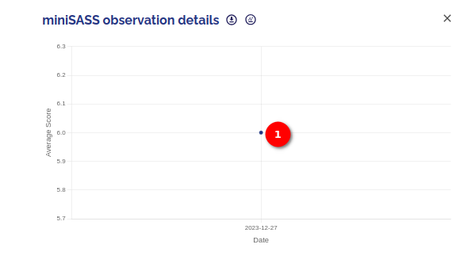

    1. **Dot:** The dot shows the score on the chart. The user can hover over the dot for more information.

6. **Add Record:** Clicking on the `Add Record` button opens an add record form for adding the record. For detailed add record instructions, refer to the [add record documentation](../upload/add-records.md).

7. **Map:** - For detailed map instructions, refer to the [map documentation](./map.md).

## Available References

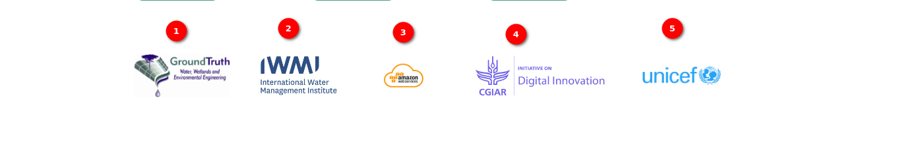

1. **Ground Truth**: GroundTruth provides a range of consulting services and equipment beneficial to water resource management projects.

    - GroundTruth has provided input into and coordinated large-scale, multi-national projects as well as small-scale, local projects. Through these projects, we have fostered a large and diverse client base and gained recognition for our work through several awards. 

    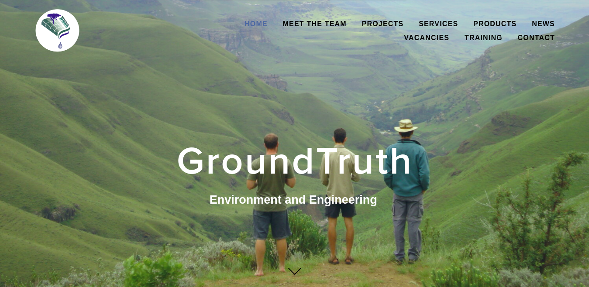

2. **United Nations Children's Fund (UNICEF)**: UNICEF works in over 190 countries and territories to save children's lives, defend their rights, and help them fulfil their potential, from early childhood through adolescence. And we never give up.

    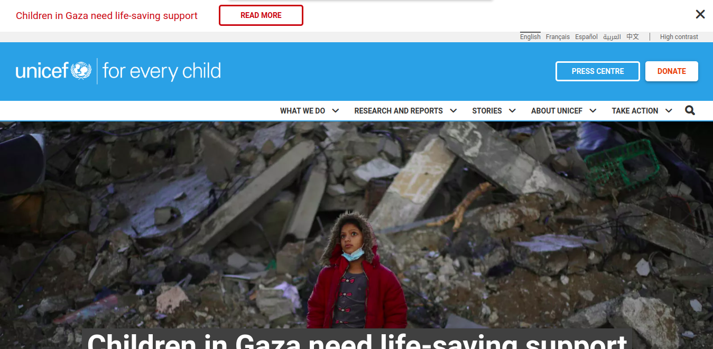

3. **CGIAR**: CGIAR is a global research partnership for a food-secure future dedicated to transforming food, land, and water systems in a climate crisis. CGIAR is the world’s largest global agricultural innovation network.
    - We provide evidence to policymakers, innovation to partners, and new tools to harness the economic, environmental and nutritional power of agriculture.

    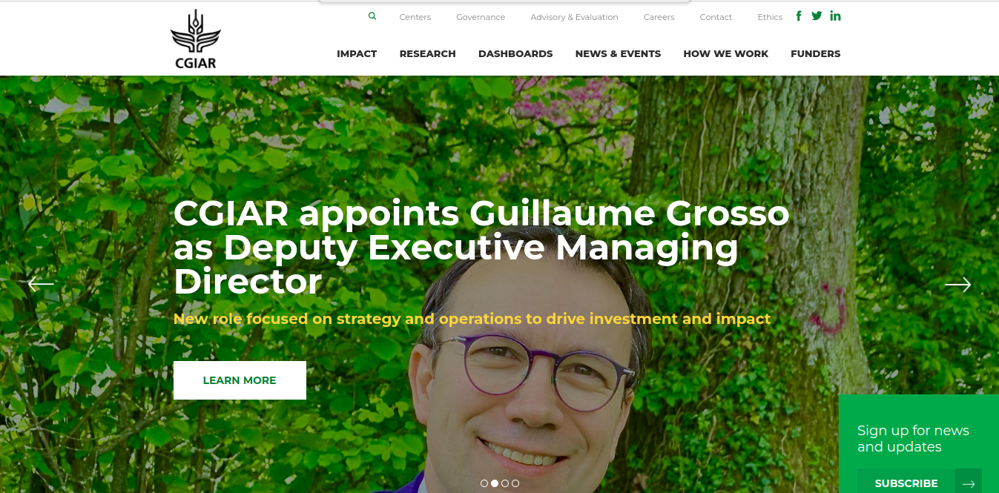

4. **International Water Management Institute (IWMI)**: IWMI is an international, research-for-development organization, with offices in 15 countries and a global network of scientists operating in more than 55 countries. For over three decades, our research results have led to changes in water management that have contributed to social and economic development.

    - A global network for water research that focuses on issues related to sustainable use of water resources.
    - IWMI’s mission is a water-secure world.

    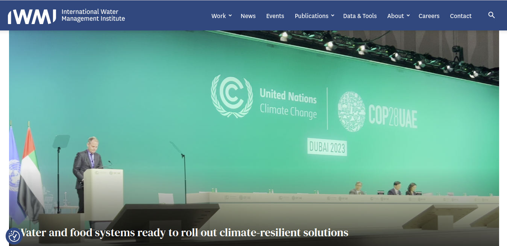

5. **Water Research Commission:** The WRC was established in terms of the Water Research Act (Act No 34 of 1971), following a period of serious water shortage. It was deemed to be of national importance to generate new knowledge and to promote the country’s water research purposefully, owing to the view held that water would be one of South Africa’s most limiting factors in the 21st century. In 1971 when the WRC was founded, water research and development (R&D) in South Africa was limited to a few institutions and the funding level inadequate. There was no research coordination and an apparent neglect of some key research fields. In addition, there was little strategic direction or leadership that would provide for the identification of priority areas or appropriate technology transfer. It was to address these issues, that the WRC was established.

    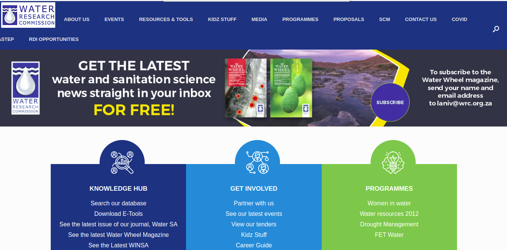

6. **Amazon Web Services (AWS)**: Amazon Web Services (AWS) is the world’s most comprehensive and broadly adopted cloud, offering over 200 fully featured services from data centers globally. Millions of customers—including the fastest-growing startups, largest enterprises, and leading government agencies—are using AWS to lower costs, become more agile, and innovate faster.

    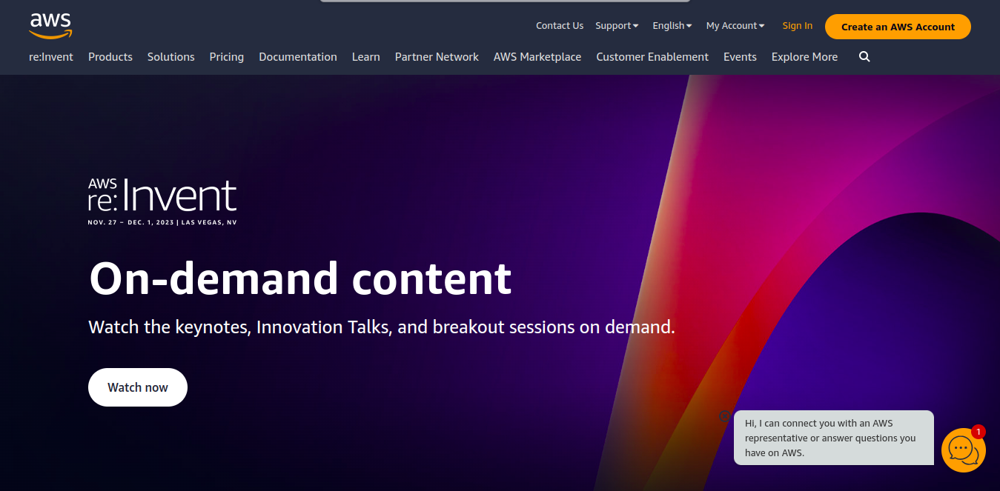

7. **WESSA (Wildlife and Environment Society of South Africa):** WESSA (the Wildlife and Environment Society of South Africa) is a South African environmental organisation that aims to initiate and support high-impact environmental and conservation projects to promote participation in caring for the Earth. For over 90 years we have proactively engaged with the challenges and opportunities presented by our country’s unique natural heritage and the social and economic systems that depend on it.

    

8. **Kartoza:** Make geospatial data and technology work for you by partnering with us for training, development and maintenance of GIS systems. Kartoza is a South Africa-based Free and Open Source GIS (FOSSGIS) service provider. We use GIS software to solve complex location-related problems for individuals, businesses and governments around the world. Our team develops software using FOSSGIS to give you the freedom to share and modify your GIS as your needs grow and change.

    

## Footer Options

1. **Home**: Navigate to the home page by clicking on the `Home` link.

2. **How To**: Navigate to the how-to page by clicking on the `How To` link. For detailed how-to instructions, refer to the [how-to page documentation](../how-to/how-to.md).

3. **Map**: Navigate to the map page by clicking on the `Map` link.
