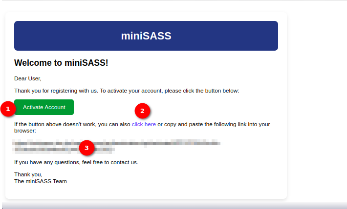

# Activate Account User Manual

## Activate Account Email

1. **Activate Account Button:** Click the Activate Account button provided in the email. This will redirect the user to the activation page.

2. **Click Here Option:** Alternatively, if the button above does not work, the user can click the `click here` option to open the activation page.

3. **Link Option for Copy Paste:** If neither of the above options is feasible, the user can copy and paste the given link into the browser to open the activation page.
    
