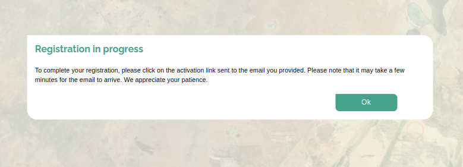

# Register Page User Manual

## Introduction

The miniSASS Register form allows users to create a new account and participate in monitoring the health of rivers. This user manual provides step-by-step instructions on how to register on the miniSASS platform.

## Accessing the Register Page

1. **Register:** Click on the `Register` button to access the registration form.

## Registering a New Account

1. **Form Fields:** The miniSASS Registration Form allows users to create a new account by providing the necessary information. Follow these steps to fill out the registration form.

- **Username:** Enter a unique username that the user would like to use for their miniSASS account. This will be the user's identification when logging in.

- **Email:** Provide a valid email address. This email will be associated with the user's miniSASS account and will be used for communication and account-related notifications.

- **Name:** Enter the first name in the `Name` field. This helps personalise the user's account and interactions on the platform.

- **Surname:** Enter the last name in the `Surname` field. This complements the first name to complete the user's user profile.

- **Organisation Name:** Enter the name of the organisation. If the users are not affiliated with an organisation, they can leave this field blank.

- **Organisation Type (Dropdown):** The user can choose the type of organisation they belong to from the dropdown menu. This could include options such as `NGOs`, `Schools` or other relevant categories.

    

- **Password:** Create a strong and secure password for your miniSASS account.

    * **Password Requirements**

        

        When creating a password for your miniSASS account, ensure it meets the following requirements:

        * **At least one uppercase letter is required:** Include at least one uppercase letter (A-Z) in your password.

        * **At least one lowercase letter is required:** Include at least one lowercase letter (a-z) in your password.

        * **At least one digit is required:** Include at least one numeric digit (0-9) in your password.
        
        * **At least one special character is required:** Include at least one special character (e.g., !, @, #, $, %, etc.) in your password.

        * **Password must be at least 6 characters long:** Ensure your password is a minimum of 6 characters in length for security.

- **Confirm Password:** Re-enter the password in the `Confirm Password` field to ensure it matches the one entered in the previous step. Otherwise, the user will see the error.

    

- **Country (Dropdown):** Select the country from the dropdown menu. This helps miniSASS tailor content and features based on the user's geographic location.

    

2. **Cross Icon:** Click on the `Cross` icon to cancel the registration.

3. **Register Button:** Once all the required information is entered, click the `Register` button to submit the registration.

On successful submission the success message will be shown.

- For detailed activate account instructions, refer to the [activate account documentation](./activate-account.md).
