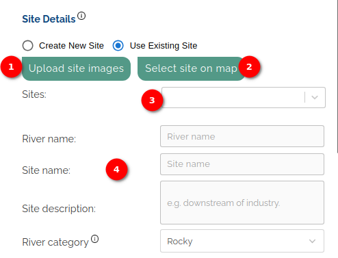
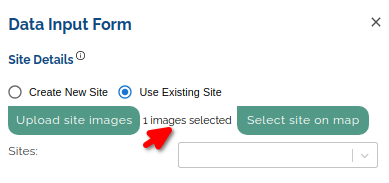

# User Manual Add Record Form

## Introduction

Welcome to the Add Record Form User Manual. This guide will walk you through the process of adding a new record using our user-friendly form. Follow the steps below to efficiently input data and contribute valuable information to our system.

1. **Site Details:** Hover over the `Information Icon` next to `Site Details` to view additional information about the section of the form.

2. **Create New Site:** Choose the `Create New Property` option to initiate the process. This option allows the user to add a new property to the site.

    **Site Details Section**

    

    1. **Upload Site Images Button:** Use the `Upload Site Images` button to attach visual representations of the property. This helps to provide a comprehensive view and enhance the overall data quality. When the user clicks on the upload site image button a popup will shown for uploading the image of the property.

        **Upload Image**

        

        The Upload Image Popup is a user interface element designed to allow users to easily upload images to a platform. This manual provides a step-by-step guide on how to use the popup, including instructions for selecting files, clearing selections, and understanding supported formats.

        1. **Browse:** Click on the `Browse` link, a file explorer window will appear then navigate to the desired location on your device and select one or multiple image files. Supported formats for upload include `.JPG`, `.JPEG`, and `.PNG`. Upon selecting a file, it will be displayed in the popup with a corresponding `Delete` icon. To remove a selected file, click on the `Delete` icon associated with that file.

            

        2. **Clear:** In case the user wishes to start over or change their selection, click on the `Clear` link. This will remove all currently selected files, allowing the user to choose new ones.

        3. **Upload Chosen Files:** After selecting the desired image files, locate and click on the `Upload chosen files` button. The system will process the uploaded files, and a user will see the message next to the `Upload site image` button, that (number) images selected.

            
        
        4. **Cross Icon:** Click on the `Cross` icon, to cancel the upload image process.

    2. **Form Fields:**

        1. **River Name:** Enter the name of the river associated with the property.

        2. **Site Name:** Provide a name for the property.

        3. **Site Description:** Add a brief description of the property, highlighting any relevant details, such as its location relative to nearby industries or landmarks.

        4. **River Category:** Hover over the `Information Icon` next to `River Category` to access additional information about the available categories in the dropdown. Select the appropriate category that best represents the river.
    
    **Site Location section**

    This user manual provides step-by-step instructions for using the `Site Location` section, which includes options for selecting the location on a map or typing in coordinates. The section comprises two main parts: `Observation Details` and `Measurements`.

    

    1. **Select on map button:** Click the `Select on map` button to choose the observation location interactively on the map. Upon clicking the `Select on map` button, the `Latitude` and `Longitude` fields are displayed on the form.

        
    
    - The selected location will be shown on the map. When the user selects the location on the map, the latitude and longitude will automatically fill in the respective fields.

        

    2. **Type in coordinates button:** Click the `Type in coordinates` button to manually input specific coordinates for the observation location. Upon clicking the `Type in coordinates` button, two radio buttons are displayed on the form. By default, the `Degree` button is selected.

        

        - When the `Degree` button is chosen there are two fields to fill `Latitude` and `Longitude`. Users can manually fill in the latitude and the longitude of the location.

        

        - When the user chooses `Degrees, Minutes, Seconds (DMS)` button, there are two fields to fill `Latitude` and `Longitude` with the minute, degree, second and direction. Users can manually fill in the latitude and the longitude of the location.
    
    3. **Observation details:**

        a. **Date:** Choose the observation date by clicking on the calendar icon. A date picker will appear for easy selection.

        

        b. **Collector's Name:** Enter the name of the person collecting the observation data.

        c. **Notes:** Provide any relevant notes or additional information related to the observation.
    
    4. **Measurements Section:**

        a. **Water Clarity (cm):** Enter the water clarity measurement in centimetres.

        b. **Water Temperature (°C):** Input the water temperature in degrees Celsius.

        c. **pH:** Enter the pH level of the water.

        d. **Dissolved Oxygen:** Choose the dissolved oxygen measurement unit from the dropdown options:

            mg/l (milligrams per litre)
            %DO (percentage of dissolved oxygen)
            PPM (parts per million)
            Unknown

        If the user inserts more than `20` in the `Dissolved Oxygen` field an information message will display.

        

        e. **Electrical Conductivity:** Enter the electrical conductivity measurement and select the unit from the dropdown options:

            S/m (Siemens per meter)
            µS/cm (microsiemens per centimetre)
            mS/m (millisiemens per meter)
            Unknown

        If the user inserts more than `100` in the `Electrical Conductivity` field an information message will display.

        

    5. **Next Button:** To proceed to the next step in adding a record, click on the `Next` button. Upon clicking `Next`, the score form will open, allowing the user to choose the group and upload an image associated with the record. It's important to note that the date field must be filled in before saving the score form.

        
    
    - For detailed instructions on adding a score, refer to the [score documentation](../upload/score.md).

3. **Use Existing Site:** Choose the `Use Existing Site` option to initiate the process. This option allows the user to use the existing property on the site.

    **Site Details Section**

    

    1. **Upload Site Images Button:** Use the `Upload Site Images` button to attach visual representations of the property. This helps to provide a comprehensive view and enhance the overall data quality. When the user clicks on the upload site image button a popup will shown for uploading the image of the property.

        **Upload Image**

        

        The Upload Image Popup is a user interface element designed to allow users to easily upload images to a platform. This manual provides a step-by-step guide on how to use the popup, including instructions for selecting files, clearing selections, and understanding supported formats.

        1. **Browse:** Click on the `Browse` link, a file explorer window will appear then navigate to the desired location on your device and select one or multiple image files. Supported formats for upload include `.JPG`, `.JPEG`, and `.PNG`. Upon selecting a file, it will be displayed in the popup with a corresponding `Delete` icon. To remove a selected file, click on the `Delete` icon associated with that file.

            

        2. **Clear:** In case the user wishes to start over or change their selection, click on the `Clear` link. This will remove all currently selected files, allowing the user to choose new ones.

        3. **Upload Chosen Files:** After selecting the desired image files, locate and click on the `Upload chosen files` button. The system will process the uploaded files, and a user will see the message next to the `Upload site image` button, that (number) images selected.

            

        4. **Cross Icon:** Click on the `Cross` icon, to cancel the upload image process.

    2. **Select Site On Map:** The `Select Site on Map` button is a feature designed to allow users to choose a specific location on the map. The user can also disable the selected site from the map by clicking on the `Disable` button.

        

    3. **Sites:** The user has the option to choose from various available sites using the `Site` dropdown menu. This dropdown contains a list of pre-defined sites that the user can select from. When the user chooses a specific site from this dropdown, the form fields associated with that site will automatically populate with the relevant information.

    4. **Form Fields:**

        1. **River Name:** The name of the river will automatically populate with the relevant information of the chosen site. The user is unable to update the value of this field.

        2. **Site Name:** The name of the site will automatically populate with the relevant information of the chosen site. The user is unable to update the value of this field.

        3. **Site Description:** The description of the site will automatically populate with the relevant information of the chosen site. The user is unable to update the value of this field.

        4. **River Category:** The category of the site will automatically populate with the relevant information of the chosen site. The user is unable to update the value of this field.

    **Site Location section**

    This user manual provides step-by-step instructions for using the `Site Location` section, for the `Use Existing Site` option. The section comprises two main parts: `Observation Details` and `Measurements`.

    

    1. **Select on map button:** The `Select on map` button is disabled for the `Use Existing Site` option.

    2. **Type in coordinates button:** The `Type in coordinates` button is disabled for the `Use Existing Site` option.
    
    3. **Observation details:**

        a. **Date:** Choose the observation date by clicking on the calendar icon. A date picker will appear for easy selection.

        

        b. **Collector's Name:** Enter the name of the person collecting the observation data.

        c. **Notes:** Provide any relevant notes or additional information related to the observation.

    4. **Measurements Section:**

        a. **Water Clarity (cm):** Enter the water clarity measurement in centimetres.

        b. **Water Temperature (°C):** Input the water temperature in degrees Celsius.

        c. **pH:** Enter the pH level of the water.

        d. **Dissolved Oxygen:** Choose the dissolved oxygen measurement unit from the dropdown options:

            mg/l (milligrams per litre)
            %DO (percentage of dissolved oxygen)
            PPM (parts per million)
            Unknown

        If the user inserts more than `20` in the `Dissolved Oxygen` field an information message will display.

        

        e. **Electrical Conductivity:** Enter the electrical conductivity measurement and select the unit from the dropdown options:

            S/m (Siemens per meter)
            µS/cm (microsiemens per centimetre)
            mS/m (millisiemens per meter)
            Unknown

        If the user inserts more than `100` in the `Electrical Conductivity` field an information message will display.

        

    5. **Next Button:** To proceed to the next step in adding a record, click on the `Next` button. Upon clicking `Next`, the score form will open, allowing the user to choose the group and upload an image associated with the record. It's important to note that the date field must be filled in before saving the score form.

        

    - For detailed instructions on adding a score, refer to the [score documentation](../upload/score.md).
