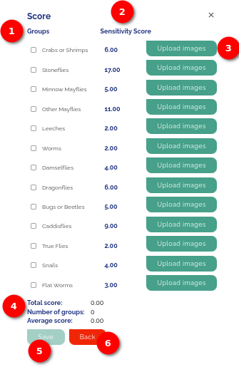
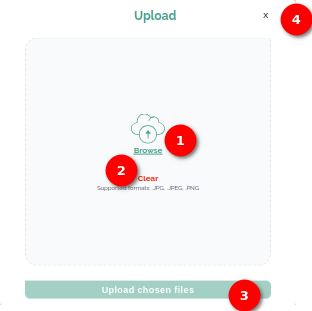
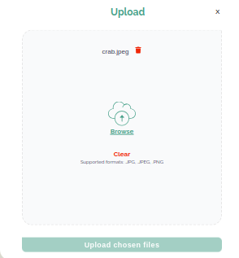
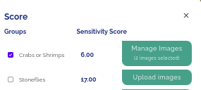
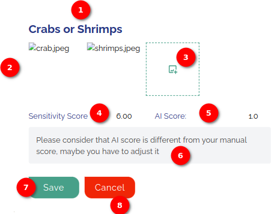
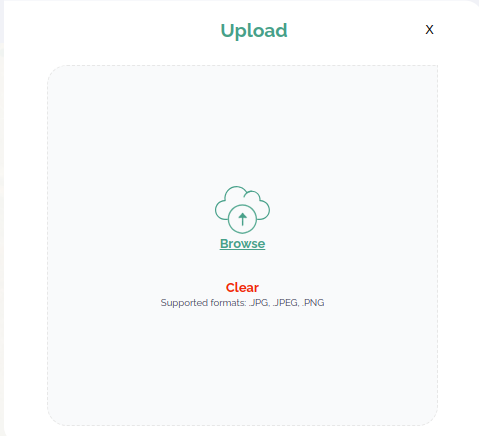
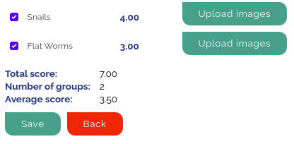

# Score Page User Manual

## Introduction

The `Score` form is a crucial element where users can review and manage their scoring data. This manual provides a step-by-step guide on how to use the features present on the `Score` form, including selecting groups, viewing sensitivity scores, uploading images, and understanding the summary information.

Click on the `Next` button to open the Score form after completing the necessary actions on the add-record page.

1. **Groups:** On the Score Page, the user will find a list of groups with associated sensitivity scores. Each group has a checkbox next to it for selection. Users can check the checkbox to select the group.

2. **Sensitivity Score:** The sensitivity scores for each group are as follows:
    - Crabs or Shrimps: 6.00
    - Stoneflies: 7.00
    - Minnow Mayflies: 5.00
    - Other Mayflies: 1.00
    - Leeches: 2.00
    - Worms: 2.00
    - Damselflies: 4.00
    - Dragonflies: 6.00
    - Bugs or Beetles: 5.00
    - Caddisflies: 9.00
    - True Flies: 2.00
    - Snails: 4.00
    - Flat Worms: 3.00

3. **Upload Images:** The user can upload the images of aquatic groups they found at the site. Click on the `upload image` button to upload the images. When the user clicks on this button an upload popup will open for uploading the images.

    

    1. **Browse:** Click on the `Browse` link, a file explorer window will appear then navigate to the desired location on your device and select one or multiple image files. Supported formats for upload include `.JPG`, `.JPEG`, and `.PNG`. Upon selecting a file, it will be displayed in the popup with a corresponding `Delete` icon. To remove a selected file, click on the `Delete` icon associated with that file.

        

    2. **Clear:** In case the user wishes to start over or change their selection, click on the `Clear` link. This will remove all currently selected files, allowing the user to choose new ones.

    3. **Upload Chosen Files:** After selecting the desired image files, locate and click on the `Upload chosen files` button. The system will process the uploaded files, and an `Upload images` button will replaced by a `Manage Images` button with the number of selected files.

        

        1. **Manage Images Button:** Click on the `Manage Images` button, to manage the aquatic group images. When the user clicks on this button a popup will open for managing the images.

            

            1. **Crabs or Shrimps:** Displays the name of the selected group.

            2. **Images:** Displays the uploaded images.

            3. **Add Image Icon** Click on the `Add Image` icon, to add new images.

                

            4. **Sensitivity Score:** Displays the sensitivity score of the group.

            5. **AI Score:** Displays the score generated by the `AI` based on the analysis of the uploaded images.

            6. **Message:** If the sensitivity score provided by the user and the score generated by AI significantly differ, a message will be displayed:

                `Please consider that AI score is different from your manual score; maybe you have to adjust it.`

            7. **Save:** Click on the `Save` button, to save the uploaded image.

            8. **Cancel:** Click on the `Cancel`, Button to close the popup.

4. **Summary Information:** At the bottom of the form, the user will find summary information:
        
    

    - **Total score:** Displays the sum of sensitivity scores for the selected groups.
    - **Number of groups:** Shows the count of selected groups.
    - **Average score:** Calculates the average sensitivity score based on the selected groups.

5. **Save:** The `Save` button allows users to save the scoring data. Note that it remains unclickable until at least one group is selected.

6. **Back:** The `Back` button takes the user to the previous page without saving any changes.
