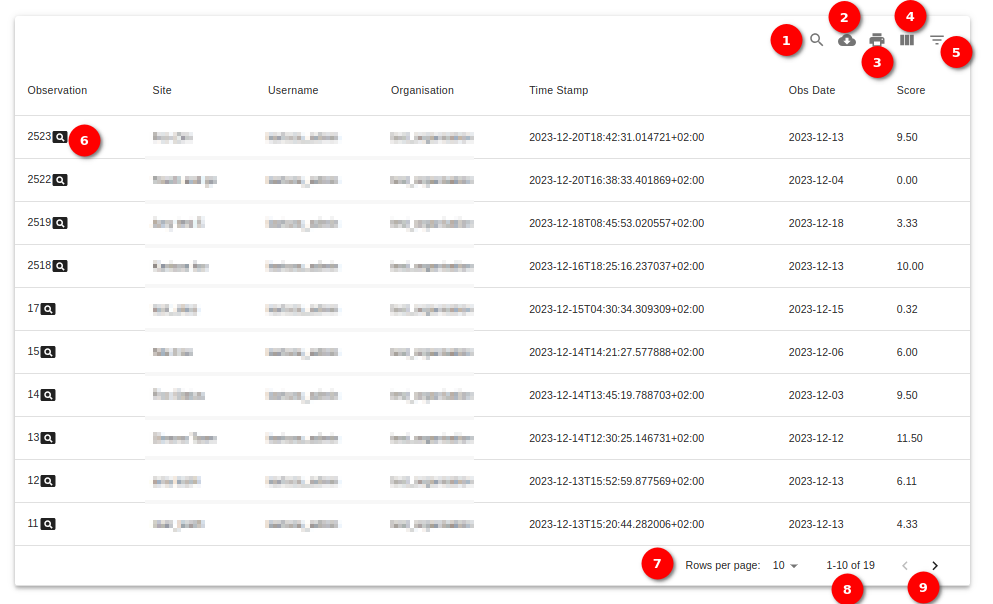

# Recent Activity User Manual

## Introduction

The `Recent Activity` page provides an overview of the latest actions and events related to the user's account. Here's a guide on how to navigate and interpret the information on the `Recent Activity` page:

1. **Recent Activity:** Click on the `Recent Activity` link, to go to the recent activity page. Upon reaching the `Recent Activity` page, the user will see a list of recent events or actions associated with the user's account.

    

    Located in the top right corner of the Recent Activity Page are several icons that provide additional functionalities:

    1. **Search Icon:** Clicking on the search icon opens a search bar. The user can enter keywords or specific terms to quickly locate relevant information within the current page.

        

        Click on the `Cross` icon, to remove the filter.

    2. **Download Icon:** The download icon allows the user to download the data displayed on the page in CSV format. This feature is useful for offline analysis or record-keeping.

        

    3. **Print Icon:** Clicking on the print icon enables the user to print the content of the `Recent Activity` page. This is useful for creating physical copies or sharing the information in a hardcopy format.

        

    4. **Toolbar Icon:** The toolbar icon provides options for customising the view of columns. The user can select specific columns to display or hide, tailoring the page to the user's preferences.

        

        The user can uncheck the checkbox to hide the columns.

        

    5. **Filter Table Icon:** The filter table icon opens a filtering tool, allowing the user to refine the displayed data based on specific criteria. This feature assists in focusing on relevant information.

        

        The `Filter Popup` is a powerful tool designed to refine and customise the data displayed on the `Recent Activity` page.

        1. **Filter Fields:** The Filter Popup provides dropdowns for various fields, each offering specific filtering options:

            - **Observation:** Filter by observation type.
            - **Site:** Filter by the site where the observation occurred.
            - **Username:** Filter by the username associated with the observation.
            - **Organisation:** Filter by the organization linked to the observation.
            - **Time Stamp:** Filter by the timestamp of the observation.
            - **Obs Date:** Filter by the observation date.
            - **Score:** Filter by the score assigned to the observation.

            

            - The user can see the selected filters on the top of the filtered table and can remove the specific filter by clicking on the cross icon next to the filtered keyword.

        2. **Reset:** The `Reset` button is a convenient feature for clearing all applied filters and returning to the default view.

        - Click on the `Cross` icon to close the filter popup.

    6. **Search Icon in Observation Column:** Clicking on the search icon in the `Observation Column` redirects the user to the map page, where the user can explore detailed observation details associated with the selected entry.

        

    7. **Rows per Page** Located below the table, the `Rows per Page` dropdown menu allows the users to choose the number of rows to display on the current page. The default setting is 10 rows per page.

        **15 Row per page**
        

    8. **Rows Number Information:** Information about the current display is presented, indicating the range of rows being shown. For example, `Showing rows 1-10 of 100` informs the user that there are 100 total observations, and the current page displays the first 10.

    9. **Pagination:** Pagination controls are available for navigating through multiple pages of observations:

        - **Arrow Right Icon:** Clicking the arrow right icon takes the user to the next page of the observations table.

        - **Arrow Left Icon:** Clicking the arrow left icon allows the user to return to the previous page of the observations table.
