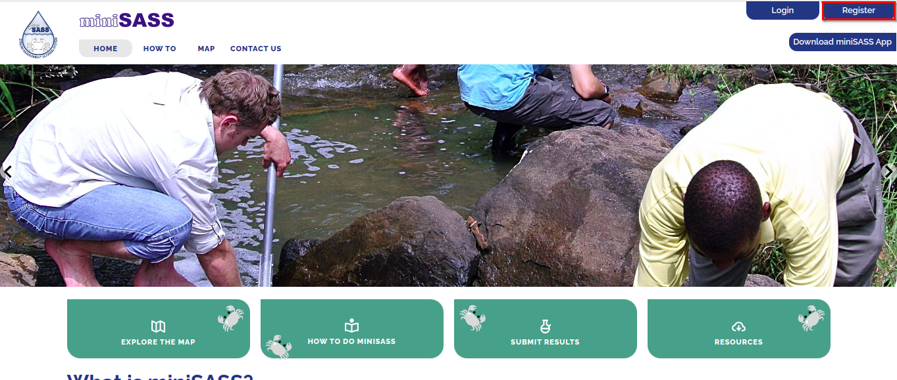
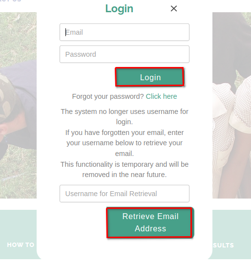

# Quick Start Guide

Begin by reviewing the `Quick Start Guide` for a seamless introduction to the miniSASS. This guide provides step-by-step instructions to help you set up your account, navigate the interface, and start using our services efficiently.

**Registering**

Click on the `Register` button to access the registration form.

**Register Page**

The miniSASS Registration Form allows users to create a new account by providing the necessary information. Fill out the registration form and click on the `Register` button to submit the registration form.

**Form Fields:**

- **Username:** Enter a unique username.

- **Email:** Provide a valid email address.

- **Name:** Enter the first name.

- **Surname:** Enter the last name in the `Surname` field.

- **Organisation Name:** Enter the name of the organisation. If the users are not affiliated with an organisation, they can leave this field blank.

- **Organisation Type (Dropdown):** The user can choose the type of organisation they belong to from the dropdown menu. This could include options such as `NGOs`, `Schools` or other relevant categories.

- **Password:** Create a strong and secure password for your miniSASS account. Ensure your miniSASS account password adheres to the following requirements: at least one uppercase letter, one lowercase letter, one digit, one special character, and a minimum length of 6 characters.

- **Confirm Password:** Re-enter the password in the `Confirm Password` field to ensure it matches the one entered in the previous step. Otherwise, the user will see the error.

- **Country (Dropdown):** Select the country from the dropdown menu. This helps miniSASS tailor content and features based on the user's geographic location.

**Cross Icon:** Click on the `Cross` icon to cancel the registration process.

**Register Button:** Once all the required information is entered, click the `Register` button to submit the registration.

On successful submission you will see the registration in progress message. To complete the registration process you need to activate your account.

**Activating Account**

Go to your email and check the activation email for the account activation sent by the miniSASS.

- **Activate Account Button:** Click the Activate Account button provided in the email. This will redirect the user to the activation page.

- **Click Here Option:** Alternatively, if the button above does not work, the user can click the `click here` option to open the activation page.

- **Link Option for Copy Paste:** If neither of the above options is feasible, the user can copy and paste the given link into the browser to open the activation page.
    

**Login**

Click on the `Ok` button and then click on the `Login` button to login into the miniSASS.

**Login Page**

Fill the required information in the respective fields and click on the login button to log in to your miniSASS account.

You can use the `Retrieve Email Address` button, to retrieve the email address using your username in case you forgot your email address associated with the username.

After successful login you will be redirected to the miniSASS home page.

**Summary**

The miniSASS Quick Start Guide offers a comprehensive walkthrough to swiftly acquaint users with the platform. It begins with registration, where users provide essential details including username, email, name, surname, and organization information. A strong password, adhering to specific criteria, is required for account security.

Upon successful registration, users receive an activation email containing instructions to activate their accounts. This involves clicking on the provided activation button or link. Subsequently, users can log in using their credentials, with the option to retrieve their email address if forgotten.

The guide emphasises ease of use and security measures, ensuring users can quickly register, activate their accounts, and seamlessly navigate the miniSASS platform for environmental assessment and monitoring.
